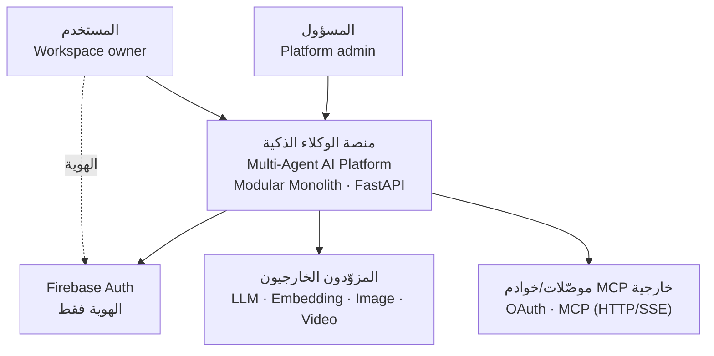
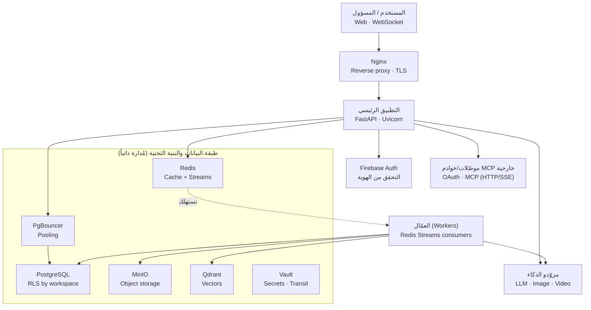
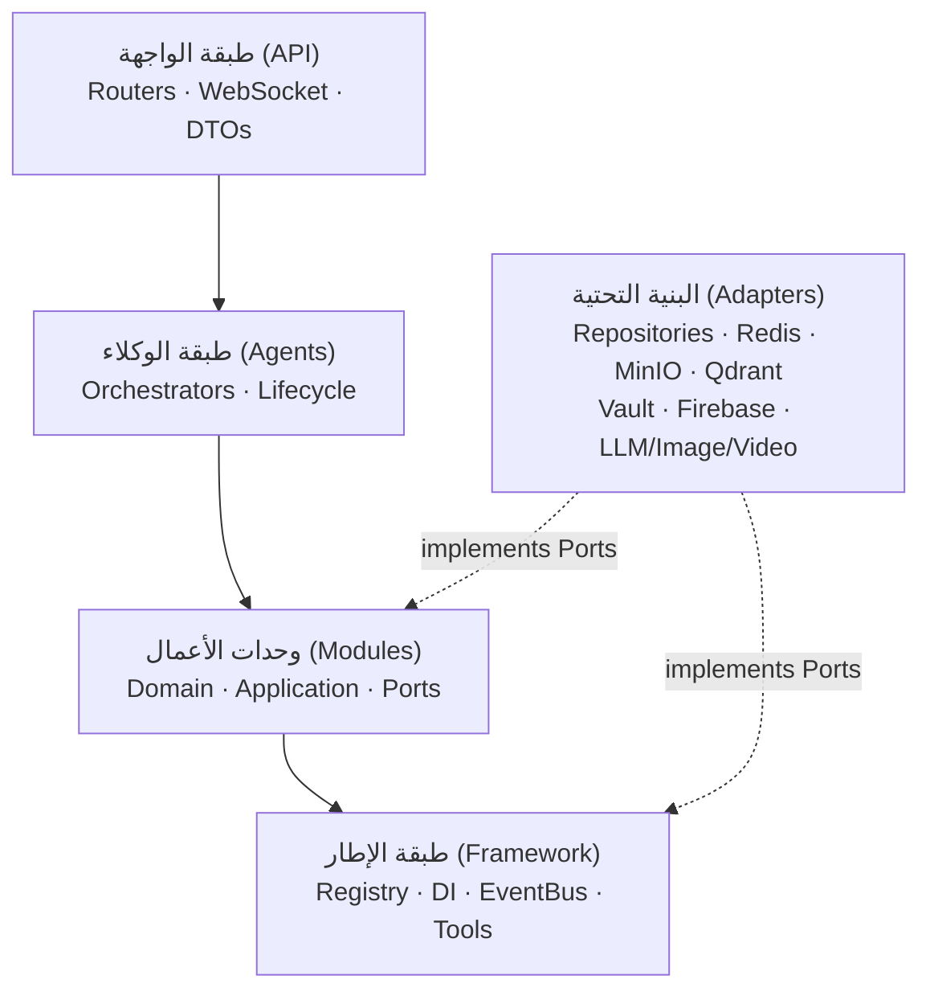
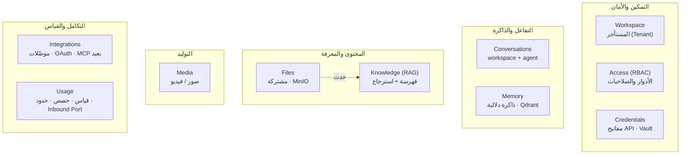
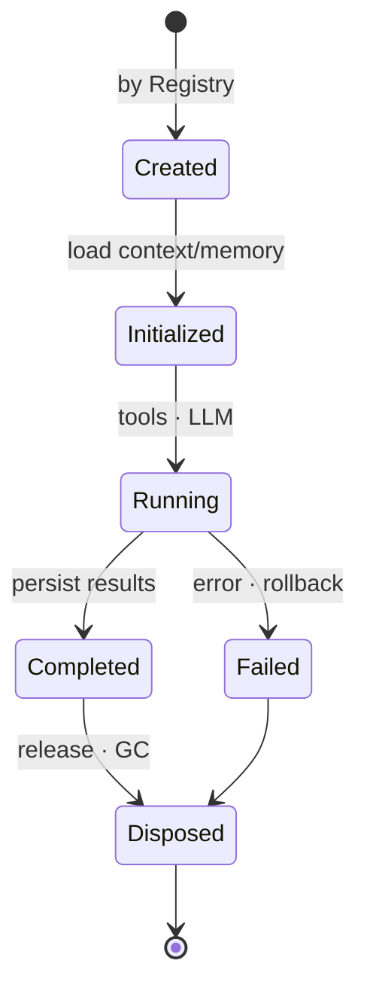
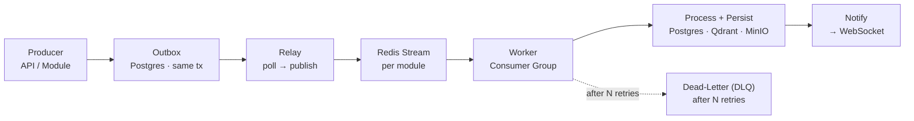
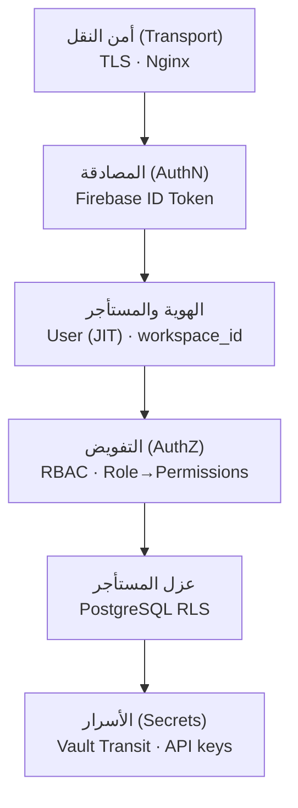
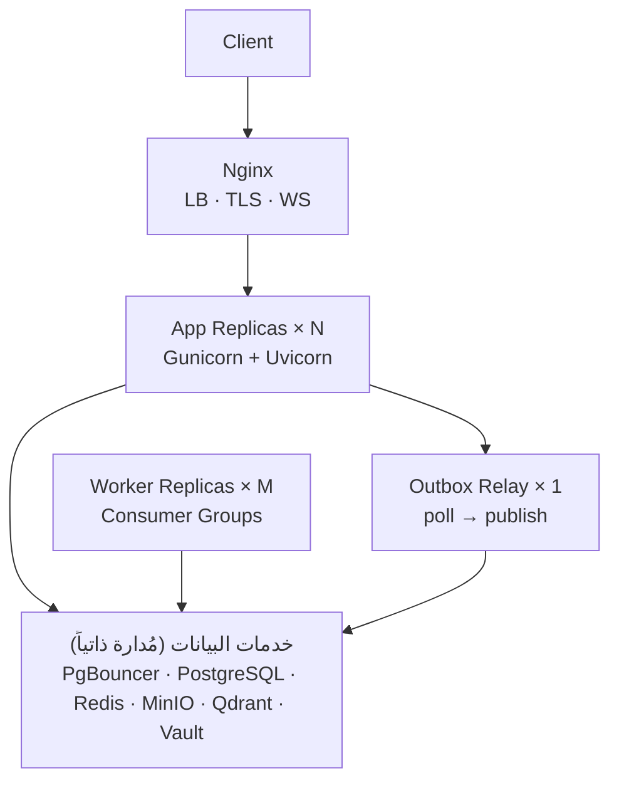

# منصة ذكاء اصطناعي متعددة الوكلاء — وثيقة المعمارية

> **Software Architecture Document · v1.0**
>
> مخطط معماري كامل لتطبيق Backend بلغة Python يخدم آلاف المستخدمين — مبني على
> **Modular Monolith** و**Hexagonal Architecture** و**Plugin System** و**Event‑Driven** للعمليات الثقيلة.

| | |
|---|---|
| **المكدّس** | FastAPI · Uvicorn |
| **النمط** | Modular Monolith |
| **الأنماط** | Hexagonal · Plugin · Event‑Driven |
| **الحالة** | ✅ معتمد — 15/15 مرحلة |
| **التاريخ** | 2026‑07‑08 |

---

## المحتويات

- [00 · نظرة عامة والمبادئ](#00--نظرة-عامة-والمبادئ)
- [01 · المكدّس التقني](#01--المكدّس-التقني)
- [02 · مراحل التصميم الخمس عشرة](#02--مراحل-التصميم-الخمس-عشرة)
- [03 · سياق النظام (C4 · L1)](#03--سياق-النظام-c4--l1)
- [04 · الحاويات وتدفق البيانات (C4 · L2)](#04--الحاويات-وتدفق-البيانات-c4--l2)
- [05 · البنية الطبقية](#05--البنية-الطبقية)
- [06 · وحدات الأعمال](#06--وحدات-الأعمال)
- [07 · الوكلاء ودورة الحياة](#07--الوكلاء-ودورة-الحياة)
- [08 · المنافذ والمحوّلات](#08--المنافذ-والمحوّلات)
- [09 · قواعد الاعتماد](#09--قواعد-الاعتماد)
- [10 · العمارة المدفوعة بالأحداث](#10--العمارة-المدفوعة-بالأحداث)
- [11 · معمارية الأمن](#11--معمارية-الأمن)
- [12 · معمارية النشر](#12--معمارية-النشر)
- [13 · سجل القرارات المعمارية (26 ADR)](#13--سجل-القرارات-المعمارية-26-adr)
- [14 · التحقق المعماري](#14--التحقق-المعماري)

---

## 00 · نظرة عامة والمبادئ

صُمّمت المنصة على يد فريق من **قائد معماري + 7 وكلاء متخصصين** (البنية الكلية، النواة، الوحدات،
الوكلاء، المنافذ، الأحداث، الأمن والنشر) عبر **15 مرحلة اعتماد متتابعة**. كل قرار معماري طُرح
واعتُمد صراحةً — لا افتراضات. الحصيلة **26 قراراً موثّقاً**.

**المبادئ الحاكمة:**

`SOLID` · `High Cohesion` · `Low Coupling` · `Separation of Concerns` · `Dependency Inversion`
· `Interface Segregation` · `Domain‑Driven Design` · **`Modular Monolith`** · **`Hexagonal`**
· **`Plugin Architecture`** · **`Event‑Driven`**

---

## 01 · المكدّس التقني

| المجال | التقنية |
|---|---|
| `db` قاعدة البيانات | PostgreSQL |
| `pool` تجميع الاتصالات | PgBouncer |
| `cache/bus` الكاش والناقل | Redis · Streams |
| `object` تخزين الكائنات | MinIO |
| `auth` الهوية | Firebase |
| `edge` الحافة | Nginx |
| `app` التطبيق | FastAPI · Uvicorn |
| `+vectors` مخزن المتجهات | **Qdrant** |
| `+secrets` إدارة الأسرار | **HashiCorp Vault** |

> **ملاحظة:** الخدمتان بعلامة (+) — **Qdrant** و**Vault** — أُضيفتا بموافقة صريحة لسدّ فجوتين لم
> تكونا في القائمة الأولية: مخزن متجهات وإدارة أسرار. لا خدمة أخرى خارج هذه القائمة.

---

## 02 · مراحل التصميم الخمس عشرة

| # | المرحلة | # | المرحلة | # | المرحلة |
|---|---|---|---|---|---|
| 01 | مراجعة القرارات | 06 | Business Modules | 11 | Event‑Driven |
| 02 | System Context | 07 | Agents Design | 12 | Infrastructure |
| 03 | Container Diagram | 08 | Plugin Architecture | 13 | Security |
| 04 | Layered Architecture | 09 | Ports & Adapters | 14 | Deployment |
| 05 | Framework Design | 10 | Dependency Rules | 15 | Validation |

---

## 03 · سياق النظام (C4 · L1)

المنصة كنظام واحد يتفاعل معه **المستخدم** و**المسؤول**، ويعتمد على أنظمة خارجية:
**Firebase** للهوية، و**مزوّدي الذكاء**، و**موصّلات/خوادم MCP خارجية** (OAuth · HTTP/SSE) عبر وحدة `integrations`. الهوية عبر Firebase؛ التفويض داخل التطبيق.

*Fig 1 — System Context (L1)*

---

## 04 · الحاويات وتدفق البيانات (C4 · L2)

التطبيق **Stateless** خلف Nginx (عدة نسخ Uvicorn)، والعمّال عمليات منفصلة تستهلك Redis Streams.
التطبيق يَنشُر أحداث المهام الثقيلة ثم يردّ فوراً — **لا اقتران مباشر بين التطبيق والعمّال**.

*Fig 2 — Container Diagram (L2)*

---

## 05 · البنية الطبقية

خمس طبقات، والاعتماد يتّجه دائماً **للداخل نحو النواة**. الـ Domain لا يعرف FastAPI ولا قاعدة
بيانات ولا أي Framework تقني. البنية التحتية محوّلات تُنفّذ المنافذ باتجاه الداخل.

*Fig 3 — Layered Architecture (🟣 Driving · 🟢 Core · ⚪ Kernel · 🟠 Driven)*

| الطبقة | الدور | تحتوي |
|---|---|---|
| **الواجهة (API)** | محوّل قيادة | Routers `‎/api/v1`، WebSocket، DTO، تحقق Firebase، RBAC guards — بلا منطق أعمال |
| **الوكلاء** | منسّق | BaseAgent، دورة الحياة، تنسيق Workflow، استخدام Tools — ينسّق فقط |
| **الوحدات** | النواة | Domain (نقي) + Application (Use‑Cases) + Ports |
| **الإطار** | الكِرنل | PluginLoader، Registries، WorkflowEngine، EventBus، ToolRegistry، المنافذ المشتركة، Settings، Composition Root |
| **البنية التحتية** | محوّل مُقاد | تنفيذ المنافذ فوق Postgres/Redis/MinIO/Qdrant/Vault/Firebase ومزوّدي الذكاء |

---

## 06 · وحدات الأعمال

كل وحدة تتبع Hexagonal داخلياً (Domain / Application / Ports / Adapters) وتطبّق Repository Pattern.
**لا وحدة تستدعي أخرى مباشرة** — فقط عبر Inbound Port محقون أو Global Event.

*Fig 4 — Business Modules Map (10 في v1)*

> **قابلة للتوسّع:** الوحدات العشر أعلاه هي مجموعة v1 (بعد ترقية **integrations** و**usage** من محجوزتين إلى وحدتَي v1 — §6.13/§6.14 من المتطلبات). المجموعة مفتوحة عبر قالب سداسي قياسي، مع **3 وحدات محجوزة** مستقبلاً (`scheduling · sandbox · runs`) — انظر القسم 12.1 من وثيقة المتطلبات.

---

## 07 · الوكلاء ودورة الحياة

كل Agent **Stateless**، يُنشأ لكل Request عبر `AgentRegistry`، يحمّل السياق والذاكرة والمحادثة،
ثم يُتلَف. المحادثات تتبع الوكيل بمفتاح `(workspace + agent)`، وللـ Workflow متعدّد الوكلاء
محادثته الخاصة.

*Fig 5 — Agent Lifecycle State Machine*

> **Plugin (D‑13):** إسقاط مجلد في `agents/` + `AgentMetadata` + وراثة `BaseAgent` → يكتشفه
> `PluginLoader` عبر importlib ويسجّله تلقائياً، بلا تعديل نواة، مع عزل الإضافة المعطوبة.

> **أمثلة الوكلاء:** RAG · Image · Video · Planner · Reviewer — منسّقون رفيعون يستدعون الوحدات
> عبر Ports ويستخدمون Tools؛ العمليات الثقيلة تُحال إلى Streams.

---

## 08 · المنافذ والمحوّلات

المنافذ تُعرَّف في **Framework**، والمحوّلات في **Infrastructure**، والربط في **Composition Root**
عبر Manual DI (عكس الاعتماد). لا يستورد أحدٌ المحوّلات المحسوسة إلا Composition Root.

| Port | Adapter(s) | Backing |
|---|---|---|
| `LLMProvider` | OpenAI · Gemini · Claude · Ollama · OpenRouter (أصلي لكل مزوّد) | خارجي |
| `EmbeddingProvider` | مزوّد خارجي | خارجي |
| `ImageProvider` / `VideoProvider` | محوّلات توليد خارجية | خارجي |
| `VectorStore` | QdrantAdapter | Qdrant |
| `StorageProvider` | MinIOAdapter | MinIO |
| `CacheProvider` / `EventPublisher` | RedisCache / RedisStreams | Redis |
| `SecretsProvider` | VaultAdapter (Transit) | Vault |
| `AuthProvider` | FirebaseAdapter | Firebase |
| `ConnectorProvider` / `MCPClient` | موصّلات OAuth + عميل MCP بعيد (HTTP/SSE) | خارجي |
| `Repository` (لكل Module) | SqlAlchemy Repositories | PostgreSQL |

> **منافذ واردة (Inbound Ports):** خلافاً للمنافذ المُقادة أعلاه، تعرّف وحدة `usage` منفذَين **واردَين** يستدعيهما المُنسِّق (طبقة الوكلاء): **فرض الحدّ** (يعيد **كائن قرار** قابلاً للتطوّر إلى reserve/commit) و**التقاط الاستهلاك** (متزامن، **بلا Redis Streams**) — `FR‑131/132`.

---

## 09 · قواعد الاعتماد

مفروضة آلياً عبر `import-linter` في CI (**D‑17**).

| الطبقة | تعتمد على | يُمنع استيراده |
|---|---|---|
| **API** | Agents · Modules · Framework | Infrastructure · Domain للمنطق |
| **Agents** | Modules(Ports) · Framework | Infrastructure · وكلاء آخرون · API |
| **Application** | Domain · Framework · Ports | أي Module آخر · Infrastructure · FastAPI |
| **Domain** | stdlib فقط | كل شيء تقني (FastAPI/SQLAlchemy/Redis/Infra) |
| **Framework** | stdlib + تجريداته | API · Agents · Modules · Infrastructure |
| **Infrastructure** | Framework · Ports | — (لا يستوردها إلا Composition Root) |

---

## 10 · العمارة المدفوعة بالأحداث

للعمليات الثقيلة فقط. نوعان: **Domain Events** (بالذاكرة، داخل الوحدة) و**Global Events**
(Redis Streams). النشر عبر **Transactional Outbox** لضمان عدم فقد الأحداث؛ التسليم
**at‑least‑once** مع مستهلكين **Idempotent** و**DLQ**؛ مجرى لكل وحدة.

*Fig 6 — Event-Driven Message Flow*

> **قياس الاستخدام خارج الناقل:** التقاط استهلاك وحدة `usage` **لا يمرّ عبر Redis Streams** (رغم كثافته) بل عبر **منفذ وارد متزامن** — صوناً لقصر الأحداث على العمليات الثقيلة فقط (`FR‑131` · D‑04).

---

## 11 · معمارية الأمن

Defense in Depth — كل طلب يعبر طبقات ضبط متتابعة. الهوية عبر Firebase (تحقق JWT محلي بمفاتيح
مُخزّنة)، والتفويض RBAC داخل التطبيق، وعزل المستأجرين عبر **RLS أصلية + ترشيح تطبيقي** (دفاع
بعمق)، والأسرار عبر Vault Transit.

*Fig 7 — Security Defense in Depth*

> **أسرار موحّدة (SEC‑07):** مفاتيح مزوّدي LLM (`credentials`) ورموز OAuth/أسرار الموصّلات (`integrations`) تُعمَّى جميعاً عبر **Vault Transit** بنمط ومفتاح ودورة تدوير موحّدين، بحدّ ملكية واضح ولا ازدواج تخزين للسرّ نفسه.

---

## 12 · معمارية النشر

**Docker Compose** — وحدات قابلة للتوسّع الأفقي: Nginx يوازن على نسخ App (Gunicorn+Uvicorn) بلا
حالة، والعمّال ومُرحّل Outbox عمليات مستقلة، وكلها تصل خدمات البيانات عبر PgBouncer
(Transaction pooling).

*Fig 8 — Deployment Topology*

---

## 13 · سجل القرارات المعمارية (26 ADR)

| # | القرار | الاختيار المعتمد |
|---|---|---|
| D‑01 | Vector Store | Qdrant (تشغيل ذاتي) |
| D‑02 | التوليد الإعلامي | منفذان: ImageProvider + VideoProvider |
| D‑03 | الأسرار | HashiCorp Vault + Transit |
| D‑04 | Multi‑Agent Workflow | متزامن للخفيف + Streams للثقيل |
| D‑05 | علاقة Agent↔Module | وكيل منسّق عبر Ports (N:M) |
| D‑06 | Memory & Conversations | Postgres (workspace+agent) + Qdrant |
| D‑07 | Tenant | المستأجر = Workspace |
| D‑08 | Tool System | أداة = محوّل فوق Ports + ToolRegistry مستقل |
| D‑09 | Workflow definition | ثابت بالكود + WorkflowRegistry |
| D‑10 | Streaming | WebSocket تفاعلي + SSE للردّ الواحد |
| D‑11 | Modules map | 10 وحدات في v1 (8 أصلية + ترقية integrations/usage) |
| D‑12 | Workflow conversation | محادثة خاصة بالـ Workflow |
| D‑13 | Plugin discovery | مسح مجلد + importlib |
| D‑14 | EmbeddingProvider | خارجي فقط |
| D‑15 | LLM adapters | أصلي لكل مزوّد |
| D‑16 | Provider routing | ProviderResolver بلا Fallback |
| D‑17 | فرض القواعد | import‑linter في CI |
| D‑18 | نشر الأحداث | Transactional Outbox |
| D‑19 | دلالات التسليم | at‑least‑once + Idempotent + DLQ |
| D‑20 | Streams topology | مجرى لكل وحدة + Consumer Groups |
| D‑21 | PgBouncer | Transaction pooling |
| D‑22 | Vault auth | AppRole |
| D‑23 | عزل المستأجرين | RLS أصلية + ترشيح تطبيقي |
| D‑24 | RBAC | Role → Permissions |
| D‑25 | التحقق من التوكن | JWT محلي بمفاتيح مُخزّنة |
| D‑26 | Orchestration | Docker Compose |

> **قرارات ما بعد الاعتماد (تحديث 2026‑07‑10 · مطابقة للمتطلبات):** تُبنى على سجلّ `D‑01…D‑26` دون تغييره:
> - **ترقية `integrations` + `usage`** من محجوزتين إلى وحدتَي v1 → **10 وحدات** (يُحدِّث D‑11)؛ المحجوز الآن **3** فقط (`scheduling · sandbox · runs`).
> - **قياس `usage` خارج الناقل:** الالتقاط عبر **منفذ وارد متزامن** لا Redis Streams (يصون قصر الأحداث على الثقيل — D‑04 · EVT‑10)، والفرض عبر منفذ يعيد **كائن قرار** قابلاً للتطوّر إلى **reserve/commit**.
> - **MCP بنقل بعيد (HTTP/SSE) حصراً** في v1؛ نقل stdio المحلي يتبع `sandbox` ويخضع لموافقة بنية تحتية (ARC‑15).
> - **موصّلات مستهلَكة عبر Tool System** بكتالوج ديناميكي لكل Workspace واكتشاف MCP وقت التشغيل؛ **تجديد OAuth كسول** بلا اعتماد على `scheduling`.
> - **أسرار موحّدة** عبر Vault Transit للموضعين `credentials` + `integrations` (SEC‑07).

---

## 14 · التحقق المعماري

مراجعة التصميم كاملاً: **6 مبادئ متوافقة تماماً**، وبندان بتوصية استباقية — بلا مخالفات حرجة.

| الفحص | الحالة | الفحص | الحالة |
|---|---|---|---|
| SOLID | ✅ متوافق | Hexagonal | ✅ متوافق |
| Low Coupling | ⚠️ توصية | Modular Monolith | ⚠️ توصية |
| No Circular | ✅ متوافق | Plugin | ✅ متوافق |
| Layers | ✅ متوافق | Event‑Driven | ✅ متوافق |

*Fig 9 — Architecture Validation Scorecard*

**توصيات استباقية:**

- **Schema لكل Module** داخل Postgres (مِلكية جداول صارمة) لتعزيز حدود الوحدات داخل قاعدة مشتركة.
- **إبقاء Framework نحيفاً** — تجريدات وتنسيق فقط، حارساً ضد تضخّم الكِرنل.
- **Outbox Relay** نقطة فشل محتملة — انتخاب قائد ومراقبة زمن النشر مستقبلاً.
- **ProviderResolver بلا Fallback (D‑16)** — مقايضة مختارة؛ يُعاد النظر إن ارتفعت متطلبات الموثوقية.
- **نقاط توسعة Observability** جاهزة (`correlation_id` + مظروف أحداث موحّد) لإضافة
  Audit/Metrics/Tracing لاحقاً دون إعادة هيكلة.

---

**منصة الوكلاء الذكية — وثيقة المعمارية v1.0 · معتمدة**

`15 مرحلة · 26 قراراً · 0 مخالفة حرجة`

