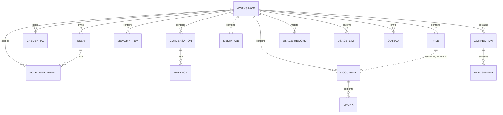

# نموذج البيانات ومخطط قاعدة البيانات

> PostgreSQL · **Schema لكل وحدة** (`DD‑01`) · **UUIDv7** (`DD‑02`) · أعمدة قياسية (`DD‑03`) · **RLS + ترشيح تطبيقي** (`DD‑04`).
> لا FK عابر بين schemas الوحدات؛ المرجعية بالـ`id` فقط. FK مسموح داخل schema الوحدة.

## 0) الاصطلاحات

**Schemas (عشر وحدات v1):** `workspace · access · credentials · conversations · memory · files · knowledge · media · integrations · usage` + `platform` (بنية الأحداث).
> **محجوزة لا مُنشأة في v1** (`FR‑110`, DAT‑01): `scheduling · sandbox · runs` — تُضاف بهجرة مستقلّة عند اعتمادها.

**قالب الأعمدة القياسية** (يُطبَّق حسب `DD‑03`):
```sql
id           uuid        PRIMARY KEY,                 -- UUIDv7 من التطبيق
workspace_id uuid        NOT NULL,                    -- على كل جدول مستأجَر
created_at   timestamptz NOT NULL DEFAULT now(),
updated_at   timestamptz NOT NULL DEFAULT now(),      -- + trigger touch
deleted_at   timestamptz NULL,                        -- محتوى المستخدم فقط
version      integer     NOT NULL DEFAULT 1            -- aggregates قابلة للتعديل
-- created_by uuid NULL                               -- (DAT‑05) حيث يُفيد تتبّع المُنشئ (اختياري لكل جدول)
```

**دالة touch (تحديث `updated_at`):**
```sql
CREATE OR REPLACE FUNCTION platform.touch_updated_at() RETURNS trigger AS $$
BEGIN NEW.updated_at = now(); RETURN NEW; END $$ LANGUAGE plpgsql;
-- CREATE TRIGGER trg_touch BEFORE UPDATE ON <t> FOR EACH ROW EXECUTE FUNCTION platform.touch_updated_at();
```

---

## 1) ERD — نظرة كلية


> `FILE ..o{ DOCUMENT` منقّطة: علاقة **منطقية عبر الوحدات** (بالـ`id`)، بلا FK فيزيائي (`DD‑01`).
> `CONNECTION`/`MCP_SERVER` في schema `integrations`؛ `USAGE_RECORD`/`USAGE_LIMIT` في schema `usage`. لا FK بينها وبين بقية الوحدات — المرجعية بالـ`id` فقط (`DAT‑02`).

---

## 2) DDL لكل وحدة

### 2.1 `workspace`
```sql
CREATE SCHEMA workspace;

CREATE TABLE workspace.workspaces (
  id            uuid PRIMARY KEY,
  owner_user_id uuid NOT NULL,
  name          text NOT NULL CHECK (char_length(name) BETWEEN 1 AND 80),
  status        text NOT NULL DEFAULT 'active' CHECK (status IN ('active','suspended','archived')),
  created_at    timestamptz NOT NULL DEFAULT now(),
  updated_at    timestamptz NOT NULL DEFAULT now(),
  version       integer NOT NULL DEFAULT 1
);
-- ملاحظة: workspaces جدول جذر المستأجر ⇒ لا RLS بعمود workspace_id (هو المستأجر نفسه)؛
-- يُقيَّد بالوصول عبر id + AuthZ.

CREATE TABLE workspace.users (
  id           uuid PRIMARY KEY,                 -- مشتق من firebase_uid عبر جدول ربط
  workspace_id uuid NOT NULL,
  firebase_uid text NOT NULL UNIQUE,
  email        text NOT NULL,
  display_name text,
  status       text NOT NULL DEFAULT 'active' CHECK (status IN ('active','disabled')),
  created_at   timestamptz NOT NULL DEFAULT now(),
  updated_at   timestamptz NOT NULL DEFAULT now(),      -- + trigger touch (قابل للتعديل عبر status)
  version      integer NOT NULL DEFAULT 1,
  CONSTRAINT fk_user_ws FOREIGN KEY (workspace_id) REFERENCES workspace.workspaces(id)
);
CREATE UNIQUE INDEX uq_users_owner ON workspace.users(workspace_id) WHERE status='active';
```

### 2.2 `access`
```sql
CREATE SCHEMA access;

CREATE TABLE access.role_assignments (
  id           uuid PRIMARY KEY,
  workspace_id uuid NOT NULL,
  user_id      uuid NOT NULL,                    -- مرجع منطقي لـ workspace.users.id
  role         text NOT NULL CHECK (role IN ('owner','admin','member','viewer','platform_admin')),
  granted_by   uuid,
  created_at   timestamptz NOT NULL DEFAULT now(),
  CONSTRAINT uq_assignment UNIQUE (workspace_id, user_id, role)
);
CREATE INDEX ix_ra_ws_user ON access.role_assignments(workspace_id, user_id);
-- Permission كتالوج ثابت بالكود (لا جدول) — انظر 05-rbac-config-secrets.md
```

### 2.3 `credentials`
```sql
CREATE SCHEMA credentials;

CREATE TABLE credentials.credentials (
  id             uuid PRIMARY KEY,
  workspace_id   uuid NULL,                       -- NULL ⇔ scope=platform
  provider       text NOT NULL,
  scope          text NOT NULL CHECK (scope IN ('platform','user')),
  label          text,
  ciphertext_ref text NOT NULL,                   -- ناتج Vault Transit (لا سرّ خام)
  key_id         text NOT NULL,                   -- معرّف مفتاح التشفير في Vault
  status         text NOT NULL DEFAULT 'active' CHECK (status IN ('active','revoked')),
  created_by     uuid,
  created_at     timestamptz NOT NULL DEFAULT now(),
  updated_at     timestamptz NOT NULL DEFAULT now(),
  version        integer NOT NULL DEFAULT 1,
  CONSTRAINT ck_scope_ws CHECK ((scope='user' AND workspace_id IS NOT NULL)
                             OR (scope='platform' AND workspace_id IS NULL))
);
CREATE INDEX ix_cred_ws_provider ON credentials.credentials(workspace_id, provider) WHERE status='active';
```

### 2.4 `conversations`
```sql
CREATE SCHEMA conversations;

CREATE TABLE conversations.conversations (
  id           uuid PRIMARY KEY,
  workspace_id uuid NOT NULL,
  agent_key    text NOT NULL,                     -- slug الوكيل أو workflow_key
  kind         text NOT NULL DEFAULT 'agent' CHECK (kind IN ('agent','workflow')),
  title        text,
  created_by   uuid,
  created_at   timestamptz NOT NULL DEFAULT now(),
  updated_at   timestamptz NOT NULL DEFAULT now(),
  deleted_at   timestamptz NULL,
  version      integer NOT NULL DEFAULT 1
);
CREATE INDEX ix_conv_ws_agent ON conversations.conversations(workspace_id, agent_key)
  WHERE deleted_at IS NULL;

CREATE TABLE conversations.messages (
  id              uuid PRIMARY KEY,
  conversation_id uuid NOT NULL,
  workspace_id    uuid NOT NULL,
  role            text NOT NULL CHECK (role IN ('user','assistant','system','tool')),
  content         jsonb NOT NULL,                 -- نص + مرفقات (file_id بالإشارة)
  token_count     integer,
  seq             integer NOT NULL,
  created_at      timestamptz NOT NULL DEFAULT now(),
  deleted_at      timestamptz NULL,                 -- حذف ناعم على مستوى الرسالة (FR‑81)
  CONSTRAINT fk_msg_conv FOREIGN KEY (conversation_id) REFERENCES conversations.conversations(id),
  CONSTRAINT uq_msg_seq UNIQUE (conversation_id, seq)
);
```

### 2.5 `memory`
```sql
CREATE SCHEMA memory;

CREATE TABLE memory.memory_items (
  id           uuid PRIMARY KEY,
  workspace_id uuid NOT NULL,
  agent_key    text NOT NULL,
  kind         text NOT NULL CHECK (kind IN ('semantic','episodic')),
  content      text NOT NULL,
  collection   text,                              -- Qdrant collection
  point_id     uuid,                              -- Qdrant point (NULL ريثما يُفهرَس)
  salience     real NOT NULL DEFAULT 0,
  created_at   timestamptz NOT NULL DEFAULT now(),
  deleted_at   timestamptz NULL
);
CREATE INDEX ix_mem_ws_agent ON memory.memory_items(workspace_id, agent_key) WHERE deleted_at IS NULL;
```

### 2.6 `files`
```sql
CREATE SCHEMA files;

CREATE TABLE files.files (
  id           uuid PRIMARY KEY,
  workspace_id uuid NOT NULL,
  name         text NOT NULL CHECK (char_length(name) BETWEEN 1 AND 255),
  content_type text NOT NULL,
  size_bytes   bigint NOT NULL CHECK (size_bytes >= 0),
  storage_key  text NOT NULL UNIQUE,              -- workspace_id/uuid
  checksum     text,                              -- sha256 hex
  status       text NOT NULL DEFAULT 'uploaded'
                 CHECK (status IN ('uploaded','scanning','ready','quarantined')),
  uploaded_by  uuid,
  created_at   timestamptz NOT NULL DEFAULT now(),
  updated_at   timestamptz NOT NULL DEFAULT now(),
  deleted_at   timestamptz NULL,
  version      integer NOT NULL DEFAULT 1
);
CREATE INDEX ix_files_ws ON files.files(workspace_id) WHERE deleted_at IS NULL;
```

### 2.7 `knowledge`
```sql
CREATE SCHEMA knowledge;

CREATE TABLE knowledge.documents (
  id           uuid PRIMARY KEY,
  workspace_id uuid NOT NULL,
  file_id      uuid NOT NULL,                     -- مرجع منطقي لـ files.files.id
  status       text NOT NULL DEFAULT 'pending'
                 CHECK (status IN ('pending','indexing','indexed','failed')),
  chunk_count  integer NOT NULL DEFAULT 0,
  error        text,
  created_at   timestamptz NOT NULL DEFAULT now(),
  updated_at   timestamptz NOT NULL DEFAULT now(),
  version      integer NOT NULL DEFAULT 1
);
CREATE INDEX ix_doc_ws_status ON knowledge.documents(workspace_id, status);

CREATE TABLE knowledge.chunks (
  id           uuid PRIMARY KEY,
  document_id  uuid NOT NULL,
  workspace_id uuid NOT NULL,
  seq          integer NOT NULL,
  text         text NOT NULL,
  token_count  integer,
  collection   text,
  point_id     uuid,                              -- Qdrant
  created_at   timestamptz NOT NULL DEFAULT now(),
  CONSTRAINT fk_chunk_doc FOREIGN KEY (document_id) REFERENCES knowledge.documents(id),
  CONSTRAINT uq_chunk_seq UNIQUE (document_id, seq)   -- Idempotency للاستيعاب
);
```

### 2.8 `media`
```sql
CREATE SCHEMA media;

CREATE TABLE media.media_jobs (
  id             uuid PRIMARY KEY,
  workspace_id   uuid NOT NULL,
  agent_key      text NOT NULL,
  kind           text NOT NULL CHECK (kind IN ('image','video')),
  prompt         text NOT NULL,
  params         jsonb NOT NULL DEFAULT '{}',
  status         text NOT NULL DEFAULT 'queued'
                   CHECK (status IN ('queued','running','succeeded','failed')),
  result_file_id uuid,                            -- مرجع منطقي لـ files.files.id
  error          text,
  created_by     uuid,
  created_at     timestamptz NOT NULL DEFAULT now(),
  updated_at     timestamptz NOT NULL DEFAULT now(),
  version        integer NOT NULL DEFAULT 1
);
CREATE INDEX ix_media_ws_status ON media.media_jobs(workspace_id, status);
```

### 2.9 `integrations` (وحدة v1 — `FR‑120…124`)
موصّلات OAuth بطرف ثالث وخوادم MCP **بعيدة (HTTP/SSE) حصراً**، لكل Workspace. الأسرار (رموز/مفاتيح) **مُعمّاة عبر Vault Transit** (`SEC‑07`) — لا نصّ صريح.
```sql
CREATE SCHEMA integrations;

CREATE TABLE integrations.connections (
  id             uuid PRIMARY KEY,
  workspace_id   uuid NOT NULL,
  connector_key  text NOT NULL,                    -- مُعرّف الموصّل في الكتالوج (مثل 'github','slack')
  display_name   text,
  status         text NOT NULL DEFAULT 'pending'
                   CHECK (status IN ('pending','connected','revoked','error')),
  scopes         text[] NOT NULL DEFAULT '{}',
  token_ref      text,                             -- ناتج Vault Transit (access/refresh) — لا سرّ خام
  key_id         text,                             -- معرّف مفتاح Transit المستخدَم للتعمية
  expires_at     timestamptz,                      -- انتهاء access token (لفحص التجديد الكسول — FR‑124)
  last_error     text,
  created_by     uuid,
  created_at     timestamptz NOT NULL DEFAULT now(),
  updated_at     timestamptz NOT NULL DEFAULT now(),
  version        integer NOT NULL DEFAULT 1,
  CONSTRAINT uq_conn_ws_connector UNIQUE (workspace_id, connector_key)
);
CREATE INDEX ix_conn_ws ON integrations.connections(workspace_id) WHERE status = 'connected';

CREATE TABLE integrations.mcp_servers (
  id             uuid PRIMARY KEY,
  workspace_id   uuid NOT NULL,
  name           text NOT NULL,
  endpoint_url   text NOT NULL,                    -- بعيد فقط (https/sse) — لا stdio (v1)
  transport      text NOT NULL DEFAULT 'http'
                   CHECK (transport IN ('http','sse')),   -- نقل بعيد حصراً (خارج v1: stdio → sandbox)
  auth_ref       text,                             -- سرّ مصادقة MCP مُعمّى عبر Transit (اختياري)
  key_id         text,
  status         text NOT NULL DEFAULT 'active' CHECK (status IN ('active','disabled','error')),
  created_by     uuid,
  created_at     timestamptz NOT NULL DEFAULT now(),
  updated_at     timestamptz NOT NULL DEFAULT now(),
  version        integer NOT NULL DEFAULT 1,
  CONSTRAINT uq_mcp_ws_name UNIQUE (workspace_id, name)
);
CREATE INDEX ix_mcp_ws ON integrations.mcp_servers(workspace_id) WHERE status = 'active';
```
> اكتشاف أدوات MCP يتمّ **وقت التشغيل** عبر `MCPClient` (لا تُخزَّن قوائم الأدوات إلزامياً)؛ التخزين هنا للاتصال/الاعتماد فقط. **يُمنع** تشغيل خوادم MCP كعمليات فرعية داخل حاويات التطبيق/العمّال (§6.13 من المتطلبات).

### 2.10 `usage` (وحدة v1 — `FR‑130…134`)
قياس + حصص + ميزانيات + حدود. **خارج الناقل**: الالتقاط عبر منفذ وارد متزامن يُلحِق في **سجلّ append‑only** (لا Redis Streams). الفوترة المالية خارج v1.
```sql
CREATE SCHEMA usage;

-- سجلّ استهلاك append‑only (بلا deleted_at/version — DAT‑07)
CREATE TABLE usage.usage_records (
  id            uuid PRIMARY KEY,
  workspace_id  uuid NOT NULL,
  agent_key     text NOT NULL,
  provider      text NOT NULL,
  tokens        bigint NOT NULL DEFAULT 0 CHECK (tokens >= 0),
  cost_micros   bigint NOT NULL DEFAULT 0 CHECK (cost_micros >= 0),  -- تكلفة بوحدات صغرى (تفادي العائم)
  operation_id  uuid NOT NULL,                    -- مفتاح إدمبوتنسي طبيعي (FR‑134)
  created_at    timestamptz NOT NULL DEFAULT now(),
  CONSTRAINT uq_usage_op UNIQUE (workspace_id, operation_id)   -- إعادة الالتقاط بنفس المفتاح ⇒ تُتجاهَل بهدوء
);
CREATE INDEX ix_usage_ws_agent_prov ON usage.usage_records(workspace_id, agent_key, provider, created_at);

-- تجميع/تدوير داخلي للفرض السريع (rollup — شأن داخلي للوحدة)
CREATE TABLE usage.usage_rollups (
  workspace_id  uuid NOT NULL,
  agent_key     text NOT NULL DEFAULT '*',        -- '*' = كل الوكلاء
  provider      text NOT NULL DEFAULT '*',
  period        text NOT NULL CHECK (period IN ('day','month')),
  period_start  date NOT NULL,
  tokens_sum    bigint NOT NULL DEFAULT 0,
  cost_micros_sum bigint NOT NULL DEFAULT 0,
  updated_at    timestamptz NOT NULL DEFAULT now(),
  PRIMARY KEY (workspace_id, agent_key, provider, period, period_start)
);

-- حصص/ميزانيات/حدود قابلة للإعداد (متوائمة مع SLO — FR‑133)
CREATE TABLE usage.limits (
  id            uuid PRIMARY KEY,
  workspace_id  uuid NOT NULL,
  scope         text NOT NULL CHECK (scope IN ('workspace','agent','provider')),
  scope_key     text NOT NULL DEFAULT '*',        -- agent_key أو provider عند تخصيص النطاق
  metric        text NOT NULL CHECK (metric IN ('tokens','cost_micros')),
  period        text NOT NULL CHECK (period IN ('day','month')),
  limit_value   bigint NOT NULL CHECK (limit_value >= 0),
  created_at    timestamptz NOT NULL DEFAULT now(),
  updated_at    timestamptz NOT NULL DEFAULT now(),
  version       integer NOT NULL DEFAULT 1,
  CONSTRAINT uq_limit UNIQUE (workspace_id, scope, scope_key, metric, period)
);
CREATE INDEX ix_limits_ws ON usage.limits(workspace_id);
```
> **الفرض** (قبل العملية) يقرأ `usage_rollups` مقابل `limits` ويعيد **كائن قرار**؛ عقد المنفذ قابل للتطوّر إلى **reserve/commit** بإضافة عمود `reservation_id`/جدول حجوزات لاحقاً بلا كسر (`FR‑132` — نقطة توسعة). كلا المنفذين يُستدعى من **المُنسِّق** (طبقة الوكلاء) حصراً.

---

## 3) عزل المستأجر — RLS (تنفيذ `DD‑04`, D‑23)

على **كل جدول مستأجَر** (يحمل `workspace_id`):
```sql
ALTER TABLE files.files ENABLE ROW LEVEL SECURITY;
ALTER TABLE files.files FORCE ROW LEVEL SECURITY;   -- يشمل مالك الجدول

CREATE POLICY tenant_isolation ON files.files
  USING      (workspace_id = current_setting('app.workspace_id', true)::uuid)
  WITH CHECK (workspace_id = current_setting('app.workspace_id', true)::uuid);
```
- ضبط السياق لكل معاملة (من `ExecutionContext` عبر `infrastructure/persistence/rls.py`):
```sql
SET LOCAL app.workspace_id = '018f...';   -- بداية كل معاملة تطبيق/عامل
```
- **دور التطبيق** `app_rw`: `NOINHERIT`, **بلا** `BYPASSRLS`, وليس مالك الجداول ⇒ خاضع للسياسة.
- **الترشيح التطبيقي** (دفاع ثانٍ): كل Repository يضيف `WHERE workspace_id = :ws` صراحةً.
- تنطبق نفس السياسة على **كل** الجداول المستأجَرة الجديدة: `integrations.connections`, `integrations.mcp_servers`, `usage.usage_records`, `usage.usage_rollups`, `usage.limits`.
- الجداول غير المستأجَرة (`workspace.workspaces`, كتالوجات المنصّة) تُحمى بالـAuthZ لا بالـRLS.
- `current_setting(..., true)` يعيد `NULL` عند غياب السياق ⇒ **صفر صفوف** (فشل آمن، لا تسريب).

### 3.1 حالة خاصّة — قراءة مفاتيح المنصّة (`credentials` بـ`workspace_id IS NULL`)

صفوف `credentials.credentials` على مستوى المنصّة (`scope='platform'`, `workspace_id IS NULL`) لا تطابق سياسة `tenant_isolation` (المطابقة على `workspace_id = app.workspace_id`)، والدور `app_rw` **بلا** `BYPASSRLS`؛ فتبقى غير مقروءة عبر السياسة القياسية. يحلّ `ProviderResolver` هذا عبر **سياسة RLS إضافية (permissive) للقراءة فقط** تسمح بصفوف المنصّة المشتركة — سياسات RLS تُدمَج بمنطق **OR**، فتوسّع القراءة لصفوف المنصّة دون كسر عزل صفوف المستأجرين الآخرين (تبقى مقيَّدة بـ`workspace_id IS NULL`):
```sql
-- قراءة فقط لمفاتيح المنصّة المشتركة، فوق سياسة العزل المستأجري
CREATE POLICY platform_credentials_read ON credentials.credentials
  FOR SELECT
  USING (workspace_id IS NULL AND scope = 'platform');
```
- النطاق **SELECT فقط** ⇒ لا كتابة/تعديل على مفاتيح المنصّة عبر مسار المستأجر (إدارتها بمسار PlatformAdmin منفصل عبر AuthZ).
- القيد `workspace_id IS NULL` يمنع تسريب مفاتيح مستأجرين آخرين؛ الرؤية تقتصر على المنصّة المشتركة + مفاتيح المستأجر الحالي (عبر `tenant_isolation`).
- يتّسق مع قاعدة الاختيار في `06-domain-models.md` (§3): تفضيل مفتاح المستخدم، وإلا مفتاح المنصّة، بلا Fallback بين المزوّدين (D‑16).

---

## 4) بنية الأحداث — `platform` (تنفيذ D‑18, D‑19)

### 4.1 Transactional Outbox
```sql
CREATE SCHEMA platform;

CREATE TABLE platform.outbox (
  id             uuid PRIMARY KEY,                -- = event_id (UUIDv7)
  workspace_id   uuid,                            -- للتتبّع (قد يكون NULL لأحداث منصّة)
  aggregate_type text NOT NULL,
  aggregate_id   uuid NOT NULL,
  event_type     text NOT NULL,                  -- <module>.<aggregate>.<event>.vN
  stream         text NOT NULL,                  -- اسم مجرى الوحدة الهدف
  payload        jsonb NOT NULL,                 -- مظروف CloudEvents كامل
  correlation_id uuid,
  causation_id   uuid,
  created_at     timestamptz NOT NULL DEFAULT now(),
  published_at   timestamptz NULL,               -- يملؤه المُرحّل بعد النشر
  attempts       integer NOT NULL DEFAULT 0
);
CREATE INDEX ix_outbox_unpublished ON platform.outbox(created_at)
  WHERE published_at IS NULL;
```
- الأثر النطاقي + صف الـOutbox يُكتبان في **نفس المعاملة** ⇒ لا فقد ولا نشر أشباح.
- `outbox_relay` (نسخة واحدة، D‑26): يسحب غير المنشور بترتيب `created_at`، ينشر إلى `XADD` للمجرى، ثم يضبط `published_at`. `at‑least‑once`.

### 4.2 Idempotency (تنفيذ D‑19, `DD‑09`)
```sql
CREATE TABLE platform.processed_events (
  consumer_group text NOT NULL,
  event_id       uuid NOT NULL,
  processed_at   timestamptz NOT NULL DEFAULT now(),
  PRIMARY KEY (consumer_group, event_id)
);
```
- المستهلك يُدرج `(group, event_id)` **داخل معاملة الأثر الجانبي**؛ تعارض المفتاح ⇒ سبق المعالجة ⇒ `ACK` بلا تكرار.

### 4.3 مواضع المجاري (اختياري للمراقبة)
```sql
CREATE TABLE platform.stream_offsets (
  stream         text NOT NULL,
  consumer_group text NOT NULL,
  last_id        text NOT NULL,                   -- Redis stream entry id
  updated_at     timestamptz NOT NULL DEFAULT now(),
  PRIMARY KEY (stream, consumer_group)
);
```
> نقطة توسعة Observability: `correlation_id`/`causation_id` محمولة في Outbox والمظروف ⇒ تتبّع لاحق بلا إعادة هيكلة.

---

## 5) الفهارس والأداء
- كل مفاتيح البحث الشائعة مفهرسة بـ`(workspace_id, …)` لتوافق مسح RLS.
- الفهارس الجزئية `WHERE deleted_at IS NULL` تُبقي المسح على الحيّ فقط.
- `platform.outbox` فهرس جزئي على غير المنشور ⇒ سحب المُرحّل O(الطابور).
- UUIDv7 يقلّل تضخّم صفحات B‑Tree مقارنةً بـv4 تحت الإدراج.

## 6) استراتيجية الهجرات (Alembic)
- **سلسلة هجرات لكل وحدة** (عشر سلاسل v1) ضمن `version_table_schema` منفصل لكل وحدة (`DAT‑03`)، تُدار مركزياً بأمر واحد؛ سلسلة تمهيدية تُنشئ الـschemas والامتدادات وجداول `platform`.
- `alembic.ini` يوجّه `version_table_schema` لكل وحدة بمعزل ⇒ إضافة وحدة جديدة = **سلسلة هجرات مستقلّة** بلا مساس بالقائم (`FR‑111`).
- ترتيب البذر: schemas → جداول المنصّة → جداول الوحدات → سياسات RLS → الأدوار/الصلاحيات (`app_rw`).
- **schemas المحجوزة** (`scheduling · sandbox · runs`) **لا تُنشأ في v1**؛ تُضاف بسلسلة هجرات خاصّة عند اعتمادها.
- لا هجرة تُنشئ FK عابراً بين schemas الوحدات (يُفحص في مراجعة الهجرات).
