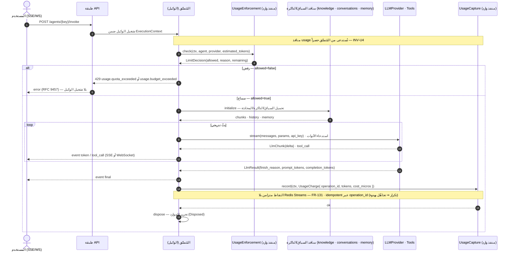

# دليل تأليف الوكلاء (Agent Authoring Guide)

> Plugin Architecture (D‑13): **إسقاط مجلد = وكيل جديد**. لا تعديل للنواة. يكتشفه `PluginLoader` عبر importlib ويسجّله في `AgentRegistry`.
> عقود الوكيل في [`02-port-contracts.md`](02-port-contracts.md) §3.2.

## 1) تشريح مجلد الوكيل
```
src/app/agents/<your_agent>/
├── __init__.py
├── manifest.py      # AgentMetadata — الهوية والقدرات والصلاحيات
├── agent.py         # صنف يرث BaseAgent — منطق التنسيق
├── tools/           # أدوات خاصة بالوكيل (اختياري) — ترث BaseTool
│   └── __init__.py
└── prompts/         # قوالب النصوص (اختياري)
```

## 2) الخطوة 1 — `manifest.py`
```python
from app.framework.agent_runtime.metadata import AgentMetadata

METADATA = AgentMetadata(
    key="rag_agent",                      # فريد، snake_case — مفتاح المحادثات والتوجيه
    name="RAG Agent",
    version="1.0.0",
    description="يجيب اعتماداً على معرفة مساحة العمل عبر الاسترجاع.",
    capabilities=frozenset({"chat", "retrieval", "streaming"}),
    required_permissions=frozenset({"agents:invoke", "knowledge:read"}),
    default_tools=("rag_search",),
)
```
- `key` هو الهوية عبر الـAPI (`/agents/{key}/invoke`) ومفتاح `(workspace + agent)` للمحادثات.
- `required_permissions` تُفحَص بـRBAC قبل التشغيل.

## 3) الخطوة 2 — `agent.py`
```python
from collections.abc import AsyncIterator
from app.framework.agent_runtime.base_agent import BaseAgent, AgentRequest, AgentEvent
from .manifest import METADATA

class RagAgent(BaseAgent):
    metadata = METADATA

    def __init__(self, ctx, deps):        # deps: منافذ محقونة فقط — لا infrastructure
        self._ctx = ctx
        self._llm = deps.llm              # LLMProvider (مُختار عبر ProviderResolver)
        self._retrieval = deps.knowledge  # KnowledgeRetrieval (Inbound Port لوحدة knowledge)
        self._conversations = deps.conversations
        self._tools = deps.tools          # ToolRegistry view

    async def initialize(self) -> None:
        # تحميل المحادثة/الذاكرة اللازمة (stateless: كل شيء من الخدمات، لا حالة RAM دائمة)
        ...

    async def run(self, req: AgentRequest) -> AsyncIterator[AgentEvent]:
        chunks = await self._retrieval.retrieve(self._ctx, req.input["text"], k=5)
        # ... بناء الرسائل ثم البثّ من المزوّد
        async for tok in self._llm.stream(messages, params, api_key):
            yield AgentEvent(type="token", data={"delta": tok.delta})
        yield AgentEvent(type="final", data={"message_id": "...", "usage": {...}})

    async def dispose(self) -> None:
        ...                               # تحرير أي موارد
```
**قواعد ملزمة:**
- **Stateless:** لا تُبقِ حالة في RAM بين الطلبات؛ حمّل من قواعد البيانات/الخدمات لكل طلب، وأنهِ بعد التنفيذ.
- **عبر المنافذ فقط:** استدعِ الوحدات عبر Inbound Ports المحقونة — **لا تستورد** وحدة أخرى ولا محوّراً محسوساً.
- **لا وكيل يستورد وكيلاً**؛ التنسيق متعدد الوكلاء يتم عبر `WorkflowEngine`.
- المهام الثقيلة (توليد صورة/فيديو، فهرسة) تُحال إلى Streams — لا تُنفَّذ داخل مسار البثّ.

## 4) الخطوة 3 — أدوات الوكيل (اختياري)
```python
from app.framework.tools.base_tool import BaseTool, ToolSpec

class RagSearchTool(BaseTool):
    spec = ToolSpec(
        name="rag_search",
        description="يبحث في معرفة المساحة ويعيد المقاطع الأقرب.",
        parameters={"type": "object", "properties": {"query": {"type": "string"}},
                    "required": ["query"]},
    )
    def __init__(self, deps): self._retrieval = deps.knowledge
    async def run(self, ctx, args):
        hits = await self._retrieval.retrieve(ctx, args["query"], k=5)
        return {"chunks": [h.__dict__ for h in hits]}
```
- الأداة محوّل رقيق فوق منافذ محقونة؛ الوكيل يستخدمها **بالاسم** عبر `ToolRegistry` دون معرفة تنفيذها (D‑08).
- **أدوات الموصّلات وMCP:** بالإضافة إلى الأدوات الثابتة، تتوفّر أدوات **الموصّلات المُفعّلة** و**MCP المُكتشَفة وقت التشغيل** ضمن **كتالوج ديناميكي لكل Workspace** (`FR‑52`) خلف نفس عقد `BaseTool` — يحلّها الوكيل بالاسم دون معرفة مصدرها (موصّل/MCP). لا تستورد وحدة `integrations` مباشرةً؛ الاكتشاف عبر منفذها الوارد.

## 5) الخطوة 4 — الاكتشاف والتسجيل (تلقائي)
- عند الإقلاع، `PluginLoader` يمسح `app/agents/*`، يستورد `manifest.py`، ويسجّل `(METADATA, factory)` في `AgentRegistry`.
- **بلا تعديل نواة**؛ يظهر الوكيل فوراً في `GET /api/v1/agents` و`/agents/{key}/invoke`.
- الإضافة المعطوبة (استيراد فاشل/manifest ناقص) **تُعزَل وتُسجَّل** دون إسقاط بقية المنصّة.
- **الحذف يُلغي التسجيل:** `AgentRegistry` يُعاد بناؤه من مسح `app/agents/*` عند كل إقلاع؛ لذا حذف مجلد الوكيل يُسقِط تسجيله تلقائياً عند الإقلاع التالي — يختفي من `GET /api/v1/agents` ويردّ `/agents/{key}/invoke` بـ`404`، **بلا تعديل نواة**. هذا يكمل إثبات `FR‑32`/`AC‑04`: إضافة **وحذف** أي وكيل دون تعديل النظام الأساسي.

## 6) دورة الحياة (تُدار بالنواة)
```
Created → Initialized → Running → Completed → Disposed
                           └────────→ Failed → Disposed
```
- `AgentRegistry.create()` يُنشئ لكل طلب؛ `initialize()` ثم `run()` (بثّ الأحداث) ثم `dispose()`.
- الفشل ⇒ حالة `Failed` + حدث خطأ (RFC 9457 عبر البثّ) + تحرير الموارد.

## 7) المحادثات والذاكرة
- المحادثات تتبع **الوكيل** بمفتاح `(workspace_id, agent_key)`؛ استخدم `deps.conversations` للإلحاق/القراءة.
- الذاكرة **مستقلة لكل وكيل** (`deps.memory`، مربوطة بـ`agent_key`) — لا تشارك ذاكرة وكيل آخر.
- الملفات **مشتركة** على مستوى المساحة (`deps.files`) — أي وكيل يقرأ أي ملف `ready`.

## 8) ضمّ الوكيل إلى Workflow
- عرّف `WorkflowDefinition` ثابتاً بالكود في `framework/workflows/definitions/` وسجّله في `WorkflowRegistry` (D‑09).
- مثال: `Planner → RAG → Image → Reviewer` — خطوات خفيفة متزامنة، والثقيلة تُحال إلى Streams (D‑04). للـWorkflow **محادثته الخاصة** (D‑12).

## 8.1) الحصص والقياس (يتولّاهما المُنسِّق — لا الوكيل)
- **لا يستدعي الوكيل وحدة `usage` مباشرة.** المُنسِّق (طبقة الوكلاء) هو من:
  - يستدعي **فرض الحدّ** قبل التشغيل عبر `UsageEnforcement.check(...)` ⇒ **كائن قرار**؛ عند الرفض يُعاد `429 usage.quota_exceeded` بلا تشغيل الوكيل (`FR‑132`).
  - يستدعي **التقاط الاستهلاك** بعد التشغيل عبر `UsageCapture.record(...)` موفّراً `operation_id` (إدمبوتنسي، بلا Streams) (`FR‑131/134`).
- على الوكيل فقط أن يُرجع عدّاد الرموز/التكلفة ضمن ناتجه ليجمعه المُنسِّق.

## 8.2) مخطط تتابع — الاستدعاء مع فرض الحصّة والبثّ

يوضّح الترتيب الفعلي من **طبقة الوكلاء (المُنسِّق)**: فرض الحدّ (كائن `LimitDecision`) ثم البثّ التدريجي ثم التقاط الاستهلاك المتزامن. دورة الحياة الكاملة (Created→…→Disposed) **غير مكرّرة هنا** — انظر `architecture.md` Fig 5؛ هذا المخطط يركّز على تفاعل المنافذ فقط.



## 9) الاختبار
- **وحدة:** شغّل `run()` بمنافذ مزيّفة (Fake `LLMProvider`/`KnowledgeRetrieval`) وتحقّق من تسلسل `AgentEvent`.
- **إضافة:** اختبر أن `PluginLoader` يكتشف وكيلك، وأن الـmanifest صالح، وأن عزل المعطوب يعمل.
- **حذف (AC‑04):** بعد حذف مجلد وكيل وإعادة الإقلاع، تحقّق أن `AgentRegistry` لم يعد يحوي `key`، وأن `GET /api/v1/agents` لا يُدرجه، وأن `/agents/{key}/invoke` يردّ `404` — إثباتاً لإلغاء التسجيل عند الحذف دون تعديل النواة (`FR‑32`/`AC‑04`).
- **صلاحيات:** تحقّق أن `required_permissions` تُرفض بـ`403` عند غيابها.

## 10) قائمة تحقّق قبل الدمج
- [ ] `manifest.py` بـ`key` فريد و`required_permissions` صحيحة.
- [ ] `agent.py` يرث `BaseAgent` وينفّذ `initialize/run/dispose`.
- [ ] **Stateless** — لا حالة RAM مستمرة.
- [ ] استدعاء الوحدات عبر Inbound Ports فقط (يمرّ `import-linter`).
- [ ] لا استيراد لوكيل آخر/API/infrastructure.
- [ ] المهام الثقيلة عبر Streams لا داخل الطلب.
- [ ] اختبارات وحدة + إضافة خضراء.
