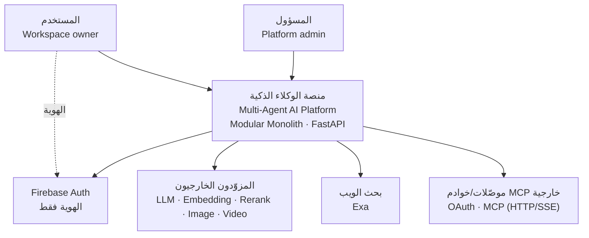
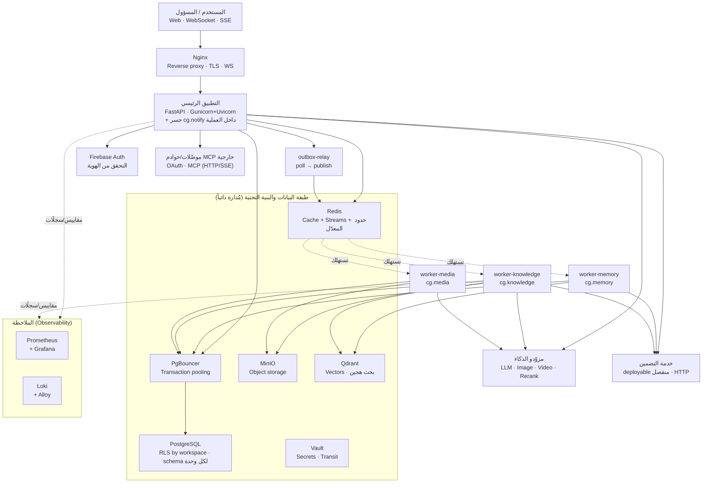
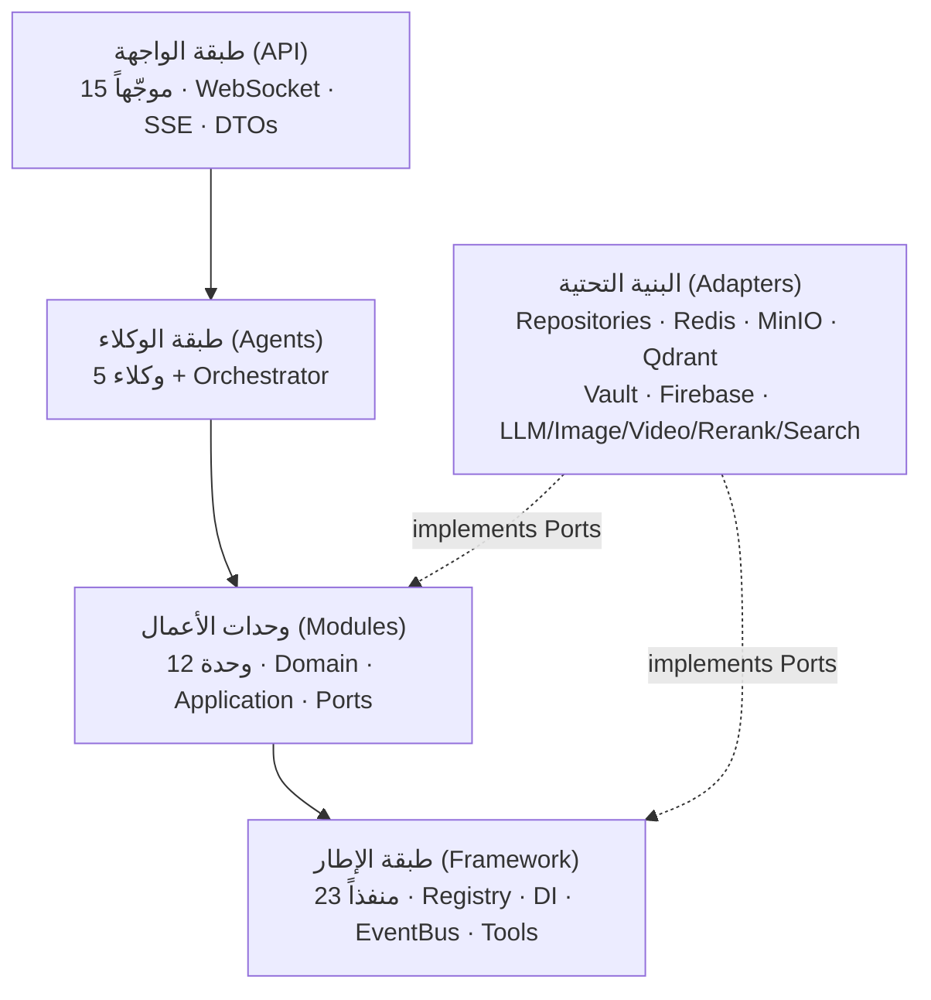
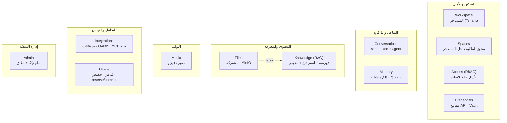
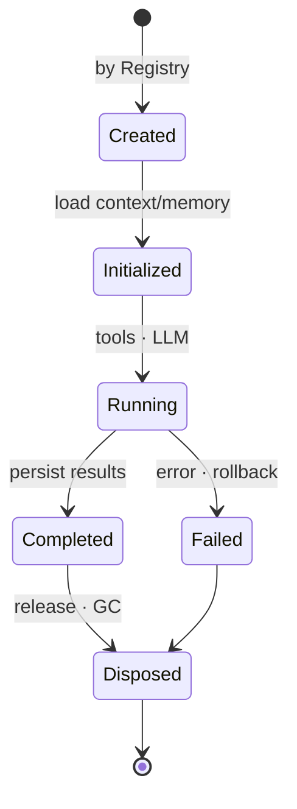
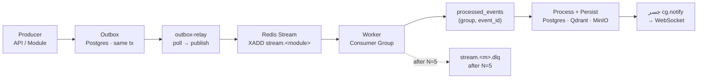
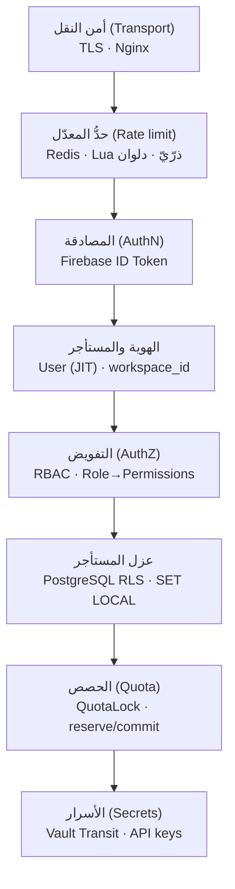
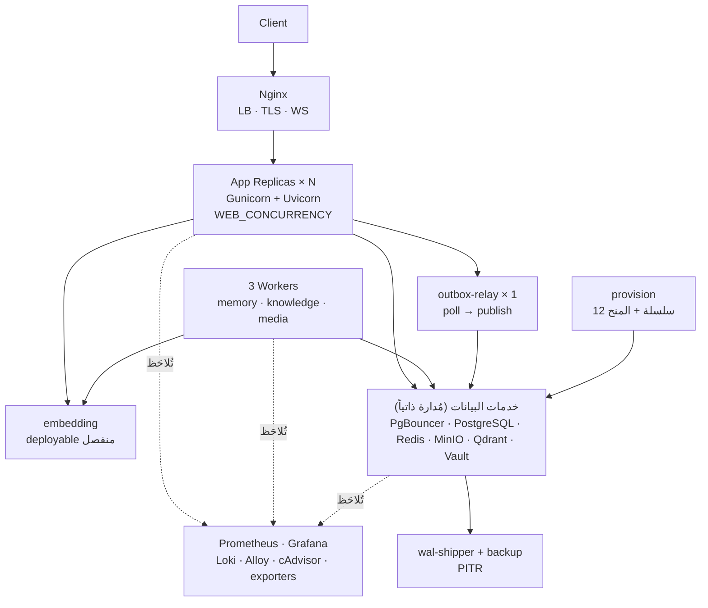

# منصة ذكاء اصطناعي متعددة الوكلاء — وثيقة المعمارية

> **Software Architecture Document · v2.0 — مطابَقة للشيفرة**
>
> مخطط معماري كامل لتطبيق Backend بلغة Python — مبني على
> **Modular Monolith** و**Hexagonal Architecture** و**Plugin System** و**Event‑Driven** للعمليات الثقيلة.

| | |
|---|---|
| **المكدّس** | FastAPI · Uvicorn · Gunicorn |
| **النمط** | Modular Monolith |
| **الأنماط** | Hexagonal · Plugin · Event‑Driven |
| **حالة التصميم** | ✅ معتمد — 15/15 مرحلة · 26 قراراً |
| **حالة البناء** | 🟡 مبنيّ ويعمل محلّيّاً — خطّة السعة قيد التنفيذ (الموجات 0→3) |
| **تاريخ الاعتماد** | 2026‑07‑08 |
| **آخر مطابقة للشيفرة** | **2026‑09‑06** · الفرع `capacity` |

> ⚠️ **ما تصفه هذه الوثيقة.** حتّى `v1.0` كانت هذه وثيقةَ **تصميمٍ معتمَد** — تصف ما اتُّفق على بنائه.
> و`v2.0` تصف **ما هو مبنيٌّ فعلاً في `src/`**: كلُّ عددٍ فيها مقروءٌ من الشجرة لا من الخطّة، وكلُّ
> فارقٍ بين التصميم والواقع مذكورٌ في موضعه لا مطموس. وما لم يُبنَ بعدُ مجموعٌ صراحةً في
> [§15](#15--ما-ليس-مبنيّاً-بعد). سجلُّ القرارات `D‑01…D‑26` يبقى كما اعتُمد — والانحرافُ عنه يُؤرَّخ
> تحته، لا فوقه.

---

## المحتويات

- [00 · نظرة عامة والمبادئ](#00--نظرة-عامة-والمبادئ)
- [01 · المكدّس التقني](#01--المكدّس-التقني)
- [02 · مراحل التصميم الخمس عشرة](#02--مراحل-التصميم-الخمس-عشرة)
- [03 · سياق النظام (C4 · L1)](#03--سياق-النظام-c4--l1)
- [04 · الحاويات وتدفق البيانات (C4 · L2)](#04--الحاويات-وتدفق-البيانات-c4--l2)
- [05 · البنية الطبقية](#05--البنية-الطبقية)
- [06 · وحدات الأعمال](#06--وحدات-الأعمال)
- [07 · الوكلاء ودورة الحياة](#07--الوكلاء-ودورة-الحياة)
- [08 · المنافذ والمحوّلات](#08--المنافذ-والمحوّلات)
- [09 · قواعد الاعتماد](#09--قواعد-الاعتماد)
- [10 · العمارة المدفوعة بالأحداث](#10--العمارة-المدفوعة-بالأحداث)
- [11 · معمارية الأمن](#11--معمارية-الأمن)
- [12 · معمارية النشر](#12--معمارية-النشر)
- [13 · سجل القرارات المعمارية (26 ADR)](#13--سجل-القرارات-المعمارية-26-adr)
- [14 · التحقق المعماري](#14--التحقق-المعماري)
- [15 · ما ليس مبنيّاً بعد](#15--ما-ليس-مبنيّاً-بعد)

---

## 00 · نظرة عامة والمبادئ

صُمّمت المنصة على يد فريق من **قائد معماري + 7 وكلاء متخصصين** (البنية الكلية، النواة، الوحدات،
الوكلاء، المنافذ، الأحداث، الأمن والنشر) عبر **15 مرحلة اعتماد متتابعة**. كل قرار معماري طُرح
واعتُمد صراحةً — لا افتراضات. الحصيلة **26 قراراً موثّقاً**.

**المبادئ الحاكمة:**

`SOLID` · `High Cohesion` · `Low Coupling` · `Separation of Concerns` · `Dependency Inversion`
· `Interface Segregation` · `Domain‑Driven Design` · **`Modular Monolith`** · **`Hexagonal`**
· **`Plugin Architecture`** · **`Event‑Driven`**

**والمبادئ مفروضةٌ آليّاً لا موصوفة:** ثمانيةُ عقودٍ في `.importlinter` تُشغَّل في CI ضمن
**البوّابات الخمس** (`ruff format --check` · `ruff check` · `mypy --strict` · `lint-imports` ·
`pytest`) — [§09](#09--قواعد-الاعتماد).

---

## 01 · المكدّس التقني

| المجال | التقنية | الحالة |
|---|---|---|
| `db` قاعدة البيانات | PostgreSQL | ✅ مبنيّ |
| `pool` تجميع الاتصالات | PgBouncer (Transaction pooling) | ✅ مبنيّ |
| `cache/bus` الكاش والناقل | Redis · Streams | ✅ مبنيّ |
| `object` تخزين الكائنات | MinIO | ✅ مبنيّ |
| `auth` الهوية | Firebase | ✅ مبنيّ |
| `edge` الحافة | Nginx (TLS · WS) | ✅ مبنيّ |
| `app` التطبيق | FastAPI · Uvicorn · Gunicorn | ✅ مبنيّ |
| `+vectors` مخزن المتجهات | **Qdrant** (بحث هجين) | ✅ مبنيّ |
| `+secrets` إدارة الأسرار | **HashiCorp Vault** (AppRole · Transit) | ✅ مبنيّ |

**وخدماتٌ أُضيفت بعد الاعتماد** — كلٌّ بسببها، ولا واحدةَ منها كانت في قائمة `v1.0`:

| المجال | التقنية | لماذا أُضيفت |
|---|---|---|
| `embed` خدمة التضمين | **deployable منفصل** (`services/embedding/`) | `torch`/`sentence-transformers` وزنٌ ثقيلٌ ونطاقُ GPU. تعيش في صورتها وحدَها ولا تدخل رسمَ استيراد `app.*` قطّ؛ التطبيقُ والعمّال يكلّمونها عبر HTTP كأيّ خدمةٍ داخليّة، فيُدفع تحميلُ النموذج **مرّةً** لا مرّةً لكلّ عملية |
| `search` البحث في الويب | **Exa** (`WebSearchProvider`) | أداةٌ للوكلاء عبر `ToolRegistry` — منفذٌ مُقادٌ كأيّ مزوّدٍ خارجيّ |
| `metrics` المقاييس | **Prometheus** + **Grafana** | الموجة 0 من خطّة السعة: RED والإشباع — إحدى عشرة عائلةَ مقاييس، وخمسُ قواعدِ تنبيه، ولوحةٌ بتسعةَ عشرَ لوحاً |
| `logs` السجلّات | **Loki** + **Alloy** | تجميعُ سجلٍّ مهيكلٍ واحدٍ قابلٍ للبحث بـ`correlation_id` عبر الحافّة والتطبيق والعامل |
| `probes` المجسّات | **cAdvisor** · `pgbouncer-exporter` · `redis-exporter` | إشباعُ المُجمِّع والكاش والحاويات — أرقامٌ لا يعرفها التطبيقُ عن نفسه |
| `load` توليد الحمل | **k6** (خلف `--profile load`) | خمسةُ سيناريوهاتٍ تجري معاً؛ لا تُقلع في التشغيل العاديّ |
| `ollama` نموذجٌ محلّيّ | **Ollama** (عبر `ollama-bridge`) | المسارُ العامل الوحيد للنماذج اليوم — [§15](#15--ما-ليس-مبنيّاً-بعد) |

> **ما تغيّر عن `v1.0`.** كانت الوثيقةُ تقول «لا خدمة أخرى خارج هذه القائمة»، وذلك **لم يعد صحيحاً**:
> منشورُ Compose اليوم **تسعٌ وعشرون خدمة**. لكنّ القيدَ الأصليَّ لم يُنقض بقدر ما تخصّص — فلا واحدةٌ
> من المضافات في مسار الطلب المتزامن: خدمةُ التضمين نداءُ HTTP داخليٌّ خلف منفذٍ قائم، والمراقبةُ
> **تُلاحِظ** ولا تُخدَم منها استجابة، وk6 خلف `profile` لا يُقلع أصلاً. القيدُ الحيُّ الآن أضيقُ وأدقّ:
> **لا تقنيةَ تدخل مسارَ الطلب إلّا خلف منفذٍ في `framework/ports/`**.

---

## 02 · مراحل التصميم الخمس عشرة

| # | المرحلة | # | المرحلة | # | المرحلة |
|---|---|---|---|---|---|
| 01 | مراجعة القرارات | 06 | Business Modules | 11 | Event‑Driven |
| 02 | System Context | 07 | Agents Design | 12 | Infrastructure |
| 03 | Container Diagram | 08 | Plugin Architecture | 13 | Security |
| 04 | Layered Architecture | 09 | Ports & Adapters | 14 | Deployment |
| 05 | Framework Design | 10 | Dependency Rules | 15 | Validation |

---

## 03 · سياق النظام (C4 · L1)

المنصة كنظام واحد يتفاعل معه **المستخدم** و**المسؤول**، ويعتمد على أنظمة خارجية:
**Firebase** للهوية، و**مزوّدي الذكاء**، و**محرّك بحثٍ في الويب**، و**موصّلات/خوادم MCP خارجية**
(OAuth · HTTP/SSE) عبر وحدة `integrations`. الهوية عبر Firebase؛ التفويض داخل التطبيق.

*Fig 1 — System Context (L1)*

---

## 04 · الحاويات وتدفق البيانات (C4 · L2)

التطبيق **Stateless** خلف Nginx (عدة نسخ Gunicorn+Uvicorn)، والعمّال **ثلاث عمليات منفصلة** تستهلك
Redis Streams، ومُرحّل Outbox عمليةٌ رابعة. التطبيق يَنشُر أحداث المهام الثقيلة ثم يردّ فوراً —
**لا اقتران مباشر بين التطبيق والعمّال**.

*Fig 2 — Container Diagram (L2)*

> **الإشعارُ يعيش داخل عملية الـAPI لا في عاملٍ خامس.** جسرُ `cg.notify` — الذي يترجم أحداثَ المجاري
> إلى رسائل WebSocket — مشترِكٌ داخل عمليّة الـAPI نفسها، لأنّ `ConnectionHub` سجلٌّ **داخلَ العملية**
> (الجلسةُ تعيش في عمليّةٍ واحدة). ولذلك ليست مجموعةً واحدةً بل **أسرةُ مجموعاتٍ لكلّ عملية**
> `cg.notify.<host>.<pid>` — [§10](#10--العمارة-المدفوعة-بالأحداث).

---

## 05 · البنية الطبقية

خمس طبقات، والاعتماد يتّجه دائماً **للداخل نحو النواة**. الـ Domain لا يعرف FastAPI ولا قاعدة
بيانات ولا أي Framework تقني. البنية التحتية محوّلات تُنفّذ المنافذ باتجاه الداخل.

*Fig 3 — Layered Architecture (🟣 Driving · 🟢 Core · ⚪ Kernel · 🟠 Driven)*

| الطبقة | المجلّد | الدور | تحتوي |
|---|---|---|---|
| **الواجهة (API)** | `src/app/api/` | محوّل قيادة | 15 موجّهاً `‎/api/v1`، WebSocket، SSE، DTO، تحقق Firebase، RBAC guards، وسائطُ الحدّ والمقاييس والتزامن — بلا منطق أعمال |
| **الوكلاء** | `src/app/agents/` | منسّق | BaseAgent، دورة الحياة، Orchestrator، استخدام Tools — ينسّق فقط |
| **الوحدات** | `src/app/modules/` | النواة | 12 وحدة: Domain (نقي) + Application (Use‑Cases) + Ports |
| **الإطار** | `src/app/framework/` | الكِرنل | PluginLoader، Registries، WorkflowEngine، EventBus، ToolRegistry، 23 منفذاً مشتركاً، ConnectionHub، Observability، Settings، Composition Root |
| **البنية التحتية** | `src/app/infrastructure/` | محوّل مُقاد | تنفيذ المنافذ فوق Postgres/Redis/MinIO/Qdrant/Vault/Firebase ومزوّدي الذكاء والبحث |

**وطبقتان تشغيليّتان خارج المكدّس الخمسـيّ** — لا تدخلان رسمَ الاعتماد لأنّ لا أحد يستوردهما:

| المجلّد | الدور |
|---|---|
| `src/app/workers/` | **ثلاثة عمّال + مُرحّل**: `memory_worker` · `knowledge_worker` · `media_worker` · `outbox_relay`. الصورة نفسُها، أمرٌ مختلف |
| `src/app/ops/` | **خمس عشرة نقطةَ دخولٍ تشغيليّة** — `provision` (الهجرات ثمّ المنح) · `backup` · `retention` · `purge` · `revoke` · `rotate_transit` · `dlq` · `healthcheck` · `online_ddl` · `payload_indexes` · `slow_queries` · `explain_hot_paths` · `table_growth` · `notify_groups` · `load_seed` |

> **`alembic upgrade head` ليس أمراً يملكه هذا المستودع.** المنصّةُ تُشغّل **اثنتَي عشرةَ سلسلةَ هجراتٍ
> مستقلّة** (‏`version_table_schema` لكلّ وحدة)، فـ`head` ملتبسٌ وAlembic يرفضه. الاستدعاءُ الحقيقيُّ
> `python -m app.ops.provision` — يُشغّل السلاسل بالترتيب ثمّ يُصدر المنحَ التي لا تُصدرها أيُّ هجرة.

---

## 06 · وحدات الأعمال

كل وحدة تتبع Hexagonal داخلياً (Domain / Application / Ports / Adapters) وتطبّق Repository Pattern.
**لا وحدة تستدعي أخرى مباشرة** — فقط عبر Inbound Port محقون أو Global Event.

*Fig 4 — Business Modules Map (**12** في v1)*

| # | الوحدة | schema | domain | ملاحظة |
|---|---|---|---|---|
| 1 | `workspace` | ✅ | ✅ | المستأجر — حدُّ الأمان الوحيد |
| 2 | **`spaces`** | ✅ | ✅ | **أُضيفت بعد الاعتماد** |
| 3 | `access` | ✅ | ✅ | RBAC |
| 4 | `credentials` | ✅ | ✅ | مفاتيح المزوّدين · Vault Transit |
| 5 | `conversations` | ✅ | ✅ | |
| 6 | `memory` | ✅ | ✅ | |
| 7 | `files` | ✅ | ✅ | |
| 8 | `knowledge` | ✅ | ✅ | سبعةُ منافذَ داخليّة — أكبرُ وحدة |
| 9 | `media` | ✅ | ✅ | |
| 10 | `integrations` | ✅ | ✅ | OAuth · MCP بعيد |
| 11 | `usage` | ✅ | ✅ | منافذُ واردة |
| 12 | **`admin`** | ✗ | ✗ | **أُضيفت بعد الاعتماد** |

> **`spaces` ليست مستأجراً، وهذا هو التصميم.** الفضاءُ **محورُ الملكية داخل** مساحة العمل: كلُّ ملفٍّ
> وكلُّ محادثةٍ ينتمي إلى واحدٍ بالضبط، وما يراه الحديثُ هو محتوى فضائه. لكنّ **مساحةَ العمل تبقى حدَّ
> الأمان الوحيد**: ‏RLS ما تزال على `app.workspace_id` وحدَه، والفضاءُ يُرشَّح عليه **في الاستعلام لا في
> سياسة**. والمُجمَّعُ رقيقٌ عمداً — لا آلةَ حالاتٍ ولا عدّادات: ما يجعل الفضاءَ مهمّاً تملكه وحداتٌ أخرى
> وتبلغه بالترشيح على مُعرِّفه.

> **`admin` وحدةٌ تطبيقيّةٌ بلا نطاقٍ ولا schema، وذلك مقصود.** إدارةُ المنصّة لا تملك كياناً خاصّاً
> بها — تقرأ وتتصرّف عبر أربعة منافذَ (`accounts` · `directory` · `providers` · `roles`) فوق ما تملكه
> الوحداتُ الأخرى. مُجمَّعٌ نطاقيٌّ لها كان سيخترع مِلكيّةً مزدوجةً لصفوفٍ لها مالكٌ بالفعل. ولذلك
> إحدى عشرةَ وحدةً لها `domain/` وschema، و`admin` ليست إحداها.

> **الوحداتُ الثلاثُ المحجوزة ما تزال محجوزة:** ‏`scheduling` · `sandbox` · `runs` — لا وجودَ لأيٍّ
> منها في `src/app/modules/`.

> **مِلكيّةُ الجداول صارت مفروضةً بـschema لكلّ وحدة** — وهي التوصيةُ الاستباقيّةُ الأولى من `§14`،
> نُفِّذت: اثنتا عشرةَ سلسلةَ هجراتٍ (إحدى عشرةَ وحدةً + `platform`)، لكلٍّ `version_table_schema`
> خاصّتُها.

---

## 07 · الوكلاء ودورة الحياة

كل Agent **Stateless**، يُنشأ لكل Request عبر `AgentRegistry`، يحمّل السياق والذاكرة والمحادثة،
ثم يُتلَف. المحادثات تتبع الوكيل بمفتاح `(workspace + agent)`، وللـ Workflow متعدّد الوكلاء
محادثته الخاصة.

*Fig 5 — Agent Lifecycle State Machine*

> **Plugin (D‑13):** إسقاط مجلد في `agents/` + `AgentMetadata` + وراثة `BaseAgent` → يكتشفه
> `PluginLoader` عبر importlib ويسجّله تلقائياً، بلا تعديل نواة، مع عزل الإضافة المعطوبة.

**الوكلاء المبنيّون — خمسةٌ ومُنسِّق** (لا «أمثلة»: هذه هي المجموعةُ القائمة في `src/app/agents/`):

| الوكيل | يحمل | |
|---|---|---|
| `rag_agent` | `prompts/` + `tools/` | الاسترجاع المُعزَّز |
| `data_analysis_agent` | `prompts/` + `tools/` | تحليل البيانات |
| `file_editing_agent` | `prompts/` + `tools/` | تحرير الملفّات |
| `image_agent` | manifest فقط | توليد الصور |
| `video_agent` | manifest فقط | توليد الفيديو |
| `orchestrator.py` | — | تنسيقُ متعدّدِ الوكلاء (ليس وكيلاً ولا إضافة) |

كلٌّ منهم منسّقٌ رفيعٌ يستدعي الوحدات عبر Ports ويستخدم Tools؛ العمليات الثقيلة تُحال إلى Streams.

---

## 08 · المنافذ والمحوّلات

المنافذ تُعرَّف في **Framework**، والمحوّلات في **Infrastructure**، والربط في **Composition Root**
عبر Manual DI (عكس الاعتماد). لا يستورد أحدٌ المحوّلات المحسوسة إلا Composition Root.

`src/app/framework/ports/` يحمل اليوم **23 وحدةَ منفذٍ** تعرّف **24 بروتوكولاً** — لا العشرةَ التي
وصفتها `v1.0`. والزيادةُ ليست تضخُّماً: كلُّ منفذٍ مضافٍ يُخرج تقنيةً كانت ستُستورد مباشرةً.

**منافذ مُقادة (Driven) — التقنيات الخارجية:**

| Port | Adapter(s) | Backing |
|---|---|---|
| `LLMProvider` | OpenAI · Gemini · Claude · Ollama · OpenRouter (أصلي لكل مزوّد) | خارجي |
| `EmbeddingProvider` | `ExternalEmbeddingProvider` → خدمة التضمين | HTTP داخلي |
| `RerankProvider` | `ExternalRerank` | خارجي |
| `ImageProvider` / `VideoProvider` | محوّلات توليد خارجية | خارجي |
| `WebSearchProvider` | `ExaWebSearch` | خارجي |
| `VectorStore` / `HybridVectorStore` | `QdrantAdapter` | Qdrant |
| `StorageProvider` | `MinIOAdapter` | MinIO |
| `CacheProvider` | `RedisCache` | Redis |
| `EventPublisher` | `RedisStreams` | Redis |
| `RateLimiter` | `RedisRateLimiter` (Lua ذرّيّ) | Redis |
| `WsConnectionRegistry` | `RedisConnectionRegistry` | Redis |
| `SecretsProvider` | `VaultSecrets` (Transit) | Vault |
| `VaultHealth` | مِجسٌّ يغلّف `SecretsProvider` نفسَه | Vault |
| `AuthProvider` | `FirebaseAuth` | Firebase |
| `ConnectorProvider` / `MCPClient` | موصّلات OAuth + عميل MCP بعيد (HTTP/SSE) | خارجي |
| `EventOutbox` | جدول Outbox | PostgreSQL |
| `IdempotencyStore` | `platform.processed_events` + سجلّ الطلبات | PostgreSQL |
| `QuotaLock` | قفلٌ استشاريٌّ لكلّ `(workspace, limit)` | PostgreSQL |
| `UnitOfWork` | معاملةٌ واحدةٌ تحت RLS | PostgreSQL |
| `MetricsSource` / `SystemStatsSource` | مصادرُ المقاييس وإحصاء النظام | محلّيّ |
| `Repository` (لكل Module) | SqlAlchemy Repositories | PostgreSQL |

**منافذ واردة (Inbound Ports):** خلافاً للمنافذ المُقادة أعلاه، تعرّف وحدة `usage` منفذَين **واردَين**
يستدعيهما المُنسِّق (طبقة الوكلاء): **فرض الحدّ** و**التقاط الاستهلاك** (متزامن، **بلا Redis Streams**)
— `FR‑131/132`.

> **`reserve`/`commit` لم يعد «قابلاً للتطوّر»، بل مبنيّ.** كانت `v1.0` تصف كائنَ قرارٍ *يمكن* أن يتطوّر
> إلى حجزٍ وشحن؛ وقد تطوّر فعلاً (خطوةُ السعة `2.7`): سقفُ الرموز يُحجَز قبل نداء النموذج ويُشحَن
> بالمقيس بعده، بجدول حجوزاتٍ تحت RLS. والسببُ قياسيٌّ لا نظريّ: بلا حجز، مئةُ طلبٍ متزامنٍ على
> مساحةٍ يتبقّى فيها رمزٌ واحدٌ كانت **تُقبل ستّةٌ وأربعون** منها — لأنّ لا أحدَ منها قد أنفق شيئاً وقتَ
> الفحص. وما فحصُه وكتابتُه متلاصقان (الملفّات مثلاً) كفاه `QuotaLock` بدل الحجز.

---

## 09 · قواعد الاعتماد

مفروضة آلياً عبر `import-linter` في CI (**D‑17**) — **ثمانيةُ عقود**، تُشغَّل ضمن البوّابات الخمس.

| الطبقة | تعتمد على | يُمنع استيراده |
|---|---|---|
| **API** | Agents · Modules · Framework | Infrastructure · Domain للمنطق |
| **Agents** | Modules(Ports) · Framework | Infrastructure · وكلاء آخرون · API |
| **Application** | Domain · Framework · Ports | أي Module آخر · Infrastructure · FastAPI |
| **Domain** | stdlib فقط | كل شيء تقني (FastAPI/SQLAlchemy/Redis/Qdrant/MinIO/hvac/Pydantic) |
| **Framework** | stdlib + تجريداته | API · Agents · Modules · Infrastructure |
| **Infrastructure** | Framework · Ports | — (لا يستوردها إلا Composition Root) |

**العقودُ الثمانية بالاسم:** الطبقاتُ الخمس · نقاءُ النطاق · حدودُ التطبيق · استقلالُ الوحدات ·
استقلالُ الوكلاء · الوكلاءُ بلا API/Infra · البنيةُ التحتيّة عبر Composition Root وحدَه · الكِرنلُ لا
يستورد الخارج.

> **واستثناءان مُوقَّعان، لا ثغرتان.** ‏`framework.di.composition_root` مسموحٌ له وحدَه أن يستورد
> `app.modules.**` و`app.agents.orchestrator` — لأنّ ربطَ المُحسوس بالمجرَّد **هو** عملُه، ولا سبيلَ
> إليه إلّا باستيراد ما فوقه. والاستثناءُ مكتوبٌ بأضيقِ ما يمكن: `agents.orchestrator` بعينه لا
> `app.agents.**`، فيبقى الوكيلُ **الإضافة** غيرَ قابلٍ للبلوغ إلّا عبر `importlib` وقتَ التشغيل
> (‏D‑13).

---

## 10 · العمارة المدفوعة بالأحداث

للعمليات الثقيلة فقط. نوعان: **Domain Events** (بالذاكرة، داخل الوحدة) و**Global Events**
(Redis Streams). النشر عبر **Transactional Outbox** لضمان عدم فقد الأحداث؛ التسليم
**at‑least‑once** مع مستهلكين **Idempotent** و**DLQ** بعد **N = 5** محاولات. المظروف **CloudEvents 1.0**.

*Fig 6 — Event-Driven Message Flow*

**الطوبولوجيا الفعليّة — أربعةُ مجارٍ، وثلاثُ مجموعاتٍ ساكنة:**

| المجرى | المنتِج | Consumer Group | العامل |
|---|---|---|---|
| `stream.knowledge` | knowledge | `cg.knowledge` | `knowledge_worker` |
| `stream.media` | media (API) | `cg.media` | `media_worker` |
| `stream.memory` | memory | `cg.memory` | `memory_worker` |
| `stream.files` | files | **— لا مستهلك** | — |
| `*` (فشل) | العامل | — | `stream.<m>.dlq` |

> **«مجرى لكل وحدة» لم تعد تصف الواقع، والفارقُ مقصود.** ‏`stream.files` **بلا مجموعةِ استهلاكٍ عمداً**
> منذ صارت الفهرسةُ يدويّة: كان إتمامُ الرفع أمراً بالفهرسة ولم يُسأل أحد، فصار التسجيلُ طلباً صريحاً.
> والحدثُ ما يزال يُنشَر لأنّه واقعةٌ صادقة، لكنّ **مجموعةً لا يقرؤها أحدٌ يتضخّم تأخّرُها إلى الأبد** —
> وتأخّرُ مجموعةٍ مهجورة هو بالضبط الإشارةُ التي يجب أن يثق بها المشغّل. فلا صفَّ لها في
> `STATIC_CONSUMER_TOPOLOGY`.

> **و`cg.notify` أسرةُ مجموعاتٍ لكلّ عملية، لا مجموعةٌ واحدة.** جسرُ الإشعارات يعيش داخل عمليّة الـAPI،
> و`ConnectionHub` سجلٌّ داخلَ العملية — فمجموعةٌ مشتركةٌ بين أشقّاء gunicorn كانت تُوزّع كلَّ حدثٍ على
> **نصفها فقط**، أي فقدُ نحو نصف الإشعارات صامتاً. فلكلّ عمليّةٍ `cg.notify.<host>.<pid>` تُنشئها عند
> الإقلاع وتُتلفها عند الإغلاق النظيف، واليتيمةُ تُكنَس عند إقلاعٍ تالٍ على المضيف نفسه
> (`app.ops.notify_groups`).

> **قياس الاستخدام خارج الناقل:** التقاط استهلاك وحدة `usage` **لا يمرّ عبر Redis Streams** (رغم
> كثافته) بل عبر **منفذ وارد متزامن** — صوناً لقصر الأحداث على العمليات الثقيلة فقط (`FR‑131` · D‑04).

---

## 11 · معمارية الأمن

Defense in Depth — كل طلب يعبر طبقات ضبط متتابعة. الهوية عبر Firebase (تحقق JWT محلي بمفاتيح
مُخزّنة)، والتفويض RBAC داخل التطبيق، وعزل المستأجرين عبر **RLS أصلية + ترشيح تطبيقي** (دفاع
بعمق)، والأسرار عبر Vault Transit.

*Fig 7 — Security Defense in Depth*

> **أسرار موحّدة (SEC‑07):** مفاتيح مزوّدي LLM (`credentials`) ورموز OAuth/أسرار الموصّلات
> (`integrations`) تُعمَّى جميعاً عبر **Vault Transit** بنمط ومفتاح ودورة تدوير موحّدين، بحدّ ملكية
> واضح ولا ازدواج تخزين للسرّ نفسه. والتدويرُ أداةٌ قائمة: `app.ops.rotate_transit`.

**وأدوارُ قاعدة البيانات ثمانية، وثامنُها وُلد من ضرورة.** ‏`aizzak_owner` يملك الجداول،
و`app_rw` يعمل تحت RLS — و**لا واحدَ منهما يستطيع أخذ نسخةٍ احتياطيّةٍ منطقيّة**: ‏`pg_dump` بدور
المالك يفشل على أوّل جدولٍ مستأجر، وبـ`--enable-row-security` **يخرج بصفرٍ ويكتب قاعدةً فارغة** —
نسخةٌ «ناجحة» لا شيءَ فيها. فدورٌ بـ`BYPASSRLS` للنسخ وحدَه، والأداةُ ترفض العمل بلا تلك السمة،
وكلُّ دُفعةٍ تُقرأ من جديد للتحقّق.

---

## 12 · معمارية النشر

**Docker Compose** — **تسعٌ وعشرون خدمة**، قابلةٌ للتوسّع الأفقي: Nginx يوازن على نسخ App
(Gunicorn+Uvicorn) بلا حالة، والعمّال الثلاثة ومُرحّل Outbox عملياتٌ مستقلة، وكلها تصل خدمات البيانات
عبر PgBouncer (Transaction pooling).

*Fig 8 — Deployment Topology*

**وثلاثةُ بنودٍ لم تكن في `v1.0`:**

- **الاسترجاعُ الزمنيّ (PITR) مبنيٌّ ومُقاس.** ‏`wal-shipper` يشحن المقاطع و`backup` يأخذ المرساةَ
  الماديّة (`pg_basebackup`) — لأنّ **دُفعةً منطقيّةً + رفَّ WAL لا يُنتج استرجاعاً زمنيّاً بحال**:
  المنطقيّةُ تُستعاد في عنقودٍ بمُعرِّفِ نظامٍ جديد، والمقطعُ المؤرشَفُ سجلٌّ ماديٌّ يرفضه أيُّ عنقودٍ
  سواه. والدُّفعةُ باقيةٌ لما لا تستطيعه الماديّة (إصدارٌ رئيسٌ مختلف · جدولٌ واحد · فسادٌ تنسخه
  الماديّةُ بأمانة). المُقاس: استرجاعٌ إلى لحظةٍ مختارة في **46.1 ثانية**.
- **التزويدُ خطوةُ نشرٍ لا هجرة.** كلُّ نسخةٍ تُشغّل `provision`، وذلك كان سباقاً حتّى `2.9`: واحدةٌ من
  كلّ ثلاثِ نسخٍ تفشل **في المنح** بـ`tuple concurrently updated` — على جملةٍ كانت وثيقتُها تصفها
  بأنّها «آمنةٌ في كلّ نشر». صار قفلُ جلسةٍ يغطّي الأطوارَ الثلاثة.
- **منشوران لا منشورٌ واحد.** Compose و**RunPod** يختلفان في القيود اختلافاً معماريّاً: RunPod
  **بلا مُجمِّعٍ أصلاً**، فسقفُ `WEB_CONCURRENCY` عليه **5** مقابل 14 على Compose. وما يصلح لأحدهما
  قد لا يبلغ الآخر — إعداداتُ الشبكة مقيَّدةٌ بفضاء الاسم، لا يبلغها سكربتُ مضيف.

---

## 13 · سجل القرارات المعمارية (26 ADR)

| # | القرار | الاختيار المعتمد |
|---|---|---|
| D‑01 | Vector Store | Qdrant (تشغيل ذاتي) |
| D‑02 | التوليد الإعلامي | منفذان: ImageProvider + VideoProvider |
| D‑03 | الأسرار | HashiCorp Vault + Transit |
| D‑04 | Multi‑Agent Workflow | متزامن للخفيف + Streams للثقيل |
| D‑05 | علاقة Agent↔Module | وكيل منسّق عبر Ports (N:M) |
| D‑06 | Memory & Conversations | Postgres (workspace+agent) + Qdrant |
| D‑07 | Tenant | المستأجر = Workspace |
| D‑08 | Tool System | أداة = محوّل فوق Ports + ToolRegistry مستقل |
| D‑09 | Workflow definition | ثابت بالكود + WorkflowRegistry |
| D‑10 | Streaming | WebSocket تفاعلي + SSE للردّ الواحد |
| D‑11 | Modules map | ~~10 وحدات~~ → **12 وحدة** (انظر أدناه) |
| D‑12 | Workflow conversation | محادثة خاصة بالـ Workflow |
| D‑13 | Plugin discovery | مسح مجلد + importlib |
| D‑14 | EmbeddingProvider | خارجي فقط |
| D‑15 | LLM adapters | أصلي لكل مزوّد |
| D‑16 | Provider routing | ProviderResolver بلا Fallback |
| D‑17 | فرض القواعد | import‑linter في CI (8 عقود) |
| D‑18 | نشر الأحداث | Transactional Outbox |
| D‑19 | دلالات التسليم | at‑least‑once + Idempotent + DLQ (N=5) |
| D‑20 | Streams topology | مجرى لكل وحدة + Consumer Groups |
| D‑21 | PgBouncer | Transaction pooling |
| D‑22 | Vault auth | AppRole |
| D‑23 | عزل المستأجرين | RLS أصلية + ترشيح تطبيقي |
| D‑24 | RBAC | Role → Permissions |
| D‑25 | التحقق من التوكن | JWT محلي بمفاتيح مُخزّنة |
| D‑26 | Orchestration | Docker Compose |

> **قرارات ما بعد الاعتماد (2026‑07‑10 · مطابقة للمتطلبات):** تُبنى على سجلّ `D‑01…D‑26` دون تغييره:
> - **ترقية `integrations` + `usage`** من محجوزتين إلى وحدتَي v1 (يُحدِّث D‑11).
> - **قياس `usage` خارج الناقل:** الالتقاط عبر **منفذ وارد متزامن** لا Redis Streams، والفرض عبر منفذ
>   يعيد **كائن قرار**.
> - **MCP بنقل بعيد (HTTP/SSE) حصراً** في v1؛ نقل stdio المحلي يتبع `sandbox` (ARC‑15).
> - **موصّلات مستهلَكة عبر Tool System** بكتالوج ديناميكي لكل Workspace؛ **تجديد OAuth كسول**.
> - **أسرار موحّدة** عبر Vault Transit للموضعين `credentials` + `integrations` (SEC‑07).

> **انحرافاتٌ مُنفَّذة عن السجلّ (2026‑09‑06) — ما بُني فخالف النصّ، وسببُه:**
> - **`D‑11` صار 12 وحدة:** ‏`spaces` (محورُ ملكيّةٍ داخل المستأجر، ليست مستأجراً) و`admin` (تطبيقيّةٌ
>   بلا نطاقٍ ولا schema). المحجوزُ **3** كما هو.
> - **`D‑20` لم يعد «مجرًى لكلّ وحدة» حرفيّاً:** أربعةُ مجارٍ، و`stream.files` **بلا مستهلكٍ عمداً** —
>   [§10](#10--العمارة-المدفوعة-بالأحداث).
> - **`D‑14` استقرّ على خدمةٍ داخليّة:** المزوّدُ «خارجيٌّ» عن `app.*` كما نصّ القرار، لكنّه اليوم
>   **deployable خاصٌّ بنا** — لإبقاء `torch` خارج رسم استيراد التطبيق.
> - **منفذان جديدان يستحقّان قراراً:** ‏`RerankProvider` (الترتيبُ الثاني في مسار RAG) و
>   `WebSearchProvider` (‏Exa) — أُضيفا كمنافذَ مُقادةٍ عاديّة تحت `D‑08`.
> - **`reserve`/`commit` نُفِّذ فعلاً** لسقوف `usage` (خطوة السعة `2.7`) — [§08](#08--المنافذ-والمحوّلات).
> - **دورٌ ثامنٌ بـ`BYPASSRLS`** للنسخ الاحتياطيّ وحدَه — [§11](#11--معمارية-الأمن).
> - **توصيةُ `§14` الأولى نُفِّذت:** schema لكلّ وحدة، اثنتا عشرةَ سلسلةَ هجرات.

---

## 14 · التحقق المعماري

مراجعة التصميم كاملاً: **6 مبادئ متوافقة تماماً**، وبندان بتوصية استباقية — بلا مخالفات حرجة.

| الفحص | الحالة | الفحص | الحالة |
|---|---|---|---|
| SOLID | ✅ متوافق | Hexagonal | ✅ متوافق |
| Low Coupling | ⚠️ توصية | Modular Monolith | ⚠️ توصية |
| No Circular | ✅ متوافق | Plugin | ✅ متوافق |
| Layers | ✅ متوافق | Event‑Driven | ✅ متوافق |

*Fig 9 — Architecture Validation Scorecard*

**التوصيات الاستباقية — وحالتُها اليوم:**

| التوصية | الحالة |
|---|---|
| **Schema لكل Module** داخل Postgres | ✅ **نُفِّذت** — 12 سلسلةَ هجرات، `version_table_schema` لكلّ وحدة |
| **إبقاء Framework نحيفاً** | 🟡 **قائمة** — الكِرنل نما إلى 23 منفذاً و`agent_runtime`/`tools`/`workflows`/`observability`. النموُّ في التجريدات لا في المنطق، والعقودُ الثمانية تحرسه — لكنّ الحراسةَ اتّجاهيّةٌ لا حجميّة |
| **Outbox Relay** نقطة فشل | 🟡 **قائمة** — ما تزال نسخةً واحدة؛ لا انتخابَ قائدٍ بعد |
| **ProviderResolver بلا Fallback (D‑16)** | 🟡 **قائمة** — المقايضةُ مُبقاة؛ والقرارُ `ق‑1` سيعيد فتحها |
| **نقاط توسعة Observability** | ✅ **استُهلكت** — `correlation_id` يعبر الحافّةَ والتطبيقَ والعامل في استعلامٍ واحد، و11 عائلةَ مقاييس، و5 قواعدِ تنبيه. **والخطوةُ وجدت أنّ المعرّفات لم تكن تُضبَط قطُّ قبلها** |

---

## 15 · ما ليس مبنيّاً بعد

هذا القسم موجودٌ لأنّ وثيقةً تصف التصميمَ وحدَه تُقرأ كأنّها تصف الواقع. الحالةُ الحيّةُ في
[`docs/capacity-status.md`](capacity-status.md)، والخطّةُ في [`docs/capacity-plan.md`](capacity-plan.md).

| البند | الأثر المعماريّ |
|---|---|
| **مفاتيح مزوّدي السحابة** | محوّلاتُ Gemini · Claude · OpenAI · OpenRouter **مكتوبةٌ ومُختبَرة** ومربوطةٌ في Composition Root — والحاجزُ المفاتيحُ والقرارُ `ق‑1` غيرُ الموقَّع. **Ollama المحلّيُّ هو المسار العامل**، وهو أيضاً سقفُ الأداء |
| **اعتماد `image:openai`** | عاملُ `media` يقلع ويستهلك، لكنّ تنفيذَ مهمّةِ صورةٍ يحتاج اعتماداً مخزَّناً؛ غيابُه **يُفشل المهمّة لا الإقلاع** |
| **خطُّ الأساس المُوثَّق** | البذرةُ والمولّدُ يعملان بحجمهما الكامل، وحدُّ الحافّة رُفع (صفرُ رفضٍ عند 300 طلب/ث). وما بقي **بِركةُ رموزِ Firebase حقيقيّة** — لا سبيلَ في المستودع لسكّها |
| **الوحدات المحجوزة الثلاث** | `scheduling` · `sandbox` · `runs` — غيرُ موجودة. و`sandbox` هو ما يحجب نقلَ MCP المحلّيّ (stdio) |
| **انتخابُ قائدٍ لمُرحّل Outbox** | نسخةٌ واحدةٌ ما تزال؛ توصيةُ `§14` قائمة |
| **الموجات 4–8 من خطّة السعة** | لم تبدأ. الطريقُ الحرج: `ق‑1` → الموجة 0 → 1 → 2 → 3 → بوّابةُ القبول |

> **وسقفُ `07-nfr-slo §3` ليس هدفَ اليوم.** الوثيقةُ تعلن 5,000 مستخدمٍ متزامنٍ و1,000 rps و10,000
> اتصالِ WS؛ وخطّةُ السعة **لا تستهدفه** — تستهدف **500 مستخدمٍ متزامن · 300 rps ذروةً · 1,500 اتصالَ
> WS · 200–400 مساحةَ عمل**، وتستهدفها بأرقامٍ قابلةٍ للقياس والرفض.

---

**منصة الوكلاء الذكية — وثيقة المعمارية v2.0 · مطابَقة للشيفرة**

`15 مرحلة · 26 قراراً · 12 وحدة · 23 منفذاً · 8 عقود · 0 مخالفة حرجة`

