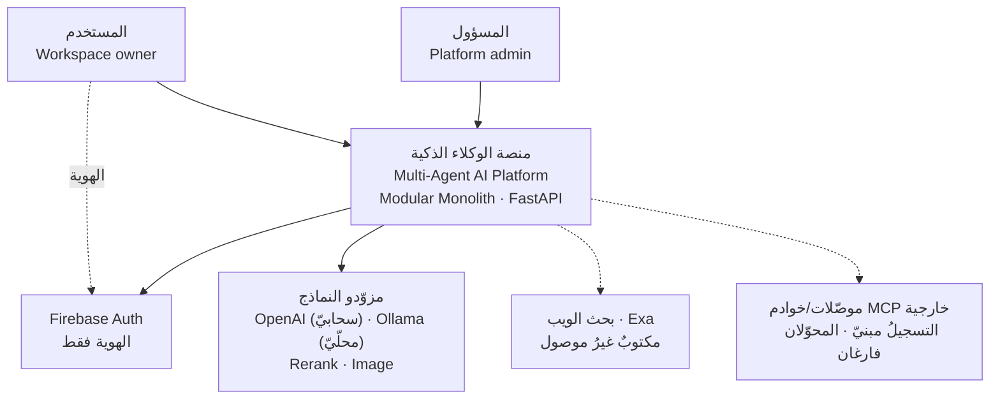
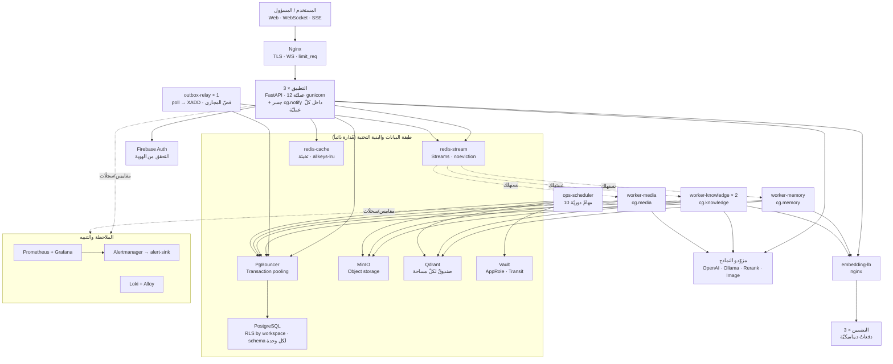
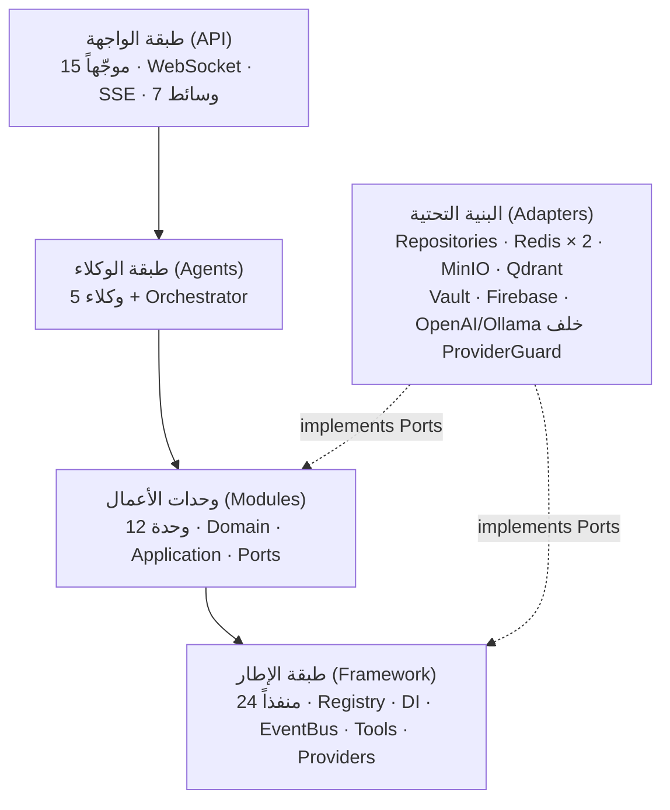
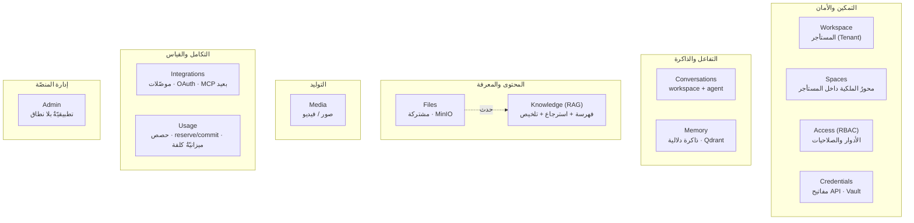
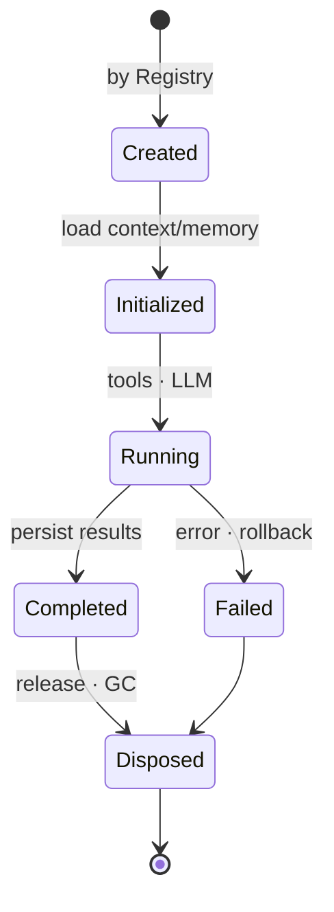
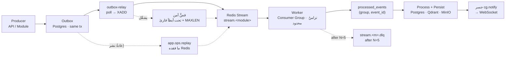
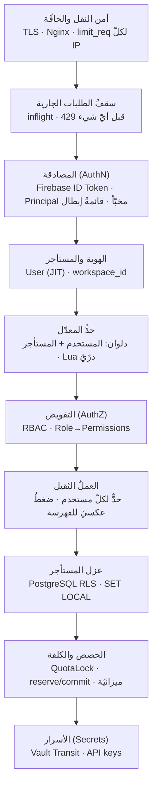
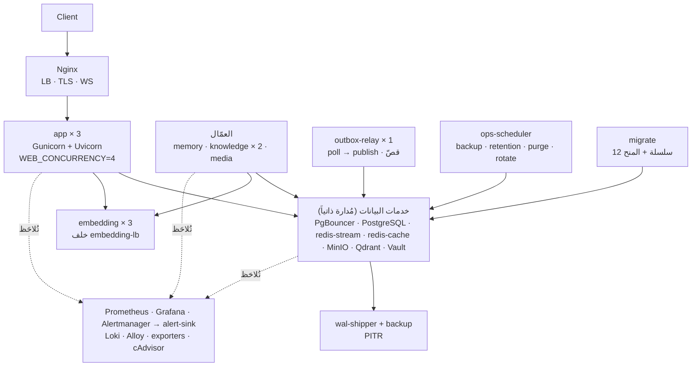

# منصة ذكاء اصطناعي متعددة الوكلاء — وثيقة المعمارية

> **Software Architecture Document · v2.1 — مطابَقة للشيفرة**
>
> مخطط معماري كامل لتطبيق Backend بلغة Python — مبني على
> **Modular Monolith** و**Hexagonal Architecture** و**Plugin System** و**Event‑Driven** للعمليات الثقيلة.

| | |
|---|---|
| **المكدّس** | FastAPI · Uvicorn · Gunicorn |
| **النمط** | Modular Monolith |
| **الأنماط** | Hexagonal · Plugin · Event‑Driven |
| **حالة التصميم** | ✅ معتمد — 15/15 مرحلة · 26 قراراً |
| **حالة البناء** | 🟡 مبنيّ ويعمل محلّيّاً — خطّة السعة: الموجات 1–3 تمّت · 4 مبنيّة · 5–7 جارية · 8 مؤجَّلة بقرار المالك |
| **تاريخ الاعتماد** | 2026‑07‑08 |
| **آخر مطابقة للشيفرة** | **2026‑10‑04** · الفرع `capacity` (بما فيه تعديلات `7.3` غير المُودَعة بعد) |

> ⚠️ **ما تصفه هذه الوثيقة.** حتّى `v1.0` كانت هذه وثيقةَ **تصميمٍ معتمَد** — تصف ما اتُّفق على بنائه.
> ومنذ `v2.0` تصف **ما هو مبنيٌّ فعلاً في `src/`**: كلُّ عددٍ فيها مقروءٌ من الشجرة لا من الخطّة، وكلُّ
> فارقٍ بين التصميم والواقع مذكورٌ في موضعه لا مطموس. وما لم يُبنَ بعدُ مجموعٌ صراحةً في
> [§15](#15--ما-ليس-مبنيّاً-بعد). سجلُّ القرارات `D‑01…D‑26` يبقى كما اعتُمد — والانحرافُ عنه يُؤرَّخ
> تحته، لا فوقه.

> **ما تغيّر منذ `v2.0` (2026‑09‑06):**
> - **35 خدمةً بدل 29:** ‏Redis انقسم مثيلَين (`5.2`)، والتضمينُ ثلاثُ نسخٍ خلف موازِن (`4.1`/`4.2`)، و`ops-scheduler`
>   يشغّل أدواتِ التشغيل وحدَه (`5.7`)، و`alertmanager` + `alert-sink` يوصلان التنبيهات (`7.3`).
> - **منفذٌ رابعٌ وعشرون:** ‏`TaskLedger` — كلُّ مهمّةٍ دوريّةٍ تقول متى نجحت آخرَ مرّة.
> - **طبقةُ المزوّدين صارت حقيقيّة:** حارسٌ لكلّ مزوّد (`6.1`)، وتحويلٌ من السحابيّ إلى المحلّيّ (`6.4`) — وهو انحرافٌ عن
>   `D‑16`، ‏وتسعيرٌ وميزانيّةُ كلفة لكلّ مساحة (`6.5`).
> - **المجاري:** تزامنٌ محدودٌ في المستهلك (`5.1`)، وقصٌّ آمن (`5.5`)، وإعادةُ نشرٍ من `outbox` (`5.6`)، وضغطٌ عكسيٌّ مُعلَن (`5.3`).
> - **الرصد:** 33 مقياساً، و23 قاعدةَ تنبيهٍ **تصل** (محلّيّاً)، ولكلٍّ إجراءٌ مكتوب.
> - **تصحيحاتٌ لِما قالته `v2.0` خطأً** — والشيفرةُ هي الحَكَم:
>   - قالت إنّ محوّلات **Gemini · Claude · OpenRouter** «مكتوبةٌ ومُختبَرة» — **ملفّاتُها فارغة (0 بايت)**، وكانت كذلك يومَها.
>   - و**موصّلاتُ OAuth وعميلُ MCP البعيد ومحوّلُ الفيديو** ملفّاتٌ فارغةٌ كذلك.
>   - و**Exa** محوّلٌ مكتوبٌ **غيرُ موصول** — لا يبنيه Composition Root بلا مفتاح.
>   - و**كتالوجُ الـWorkflows فارغ** — المحرّكُ والسجلُّ مبنيّان، ولا تعريفَ واحداً مسجَّلاً.

---

## المحتويات

- [00 · نظرة عامة والمبادئ](#00--نظرة-عامة-والمبادئ)
- [01 · المكدّس التقني](#01--المكدّس-التقني)
- [02 · مراحل التصميم الخمس عشرة](#02--مراحل-التصميم-الخمس-عشرة)
- [03 · سياق النظام (C4 · L1)](#03--سياق-النظام-c4--l1)
- [04 · الحاويات وتدفق البيانات (C4 · L2)](#04--الحاويات-وتدفق-البيانات-c4--l2)
- [05 · البنية الطبقية](#05--البنية-الطبقية)
- [06 · وحدات الأعمال](#06--وحدات-الأعمال)
- [07 · الوكلاء ودورة الحياة](#07--الوكلاء-ودورة-الحياة)
- [08 · المنافذ والمحوّلات](#08--المنافذ-والمحوّلات)
- [09 · قواعد الاعتماد](#09--قواعد-الاعتماد)
- [10 · العمارة المدفوعة بالأحداث](#10--العمارة-المدفوعة-بالأحداث)
- [11 · معمارية الأمن](#11--معمارية-الأمن)
- [12 · معمارية النشر](#12--معمارية-النشر)
- [13 · سجل القرارات المعمارية (26 ADR)](#13--سجل-القرارات-المعمارية-26-adr)
- [14 · التحقق المعماري](#14--التحقق-المعماري)
- [15 · ما ليس مبنيّاً بعد](#15--ما-ليس-مبنيّاً-بعد)

---

## 00 · نظرة عامة والمبادئ

صُمّمت المنصة على يد فريق من **قائد معماري + 7 وكلاء متخصصين** (البنية الكلية، النواة، الوحدات،
الوكلاء، المنافذ، الأحداث، الأمن والنشر) عبر **15 مرحلة اعتماد متتابعة**. كل قرار معماري طُرح
واعتُمد صراحةً — لا افتراضات. الحصيلة **26 قراراً موثّقاً**.

**المبادئ الحاكمة:**

`SOLID` · `High Cohesion` · `Low Coupling` · `Separation of Concerns` · `Dependency Inversion`
· `Interface Segregation` · `Domain‑Driven Design` · **`Modular Monolith`** · **`Hexagonal`**
· **`Plugin Architecture`** · **`Event‑Driven`**

**والمبادئ مفروضةٌ آليّاً لا موصوفة:** ثمانيةُ عقودٍ في `.importlinter` تُشغَّل في CI ضمن
**البوّابات الخمس** (`ruff format --check` · `ruff check` · `mypy --strict` · `lint-imports` ·
`pytest`) — [§09](#09--قواعد-الاعتماد). ومنذ `7.3` خطوةٌ سادسةٌ في الوظيفة نفسِها: قواعدُ التنبيه
تُختبَر بـ`promtool test rules` و`amtool check-config` (‏`deploy/prometheus/test-rules.sh`).

---

## 01 · المكدّس التقني

| المجال | التقنية | الحالة |
|---|---|---|
| `db` قاعدة البيانات | PostgreSQL | ✅ مبنيّ |
| `pool` تجميع الاتصالات | PgBouncer (Transaction pooling) | ✅ مبنيّ |
| `cache/bus` الكاش والناقل | **Redis × 2** — `redis-stream` (Streams · `noeviction` · AOF) و`redis-cache` (تخبئةٌ قابلةٌ للطرد · `allkeys-lru` · بلا حفظ) | ✅ مبنيّ — فُصل في `5.2` |
| `object` تخزين الكائنات | MinIO | ✅ مبنيّ |
| `auth` الهوية | Firebase | ✅ مبنيّ |
| `edge` الحافة | Nginx (TLS · WS · `limit_req` لكلّ IP) | ✅ مبنيّ |
| `app` التطبيق | FastAPI · Uvicorn · Gunicorn | ✅ مبنيّ |
| `+vectors` مخزن المتجهات | **Qdrant** (بحث هجين · صندوقٌ لكلّ مساحة عمل) | ✅ مبنيّ |
| `+secrets` إدارة الأسرار | **HashiCorp Vault** (AppRole · Transit) | ✅ مبنيّ |

**وخدماتٌ أُضيفت بعد الاعتماد** — كلٌّ بسببها، ولا واحدةَ منها كانت في قائمة `v1.0`:

| المجال | التقنية | لماذا أُضيفت |
|---|---|---|
| `embed` خدمة التضمين | **deployable منفصل** (`services/embedding/`) — **ثلاثُ نسخ خلف `embedding-lb`** (nginx) | `torch`/`sentence-transformers` وزنٌ ثقيل؛ تعيش في صورتها وحدَها ولا تدخل رسمَ استيراد `app.*`. ونسخٌ بلا موازِنٍ أمامها كانت **عطباً صامتاً** لا تحسيناً ناقصاً، فشُحنت `4.1` و`4.2` معاً. وداخلها **تجميعُ دفعاتٍ ديناميكيّ** (`EMB_BATCH_WINDOW_MS`، ‏`4.3`) |
| `search` البحث في الويب | **Exa** (`WebSearchProvider`) — ⚠️ **مكتوبٌ غيرُ موصول** | المحوّلُ موجود، لكنّ Composition Root لا يبنيه بلا مفتاح: حقلُ `web_search` في تبعيّات الوكيل `None`، والوكيلُ الذي يطلبه يفشل بـ500 نظيفٍ لا بجوابٍ خاطئٍ صامت |
| `metrics` المقاييس | **Prometheus** + **Grafana** | **33 مقياساً** باسمه في `src/app`، ولوحتان: السعة (**24 لوحاً في 6 صفوف**) والسجلّات |
| `alerts` التنبيه | **Alertmanager** + **`alert-sink`** | `7.3`: كانت القواعدُ تُقيَّم ولا تصل أحداً. صارت **23 قاعدة** تصل — **محلّيّاً فقط** بقرار المالك (2026‑10‑04) — ولكلٍّ قسمٌ في [`docs/runbooks/alerts.md`](runbooks/alerts.md) وحالتان في `promtool` (تُشعله وتُصمته) |
| `logs` السجلّات | **Loki** + **Alloy** | سجلٌّ مهيكلٌ واحدٌ قابلٌ للبحث بـ`correlation_id` عبر الحافّة والتطبيق والعامل |
| `probes` المجسّات | `pgbouncer-exporter` · `redis-stream-exporter` · `redis-cache-exporter` · **cAdvisor** (خلف `--profile container-metrics`) | إشباعُ المُجمِّع وخادمَي Redis والحاويات — أرقامٌ لا يعرفها التطبيقُ عن نفسه |
| `sched` المُجدوِل | **`ops-scheduler`** (الصورة نفسُها، `python -m app.ops.scheduler run`) | `5.7`: «مهمّةٌ مجدولةٌ تفشل صامتةً أسوأُ من غياب المهمّة». **عشرُ مهامّ دوريّة** تكتب نجاحَها في `TaskLedger`، وتنبيهان لمهمّةٍ متأخّرةٍ أو لم يُسلّحها أحد |
| `load` توليد الحمل | **k6** (خلف `--profile load`) | **سبعةُ سيناريوهات** في **ستّة ملفّاتِ حمل** (`peak` · `average` · `step` · `backlog` · `abuse` · `rag`) + `smoke.sh`؛ لا تُقلع في التشغيل العاديّ |
| `ollama` نموذجٌ محلّيّ | **Ollama** (عبر `ollama-bridge`) | المسارُ الافتراضيُّ المحلّيّ، **ومقصدُ التحويل** حين يتعذّر النموذجُ السحابيّ (`6.4`) |

> **ما تغيّر عن `v1.0`.** كانت الوثيقةُ تقول «لا خدمة أخرى خارج هذه القائمة»، وذلك **لم يعد صحيحاً**:
> منشورُ Compose اليوم **خمسٌ وثلاثون خدمة** — اثنتان وثلاثون تُقلع افتراضيّاً، وثلاثٌ خلف `profile`
> (`backup` · `cadvisor` · `k6`). لكنّ القيدَ الأصليَّ لم يُنقض بقدر ما تخصّص: ما دخل مسارَ الطلب
> (`redis-cache` · `embedding-lb`) دخله **خلف منفذٍ قائم** (`CacheProvider` · `EmbeddingProvider`)،
> والمراقبةُ والتنبيهُ **يُلاحِظان** ولا تُخدَم منهما استجابة. القيدُ الحيُّ أضيقُ وأدقّ:
> **لا تقنيةَ تدخل مسارَ الطلب إلّا خلف منفذٍ في `framework/ports/`**.

---

## 02 · مراحل التصميم الخمس عشرة

| # | المرحلة | # | المرحلة | # | المرحلة |
|---|---|---|---|---|---|
| 01 | مراجعة القرارات | 06 | Business Modules | 11 | Event‑Driven |
| 02 | System Context | 07 | Agents Design | 12 | Infrastructure |
| 03 | Container Diagram | 08 | Plugin Architecture | 13 | Security |
| 04 | Layered Architecture | 09 | Ports & Adapters | 14 | Deployment |
| 05 | Framework Design | 10 | Dependency Rules | 15 | Validation |

---

## 03 · سياق النظام (C4 · L1)

المنصة كنظام واحد يتفاعل معه **المستخدم** و**المسؤول**، ويعتمد على أنظمة خارجية:
**Firebase** للهوية، و**مزوّدي النماذج** (OpenAI سحابيّاً · Ollama محلّيّاً)، و**محرّك بحثٍ في الويب**
(غيرُ موصول)، و**موصّلات/خوادم MCP خارجية** (التسجيلُ مبنيّ، والنقلُ لا). الهوية عبر Firebase؛
التفويض داخل التطبيق.

*Fig 1 — System Context (L1) · المتقطّعُ = غيرُ عاملٍ اليوم*

---

## 04 · الحاويات وتدفق البيانات (C4 · L2)

التطبيق **Stateless** خلف Nginx — **ثلاثُ نسخٍ × `WEB_CONCURRENCY=4` = اثنتا عشرةَ عمليّة**. والعمّال
**ثلاث عمليات منفصلة** تستهلك Redis Streams (`worker-knowledge` بنسختَين)، ومُرحّل Outbox عمليةٌ رابعة،
و`ops-scheduler` خامسة. التطبيق يكتب حدثَ المهمّة الثقيلة في `outbox` **في معاملته نفسِها** ثم يردّ
فوراً — **لا اقتران مباشر بين التطبيق والعمّال**، ولا بين التطبيق والمُرحِّل.

*Fig 2 — Container Diagram (L2)*

> **الإشعارُ يعيش داخل عملية الـAPI لا في عاملٍ خامس.** جسرُ `cg.notify` — الذي يترجم أحداثَ المجاري
> إلى رسائل WebSocket — مشترِكٌ داخل عمليّة الـAPI نفسها، لأنّ `ConnectionHub` سجلٌّ **داخلَ العملية**
> (الجلسةُ تعيش في عمليّةٍ واحدة). ولذلك ليست مجموعةً واحدةً بل **أسرةُ مجموعاتٍ لكلّ عملية**
> `cg.notify.<host>.<pid>` — [§10](#10--العمارة-المدفوعة-بالأحداث). ولكلّ جلسةٍ قائمةُ انتظارٍ محدودة،
> فالمستهلكُ البطيءُ يُقطَع وحدَه ولا يوقف إشعاراتِ المستأجرين جميعاً (`3.6`).

> **Redis مثيلان، والاختيارُ بينهما قرارُ توصيلٍ في Composition Root لا في الإعداد** (`5.2` · `ق‑4`).
> ‏`REDIS_URL` (`redis-stream`، ‏`noeviction`) هو **الافتراضيُّ لكلّ شيء**: المجاري، وقائمةُ إبطال الجلسات،
> وحالةُ OAuth، وعدّاداتُ الإساءة — ولا شيءَ منها يجوز طردُه. و`CACHE_REDIS_URL` (`redis-cache`،
> ‏`allkeys-lru`) يُشار إليه من **مستدعيَين اثنين فقط**، وكلاهما قابلٌ لإعادة البناء من مصدر حقيقته: متّجهُ
> الاستعلام المخبّأ (`embed:v1:*`، ‏`4.3`) و`Principal` المخبّأ (`auth:principal:*`، ‏`1.1`). فالمستدعي
> الذي يُضاف لاحقاً بلا تفكيرٍ كافٍ يقع على المثيل **الآمن**.

---

## 05 · البنية الطبقية

خمس طبقات، والاعتماد يتّجه دائماً **للداخل نحو النواة**. الـ Domain لا يعرف FastAPI ولا قاعدة
بيانات ولا أي Framework تقني. البنية التحتية محوّلات تُنفّذ المنافذ باتجاه الداخل.

*Fig 3 — Layered Architecture (🟣 Driving · 🟢 Core · ⚪ Kernel · 🟠 Driven)*

| الطبقة | المجلّد | الدور | تحتوي |
|---|---|---|---|
| **الواجهة (API)** | `src/app/api/` | محوّل قيادة | 15 موجّهاً `‎/api/v1`، WebSocket، SSE، DTO — و**سبعُ وسائط**: سقفُ الطلبات الجارية (`inflight`) · مقاييسُ RED · المصادقة (+ `Principal` مخبّأ) · RBAC · حدُّ المعدّل بدلوَين · المهامُّ الثقيلة لكلّ مستخدم · **الضغطُ العكسيّ لطابور الفهرسة** (`5.3`) — بلا منطق أعمال |
| **الوكلاء** | `src/app/agents/` | منسّق | BaseAgent، دورة الحياة، Orchestrator (عدٌّ وتسعيرٌ وتحويلٌ حول كلّ نداء نموذج)، استخدام Tools — ينسّق فقط |
| **الوحدات** | `src/app/modules/` | النواة | 12 وحدة: Domain (نقي) + Application (Use‑Cases) + Ports |
| **الإطار** | `src/app/framework/` | الكِرنل | PluginLoader، Registries، WorkflowEngine، EventBus، ToolRegistry، **24 منفذاً مشتركاً**، ConnectionHub، Observability (+ كتالوج المهامّ الدوريّة)، **`providers/`** (Resolver · Fallback · Pricing · Catalog)، Settings، Composition Root |
| **البنية التحتية** | `src/app/infrastructure/` | محوّل مُقاد | تنفيذ المنافذ فوق Postgres/Redis/MinIO/Qdrant/Vault/Firebase ومزوّدي النماذج — ومنها `monitoring/` (‏`RedisTaskLedger` · `VaultProbe` · `SqlRedisMetricsSource`) و`messaging/stream_retention.py` |

**وطبقتان تشغيليّتان خارج المكدّس الخمسـيّ** — لا تدخلان رسمَ الاعتماد لأنّ لا أحد يستوردهما:

| المجلّد | الدور |
|---|---|
| `src/app/workers/` | **ثلاثة عمّال + مُرحّل**: `memory_worker` · `knowledge_worker` · `media_worker` · `outbox_relay` — ومعها `bootstrap` و`content_resolver` و`media_generation` و`summary_metering` (عدُّ التلخيص، `6.5`). الصورة نفسُها، أمرٌ مختلف |
| `src/app/ops/` | **ثلاثٌ وعشرون وحدة: إحدى وعشرون نقطةَ دخولٍ تشغيليّة** — `provision` (الهجرات ثمّ المنح) · `backup` · `retention` · `purge` · `revoke` · `rotate_transit` · `dlq` · `healthcheck` · `payload_indexes` · `slow_queries` · `explain_hot_paths` · `table_growth` · `notify_groups` · `load_seed` · 🆕 `scheduler` · `stream_trim` · `replay` · `embedding_migration` · `qdrant_capacity` · `notify_cost` · `mint_load_tokens` — **ومكتبتان** تستوردهما الأدوات: `online_ddl` و🆕 `role_guard` |

> **`alembic upgrade head` ليس أمراً يملكه هذا المستودع.** المنصّةُ تُشغّل **اثنتَي عشرةَ سلسلةَ هجراتٍ
> مستقلّة** (‏`version_table_schema` لكلّ وحدة)، فـ`head` ملتبسٌ وAlembic يرفضه. الاستدعاءُ الحقيقيُّ
> `python -m app.ops.provision` (خدمةُ `migrate`) — يُشغّل السلاسل بالترتيب ثمّ يُصدر المنحَ التي لا
> تُصدرها أيُّ هجرة.

---

## 06 · وحدات الأعمال

كل وحدة تتبع Hexagonal داخلياً (Domain / Application / Ports / Adapters) وتطبّق Repository Pattern.
**لا وحدة تستدعي أخرى مباشرة** — فقط عبر Inbound Port محقون أو Global Event.

*Fig 4 — Business Modules Map (**12** في v1)*

| # | الوحدة | schema | domain | منافذ | ملاحظة |
|---|---|---|---|---|---|
| 1 | `workspace` | ✅ | ✅ | 3 | المستأجر — حدُّ الأمان الوحيد |
| 2 | **`spaces`** | ✅ | ✅ | 2 | **أُضيفت بعد الاعتماد** |
| 3 | `access` | ✅ | ✅ | 2 | RBAC |
| 4 | `credentials` | ✅ | ✅ | 2 | مفاتيح المزوّدين · Vault Transit |
| 5 | `conversations` | ✅ | ✅ | 4 | |
| 6 | `memory` | ✅ | ✅ | 1 | |
| 7 | `files` | ✅ | ✅ | 3 | |
| 8 | `knowledge` | ✅ | ✅ | 7 | أكبرُ وحدة — صندوقُ Qdrant لكلّ مساحة (`ق‑3`)، بمراجعاتٍ واسمٍ مستعار (`4.5`) |
| 9 | `media` | ✅ | ✅ | 3 | |
| 10 | `integrations` | ✅ | ✅ | 3 | OAuth · MCP بعيد — المنطقُ والتسجيلُ موصولان، والمحوّلان فارغان ([§15](#15--ما-ليس-مبنيّاً-بعد)) |
| 11 | `usage` | ✅ | ✅ | 2 | منافذُ واردة · `reserve`/`commit` · **ميزانيّةُ كلفةٍ تعمل** (`6.5`) |
| 12 | **`admin`** | ✗ | ✗ | 4 | **أُضيفت بعد الاعتماد** |

> **`spaces` ليست مستأجراً، وهذا هو التصميم.** الفضاءُ **محورُ الملكية داخل** مساحة العمل: كلُّ ملفٍّ
> وكلُّ محادثةٍ ينتمي إلى واحدٍ بالضبط، وما يراه الحديثُ هو محتوى فضائه. لكنّ **مساحةَ العمل تبقى حدَّ
> الأمان الوحيد**: ‏RLS ما تزال على `app.workspace_id` وحدَه، والفضاءُ يُرشَّح عليه **في الاستعلام لا في
> سياسة**. والمُجمَّعُ رقيقٌ عمداً — لا آلةَ حالاتٍ ولا عدّادات: ما يجعل الفضاءَ مهمّاً تملكه وحداتٌ أخرى
> وتبلغه بالترشيح على مُعرِّفه.

> **`admin` وحدةٌ تطبيقيّةٌ بلا نطاقٍ ولا schema، وذلك مقصود.** إدارةُ المنصّة لا تملك كياناً خاصّاً
> بها — تقرأ وتتصرّف عبر أربعة منافذَ (`accounts` · `directory` · `providers` · `roles`) فوق ما تملكه
> الوحداتُ الأخرى. مُجمَّعٌ نطاقيٌّ لها كان سيخترع مِلكيّةً مزدوجةً لصفوفٍ لها مالكٌ بالفعل. ولذلك
> إحدى عشرةَ وحدةً لها `domain/` وschema، و`admin` ليست إحداها.

> **الوحداتُ الثلاثُ المحجوزة ما تزال محجوزة:** ‏`scheduling` · `sandbox` · `runs` — لا وجودَ لأيٍّ
> منها في `src/app/modules/`. و`ops-scheduler` **ليس** `scheduling`: الأوّلُ يشغّل أدواتِ تشغيلٍ للمنصّة،
> والثانيةُ وحدةُ أعمالٍ لمهامّ المستخدمين ولم تُبنَ.

> **مِلكيّةُ الجداول مفروضةٌ بـschema لكلّ وحدة** — وهي التوصيةُ الاستباقيّةُ الأولى من `§14`،
> نُفِّذت: اثنتا عشرةَ سلسلةَ هجراتٍ (إحدى عشرةَ وحدةً + `platform`)، لكلٍّ `version_table_schema`
> خاصّتُها.

---

## 07 · الوكلاء ودورة الحياة

كل Agent **Stateless**، يُنشأ لكل Request عبر `AgentRegistry`، يحمّل السياق والذاكرة والمحادثة،
ثم يُتلَف. المحادثات تتبع الوكيل بمفتاح `(workspace + agent)`، وللـ Workflow متعدّد الوكلاء
محادثته الخاصة.

*Fig 5 — Agent Lifecycle State Machine*

> **Plugin (D‑13):** إسقاط مجلد في `agents/` + `AgentMetadata` + وراثة `BaseAgent` → يكتشفه
> `PluginLoader` عبر importlib ويسجّله تلقائياً، بلا تعديل نواة، مع عزل الإضافة المعطوبة.

**الوكلاء المبنيّون — خمسةٌ ومُنسِّق** (لا «أمثلة»: هذه هي المجموعةُ القائمة في `src/app/agents/`):

| الوكيل | يحمل | | ملاحظة |
|---|---|---|---|
| `rag_agent` | `prompts/` + `tools/` | الاسترجاع المُعزَّز | يسترجع ويستشهد بمقاطع المساحة الحقيقيّة |
| `data_analysis_agent` | `prompts/` + `tools/` | تحليل البيانات | |
| `file_editing_agent` | `prompts/` + `tools/` | تحرير الملفّات | |
| `image_agent` | manifest فقط | توليد الصور | عبر `OpenAIImage` |
| `video_agent` | manifest فقط | توليد الفيديو | ⚠️ لا محوّلَ لـ`VideoProvider` — الملفُّ فارغ |
| `orchestrator.py` | — | تنسيقُ متعدّدِ الوكلاء | ليس وكيلاً ولا إضافة |

كلٌّ منهم منسّقٌ رفيعٌ يستدعي الوحدات عبر Ports ويستخدم Tools؛ العمليات الثقيلة تُحال إلى Streams.

> **المُنسِّق صار يحيط كلَّ نداء نموذجٍ بثلاث طبقات** (الموجة 6):
> **العدّ** (`_MeteredLLM` — الاستهلاكُ يُلتقط متزامناً عبر منفذ `usage` الوارد)، و**التسعير** (`_BilledRoute`
> — لكلّ نموذجٍ سحابيٍّ سعرٌ في `LLM_PRICES`، فكلُّ دورٍ يُشحَن بكلفته الحقيقيّة بدل الصفر)، و**التحويل**
> (`LlmFallback` — دورٌ تعذّر نموذجُه السحابيُّ **قبل أوّل مقطع** يُجيبه النموذجُ المحلّيّ ويُخبَر المستخدم).
> والميزانيّةُ تُفحَص **قبل** بدء المحادثة، والنافدةُ توقف محادثاتِ المساحة كلَّها، **المحلّيّةَ أيضاً** (قرار المالك).

> **محرّكُ الـWorkflows وسجلُّه موصولان، والكتالوجُ فارغ — وهذه نتيجةٌ لا عنصرٌ نائب.**
> ‏`framework/workflows/definitions/` لا يحمل إلّا ملفّاتٍ فارغة، فلا تعريفَ مسجَّلاً. والمثالُ الوحيدُ في
> التصميم (`rag → data_analysis → image → video → file_editing`) **لا يتسلسل** على الوكلاء كما بُنوا:
> ‏`rag_agent` يُخرج `{text, citations}` و`data_analysis_agent` يطلب `file_id` لا تُنتجه خطوةٌ سابقة.

---

## 08 · المنافذ والمحوّلات

المنافذ تُعرَّف في **Framework**، والمحوّلات في **Infrastructure**، والربط في **Composition Root**
عبر Manual DI (عكس الاعتماد). لا يستورد أحدٌ المحوّلات المحسوسة إلا Composition Root.

`src/app/framework/ports/` يحمل اليوم **24 وحدةَ منفذٍ** تعرّف **25 بروتوكولاً** — لا العشرةَ التي
وصفتها `v1.0`. والزيادةُ ليست تضخُّماً: كلُّ منفذٍ مضافٍ يُخرج تقنيةً كانت ستُستورد مباشرةً.
**وأسماءُ المحوّلات أدناه هي أسماءُ الأصناف في الشيفرة** (`v2.0` كانت تكتب أسماءً وصفيّة).

**منافذ مُقادة (Driven) — التقنيات الخارجية:**

| Port | Adapter(s) | Backing |
|---|---|---|
| `LLMProvider` | `OpenAILLM` · `OllamaLLM` — كلٌّ ملفوفٌ بـ`GuardedLLM` (`ProviderGuard`). ‏⚠️ Claude · Gemini · OpenRouter: **ملفّاتٌ فارغة** | خارجي / محلّي |
| `EmbeddingProvider` | `ExternalEmbeddingProvider` → `embedding-lb` → ثلاث نسخ؛ ويلفّه `CachingEmbeddingProvider` على `redis-cache` | HTTP داخلي |
| `RerankProvider` | `ExternalRerankProvider` | HTTP |
| `ImageProvider` | `OpenAIImage` | خارجي |
| `VideoProvider` | ⚠️ — **ملفٌّ فارغ** | — |
| `WebSearchProvider` | `ExaWebSearchAdapter` — ⚠️ **مكتوبٌ غيرُ موصول** | خارجي |
| `VectorStore` / `HybridVectorStore` | `QdrantVectorStore` (صندوقٌ لكلّ مساحة · مراجعاتٌ واسمٌ مستعار) | Qdrant |
| `StorageProvider` | `MinioStorage` | MinIO |
| `CacheProvider` | `RedisCache` × 2 — **المحفوظ** (الافتراضيّ، `redis-stream`) و**القابلُ للطرد** (`redis-cache`) | Redis |
| `EventPublisher` | `RedisStreamsPublisher` | Redis |
| `RateLimiter` | `RedisRateLimiter` (Lua ذرّيّ · دلوان في نداءٍ واحد) | Redis |
| `WsConnectionRegistry` | `RedisWsConnectionRegistry` | Redis |
| 🆕 `TaskLedger` | `RedisTaskLedger` — سجلٌّ لكلّ **مهمّة** لا مقياسٌ لكلّ عمليّة | Redis |
| `SecretsProvider` | `VaultSecrets` (Transit) | Vault |
| `VaultHealth` | `VaultProbe` | Vault |
| `AuthProvider` | `FirebaseAuth` | Firebase |
| `ConnectorProvider` / `MCPClient` | ⚠️ — **ملفّان فارغان**؛ التسجيلُ والإدراجُ والتعطيلُ موصولة | — |
| `EventOutbox` | `SqlEventOutbox` | PostgreSQL |
| `IdempotencyStore` | `SqlIdempotencyStore` (ومعه `SqlProcessedEventLedger` للمستهلكين) | PostgreSQL |
| `QuotaLock` | `AdvisoryQuotaLock` — قفلٌ استشاريٌّ لكلّ `(workspace, limit)` | PostgreSQL |
| `UnitOfWork` | `TenantSessionFactory.begin` — معاملةٌ واحدةٌ تحت RLS يلتحق بها كلُّ مستودعٍ والـOutbox | PostgreSQL |
| `MetricsSource` / `SystemStatsSource` | `SqlRedisMetricsSource` · `HostSystemStats` | Postgres · Redis · المضيف |
| `Repository` (لكل Module) | SqlAlchemy Repositories | PostgreSQL |

**منافذ واردة (Inbound Ports):** خلافاً للمنافذ المُقادة أعلاه، تعرّف وحدة `usage` منفذَين **واردَين**
يستدعيهما المُنسِّق (طبقة الوكلاء): **فرض الحدّ** و**التقاط الاستهلاك** (متزامن، **بلا Redis Streams**)
— `FR‑131/132`.

> **`ProviderGuard` — ثلاثةُ أشياء لكلّ مزوّد، لكلّ عمليّة، ولا شيءَ غيرها** (`6.1` · `ق‑6`):
> **سقفُ تزامنٍ يرفض بدل أن يصطفّ** (Ollama 2، والسحابيُّ 5 — والزائدُ `429` فوراً بـ`Retry-After`)،
> و**قاطعُ دارة** بعد إخفاقاتٍ عابرةٍ متتالية (`502` فوراً بدل انتظار المهلة أمام مزوّدٍ معروفٍ أنّه ساقط)،
> و**إعادةٌ للإخفاقات الرخيصة وحدَها** قبل أوّل مقطع. «لكلّ عمليّة» مقصود: اثنتا عشرةَ عمليّةً تتعلّم في خمسة
> نداءاتٍ أنّ المزوّدَ ساقط أرخصُ من رحلةٍ إلى Redis في كلّ نداء.

> **وفي `framework/providers/` بروتوكولان ليسا في `ports/` عمداً:** ‏`LlmFallback` و`LlmPricing`. لا يسألهما
> إلّا المُنسِّق، وينفّذهما الكائنُ نفسُه الذي يقرأ جدولَ التوجيه — فلا يستطيع مسارُ التحويل أن يسمّي مساراً
> لا يعرفه الـResolver. والإقلاعُ **يرفض** جدولاً فيه مسارٌ سحابيٌّ بلا سعر، أو مسارُ تحويلٍ يحتاج اعتماداً.

> **`reserve`/`commit` مبنيّ، وصار يحمل الكلفةَ لا الرموزَ وحدَها.** سقفُ الرموز يُحجَز قبل نداء النموذج
> ويُشحَن بالمقيس بعده (`2.7`) — بلا حجز، مئةُ طلبٍ متزامنٍ على مساحةٍ يتبقّى فيها رمزٌ واحدٌ كانت **تُقبل
> ستّةٌ وأربعون** منها. وحتّى `6.5` كان كلُّ شحنٍ يحمل `cost_micros = 0` فلا تعضّ ميزانيّةُ الكلفة أبداً؛ صار
> السعرُ بالدولار لكلّ مليون رمز — وهو بالضبط ميكرو‑دولار لكلّ رمز — بـ`Decimal` لا `float`، **والتلخيصُ
> صار يُعَدّ** ويُرفض قبل أوّل نداءٍ إن نفدت الميزانيّة.

---

## 09 · قواعد الاعتماد

مفروضة آلياً عبر `import-linter` في CI (**D‑17**) — **ثمانيةُ عقود**، تُشغَّل ضمن البوّابات الخمس.

| الطبقة | تعتمد على | يُمنع استيراده |
|---|---|---|
| **API** | Agents · Modules · Framework | Infrastructure · Domain للمنطق |
| **Agents** | Modules(Ports) · Framework | Infrastructure · وكلاء آخرون · API |
| **Application** | Domain · Framework · Ports | أي Module آخر · Infrastructure · FastAPI |
| **Domain** | stdlib فقط | كل شيء تقني (FastAPI/SQLAlchemy/Redis/Qdrant/MinIO/hvac/Pydantic) |
| **Framework** | stdlib + تجريداته | API · Agents · Modules · Infrastructure |
| **Infrastructure** | Framework · Ports | — (لا يستوردها إلا Composition Root) |

**العقودُ الثمانية بالاسم:** الطبقاتُ الخمس · نقاءُ النطاق · حدودُ التطبيق · استقلالُ الوحدات ·
استقلالُ الوكلاء · الوكلاءُ بلا API/Infra · البنيةُ التحتيّة عبر Composition Root وحدَه · الكِرنلُ لا
يستورد الخارج.

> **واستثناءان مُوقَّعان، لا ثغرتان.** ‏`framework.di.composition_root` مسموحٌ له وحدَه أن يستورد
> `app.modules.**` و`app.agents.orchestrator` — لأنّ ربطَ المُحسوس بالمجرَّد **هو** عملُه، ولا سبيلَ
> إليه إلّا باستيراد ما فوقه. والاستثناءُ مكتوبٌ بأضيقِ ما يمكن: `agents.orchestrator` بعينه لا
> `app.agents.**`، فيبقى الوكيلُ **الإضافة** غيرَ قابلٍ للبلوغ إلّا عبر `importlib` وقتَ التشغيل
> (‏D‑13).

---

## 10 · العمارة المدفوعة بالأحداث

للعمليات الثقيلة فقط. نوعان: **Domain Events** (بالذاكرة، داخل الوحدة) و**Global Events**
(Redis Streams). النشر عبر **Transactional Outbox** لضمان عدم فقد الأحداث؛ التسليم
**at‑least‑once** مع مستهلكين **Idempotent** و**DLQ** بعد **N = 5** محاولات. المظروف **CloudEvents 1.0**.

*Fig 6 — Event-Driven Message Flow*

**الطوبولوجيا الفعليّة — أربعةُ مجارٍ، وثلاثُ مجموعاتٍ ساكنة:**

| المجرى | المنتِج | Consumer Group | العامل |
|---|---|---|---|
| `stream.knowledge` | knowledge | `cg.knowledge` | `knowledge_worker` (× 2) |
| `stream.media` | media (API) | `cg.media` | `media_worker` |
| `stream.memory` | memory | `cg.memory` | `memory_worker` |
| `stream.files` | files | **— لا مستهلك** | — |
| `*` (فشل) | العامل | — | `stream.<m>.dlq` |

**وما أضافته الموجة 5 على هذا الخطّ:**

| الخطوة | ما بُني | أين |
|---|---|---|
| `5.1` | **تزامنٌ محدودٌ** في محرّك الاستهلاك — عدّةُ معالِجاتٍ في الطيران لكلّ عمليّة، ومسبحُ العامل مشتقٌّ منه (التزامن + 1) لا مكتوبٌ مرّتين | `infrastructure/messaging/consumers/engine.py` |
| `5.3` | **ضغطٌ عكسيٌّ مُعلَن**: حين يتجاوز انتظارُ أقدم مدخلٍ في `cg.knowledge` ‏120 ث، يُجاب الرفعُ الجديد `429` بـ`Retry-After` بدل `202` لعملٍ تعرف المنصّةُ أنّها لن تؤدّيه في ميزانيّتها | `api/middleware/queue_backpressure.py` |
| `5.5` | **قصٌّ آمن**: كلُّ مجرى يُقصّ **تحت أبطأ قارئٍ له**، و`MAXLEN` حدٌّ احتياطيٌّ لا سياسة — يشغّله المُرحِّل ويقرؤه `/metrics` | `infrastructure/messaging/stream_retention.py` |
| `5.6` | **إعادةُ نشرٍ من `platform.outbox`**: ما فقده Redis يُعاد، وما لا يستطيع السجلُّ ضمانَه لا يُعاد — مُقاسٌ حيّاً: عشرةٌ من عشرة بلا أثرٍ مزدوج | `ops/replay.py` |
| `5.7` | **مراقبةُ الـDLQ مهمّةٌ دوريّة** لكلّ مجرى، تكتب نجاحَها في `TaskLedger` كسائر المهامّ | `framework/observability/scheduled_tasks.py` |

> **«مجرى لكل وحدة» لم تعد تصف الواقع، والفارقُ مقصود.** ‏`stream.files` **بلا مجموعةِ استهلاكٍ عمداً**
> منذ صارت الفهرسةُ يدويّة: كان إتمامُ الرفع أمراً بالفهرسة ولم يُسأل أحد، فصار التسجيلُ طلباً صريحاً.
> والحدثُ ما يزال يُنشَر لأنّه واقعةٌ صادقة، لكنّ **مجموعةً لا يقرؤها أحدٌ يتضخّم تأخّرُها إلى الأبد** —
> وتأخّرُ مجموعةٍ مهجورة هو بالضبط الإشارةُ التي يجب أن يثق بها المشغّل. فلا صفَّ لها في
> `STATIC_CONSUMER_TOPOLOGY`.

> **و`cg.notify` أسرةُ مجموعاتٍ لكلّ عملية، لا مجموعةٌ واحدة.** جسرُ الإشعارات يعيش داخل عمليّة الـAPI،
> و`ConnectionHub` سجلٌّ داخلَ العملية — فمجموعةٌ مشتركةٌ بين أشقّاء gunicorn كانت تُوزّع كلَّ حدثٍ على
> **نصفها فقط**، أي فقدُ نحو نصف الإشعارات صامتاً. فلكلّ عمليّةٍ `cg.notify.<host>.<pid>` تُنشئها عند
> الإقلاع وتُتلفها عند الإغلاق النظيف، واليتيمةُ تُكنَس دوريّاً (`notify_groups`، مهمّةٌ في `TaskLedger`).

> **والمُرحِّلُ يُنشئ المجموعاتِ قبل أوّل `XADD`.** ‏`ensure_topology()` تمرّ على `STATIC_CONSUMER_TOPOLOGY`
> قبل أن يبدأ النشر — فلا مسارَ إقلاعٍ يُنشئ مجموعةً **بعد** مدخلاتٍ لن تراها أبداً، ولم يعد العاملُ
> يحتاج أن يسبق المُرحِّل.

> **قياس الاستخدام خارج الناقل:** التقاط استهلاك وحدة `usage` **لا يمرّ عبر Redis Streams** (رغم
> كثافته) بل عبر **منفذ وارد متزامن** — صوناً لقصر الأحداث على العمليات الثقيلة فقط (`FR‑131` · D‑04).

---

## 11 · معمارية الأمن

Defense in Depth — كل طلب يعبر طبقات ضبط متتابعة. الهوية عبر Firebase (تحقق JWT محلي بمفاتيح
مُخزّنة)، والتفويض RBAC داخل التطبيق، وعزل المستأجرين عبر **RLS أصلية + ترشيح تطبيقي** (دفاع
بعمق)، والأسرار عبر Vault Transit. **والترتيبُ أدناه هو ترتيبُ الشيفرة** — `v2.0` كانت تضع حدَّ المعدّل
قبل المصادقة، وهو بعدها: سقفٌ لكلّ مستخدمٍ لا يُطبَّق قبل معرفة المستخدم.

*Fig 7 — Security Defense in Depth*

> **دلوان لا دلوٌ واحد — والثاني هو المقصود** (`1.2`). سقفٌ لكلّ مستخدمٍ لا يعزل أحداً على منصّةٍ متعدّدة
> المستأجرين: مساحةٌ بخمسين مستخدماً تبلغ 6,000 طلبٍ/دقيقة وكلُّ واحدٍ داخل حدّه. فالسقفُ المستأجريُّ هو ما
> يحوّل «العدلَ بين المستأجرين» من نيّةٍ إلى شيءٍ يستطيع اختبارٌ أن يُسقطه — والدلوان يُستهلكان في نداءٍ ذرّيٍّ
> واحد، كلّاً أو لا شيء. وقيس: مستأجرٌ عند 6,000 طلبٍ/دقيقة لم يرفع p95 جيرانه.

> **أسرار موحّدة (SEC‑07):** مفاتيح مزوّدي LLM (`credentials`) ورموز OAuth/أسرار الموصّلات
> (`integrations`) تُعمَّى جميعاً عبر **Vault Transit** بنمط ومفتاح ودورة تدوير موحّدين، بحدّ ملكية
> واضح ولا ازدواج تخزين للسرّ نفسه. والتدويرُ مهمّةٌ دوريّةٌ الآن: `rotate_transit` في `ops-scheduler`.

**وأدوارُ قاعدة البيانات ثمانية، وثامنُها وُلد من ضرورة.** ‏`aizzak_owner` يملك الجداول،
و`app_rw` يعمل تحت RLS، و`outbox_relay` · `retention_sweeper` · `metrics_reader` · `transit_rotator` ·
`workspace_purger` لكلٍّ عملُه — و**لا واحدَ منها يستطيع أخذ نسخةٍ احتياطيّةٍ منطقيّة**: ‏`pg_dump` بدور
المالك يفشل على أوّل جدولٍ مستأجر، وبـ`--enable-row-security` **يخرج بصفرٍ ويكتب قاعدةً فارغة** —
نسخةٌ «ناجحة» لا شيءَ فيها. فـ`backup_operator` بـ`BYPASSRLS` للنسخ وحدَه، والأداةُ ترفض العمل بلا تلك
السمة، وكلُّ دُفعةٍ تُقرأ من جديد للتحقّق.

> **🆕 والمسحُ العابرُ للمستأجرين لا يعمل إلّا بدوره** (`role_guard`، ‏`5.7`). منذ صارت `retention` و`purge`
> و`rotate_transit` تُشغَّل آليّاً، صار خطأُ الإعداد يتكرّر كلَّ ليلةٍ بدل أن يُخطئه مشغّلٌ مرّة — فكلُّ أداةٍ
> منها **ترفض** أن تعمل بأيّ دورٍ غير دورها. ولذلك لا تُشغَّل من المضيف بدور المالك.

---

## 12 · معمارية النشر

**Docker Compose** — **خمسٌ وثلاثون خدمة** (اثنتان وثلاثون افتراضيّاً + ثلاثٌ خلف `profile`)، قابلةٌ
للتوسّع الأفقي: Nginx يوازن على نسخ App (Gunicorn+Uvicorn) بلا حالة، والعمّال الثلاثة ومُرحّل Outbox
والمُجدوِل عملياتٌ مستقلة، وكلها تصل خدمات البيانات عبر PgBouncer (Transaction pooling).

*Fig 8 — Deployment Topology*

**الخدمات الخمس والثلاثون بحسب الدور:**

| الدور | الخدمات | العدد |
|---|---|---|
| الحافّة | `nginx` · `nginx-certs` | 2 |
| التطبيق والعمليّات | `app` (× 3) · `worker-memory` · `worker-knowledge` (× 2) · `worker-media` · `outbox-relay` · `ops-scheduler` | 6 |
| النماذج | `embedding` (× 3) · `embedding-lb` · `ollama-bridge` | 3 |
| البيانات | `postgres` · `pgbouncer` · `redis-stream` · `redis-cache` · `minio` · `qdrant` · `vault` | 7 |
| التهيئة (تنتهي) | `wal-archive-init` · `vault-bootstrap` · `minio-bootstrap` · `migrate` | 4 |
| النسخ الاحتياطيّ | `wal-shipper` · `backup` *(profile)* | 2 |
| الملاحظة والتنبيه | `prometheus` · `grafana` · `alertmanager` · `alert-sink` · `loki` · `alloy` · `pgbouncer-exporter` · `redis-stream-exporter` · `redis-cache-exporter` · `cadvisor` *(profile)* | 10 |
| الحمل | `k6` *(profile)* | 1 |

**وبنودٌ لم تكن في `v1.0`:**

- **الاسترجاعُ الزمنيّ (PITR) مبنيٌّ ومُقاس.** ‏`wal-shipper` يشحن المقاطع و`backup` يأخذ المرساةَ
  الماديّة (`pg_basebackup`) — لأنّ **دُفعةً منطقيّةً + رفَّ WAL لا يُنتج استرجاعاً زمنيّاً بحال**:
  المنطقيّةُ تُستعاد في عنقودٍ بمُعرِّفِ نظامٍ جديد، والمقطعُ المؤرشَفُ سجلٌّ ماديٌّ يرفضه أيُّ عنقودٍ
  سواه. والدُّفعةُ باقيةٌ لما لا تستطيعه الماديّة. المُقاس: استرجاعٌ إلى لحظةٍ مختارة في **46.1 ثانية**.
  ومنذ `5.7` النسخُ **مهمّةٌ ليليّةٌ في `ops-scheduler`** لا أمرٌ يدويّ، و`purge` يرفض أن يعمل ما لم ينجح
  `backup` في الدورة نفسِها.
- **التزويدُ خطوةُ نشرٍ لا هجرة.** خدمةُ `migrate` تُشغّل `provision` وكلُّ خدمةٍ دائمةٍ تنتظر اكتمالَها،
  وقفلُ جلسةٍ يغطّي الأطوارَ الثلاثة — بعد أن كانت واحدةٌ من كلّ ثلاثِ نسخٍ تفشل **في المنح** بـ`tuple
  concurrently updated` (`2.9`).
- **ثلاثُ نسخٍ صارت تشتري إتاحةً** (`7.2`): لم تكن كذلك قبلها، ونشرٌ متدرّجٌ بلا انقطاع في
  `deploy/rolling-deploy.sh`.
- **منشوران لا منشورٌ واحد.** Compose و**RunPod** يختلفان في القيود اختلافاً معماريّاً: RunPod
  **بلا مُجمِّعٍ أصلاً**، فسقفُ `WEB_CONCURRENCY` عليه **5**، مقابل **19 لكلّ نسخةٍ** على Compose (بعد أن
  رفعت `2.2` سقفَ عملاء المُجمِّع إلى 2,000). والرقمُ انقلب مرّتين في ثلاث خطوات، فالاختبارُ لا يؤكّد أيَّهما
  أضيق بل أنّ الافتراضَ المشحونَ لكلّ منشورٍ داخلَ سقفه.
- **كلُّ خدمةٍ بسقف موارد** (`3.4`)، والدفترُ المحروسُ في `deploy/resource-budget.sh` يجمعها.

---

## 13 · سجل القرارات المعمارية (26 ADR)

| # | القرار | الاختيار المعتمد |
|---|---|---|
| D‑01 | Vector Store | Qdrant (تشغيل ذاتي) |
| D‑02 | التوليد الإعلامي | منفذان: ImageProvider + VideoProvider |
| D‑03 | الأسرار | HashiCorp Vault + Transit |
| D‑04 | Multi‑Agent Workflow | متزامن للخفيف + Streams للثقيل |
| D‑05 | علاقة Agent↔Module | وكيل منسّق عبر Ports (N:M) |
| D‑06 | Memory & Conversations | Postgres (workspace+agent) + Qdrant |
| D‑07 | Tenant | المستأجر = Workspace |
| D‑08 | Tool System | أداة = محوّل فوق Ports + ToolRegistry مستقل |
| D‑09 | Workflow definition | ثابت بالكود + WorkflowRegistry |
| D‑10 | Streaming | WebSocket تفاعلي + SSE للردّ الواحد |
| D‑11 | Modules map | ~~10 وحدات~~ → **12 وحدة** (انظر أدناه) |
| D‑12 | Workflow conversation | محادثة خاصة بالـ Workflow |
| D‑13 | Plugin discovery | مسح مجلد + importlib |
| D‑14 | EmbeddingProvider | خارجي فقط |
| D‑15 | LLM adapters | أصلي لكل مزوّد |
| D‑16 | Provider routing | ProviderResolver بلا Fallback → **انظر الانحراف أدناه** |
| D‑17 | فرض القواعد | import‑linter في CI (8 عقود) |
| D‑18 | نشر الأحداث | Transactional Outbox |
| D‑19 | دلالات التسليم | at‑least‑once + Idempotent + DLQ (N=5) |
| D‑20 | Streams topology | مجرى لكل وحدة + Consumer Groups |
| D‑21 | PgBouncer | Transaction pooling |
| D‑22 | Vault auth | AppRole |
| D‑23 | عزل المستأجرين | RLS أصلية + ترشيح تطبيقي |
| D‑24 | RBAC | Role → Permissions |
| D‑25 | التحقق من التوكن | JWT محلي بمفاتيح مُخزّنة |
| D‑26 | Orchestration | Docker Compose |

> **قرارات ما بعد الاعتماد (2026‑07‑10 · مطابقة للمتطلبات):** تُبنى على سجلّ `D‑01…D‑26` دون تغييره:
> - **ترقية `integrations` + `usage`** من محجوزتين إلى وحدتَي v1 (يُحدِّث D‑11).
> - **قياس `usage` خارج الناقل:** الالتقاط عبر **منفذ وارد متزامن** لا Redis Streams، والفرض عبر منفذ
>   يعيد **كائن قرار**.
> - **MCP بنقل بعيد (HTTP/SSE) حصراً** في v1؛ نقل stdio المحلي يتبع `sandbox` (ARC‑15).
> - **موصّلات مستهلَكة عبر Tool System** بكتالوج ديناميكي لكل Workspace؛ **تجديد OAuth كسول**.
> - **أسرار موحّدة** عبر Vault Transit للموضعين `credentials` + `integrations` (SEC‑07).

> **انحرافاتٌ مُنفَّذة عن السجلّ (2026‑09‑06) — ما بُني فخالف النصّ، وسببُه:**
> - **`D‑11` صار 12 وحدة:** ‏`spaces` (محورُ ملكيّةٍ داخل المستأجر، ليست مستأجراً) و`admin` (تطبيقيّةٌ
>   بلا نطاقٍ ولا schema). المحجوزُ **3** كما هو.
> - **`D‑20` لم يعد «مجرًى لكلّ وحدة» حرفيّاً:** أربعةُ مجارٍ، و`stream.files` **بلا مستهلكٍ عمداً** —
>   [§10](#10--العمارة-المدفوعة-بالأحداث).
> - **`D‑14` استقرّ على خدمةٍ داخليّة:** المزوّدُ «خارجيٌّ» عن `app.*` كما نصّ القرار، لكنّه
>   **deployable خاصٌّ بنا** — لإبقاء `torch` خارج رسم استيراد التطبيق.
> - **منفذان جديدان تحت `D‑08`:** ‏`RerankProvider` (الترتيبُ الثاني في مسار RAG) و`WebSearchProvider` (‏Exa).
> - **`reserve`/`commit` نُفِّذ فعلاً** لسقوف `usage` (خطوة السعة `2.7`) — [§08](#08--المنافذ-والمحوّلات).
> - **دورٌ ثامنٌ بـ`BYPASSRLS`** للنسخ الاحتياطيّ وحدَه — [§11](#11--معمارية-الأمن).
> - **توصيةُ `§14` الأولى نُفِّذت:** schema لكلّ وحدة، اثنتا عشرةَ سلسلةَ هجرات.

> **انحرافاتٌ وقراراتٌ جديدة (2026‑09‑06 → 2026‑10‑04):**
> - **`D‑16` لم يعد «بلا Fallback» مطلقاً** (`6.4`، قرار المالك 2026‑10‑03): دورٌ تعذّر نموذجُه
>   السحابيُّ **قبل أن يقول كلمة** يُجيبه النموذجُ المحلّيّ ويُخبَر المستخدم — **في اتّجاهٍ واحدٍ فقط**،
>   وبالإعداد `LLM_FALLBACK_ROUTE` (فارغُه يُطفئه). والعكسُ ممنوعٌ بالإقلاع لا بالعُرف: مستأجرٌ أبقى
>   محادثاته محلّيّةً لا تُرسَل إلى سحابةٍ لأنّ Ollama كان يُعاد تشغيله. وبعد أوّل مقطعٍ لا تحويل، بل قطع.
> - **`D‑15` مبنيٌّ لمزوّدَين من خمسة:** ‏`OpenAILLM` و`OllamaLLM`. و`claude`/`gemini`/`openrouter`
>   **مؤجَّلةٌ بقرار المالك** (`6.2`) — وملفّاتُها فارغة.
> - **`ق‑1` وُقِّع: هجين** — سحابيٌّ (`openai` مفعَّل) ومحلّيّ، والتبديلُ بين النماذج متاح.
> - **`ق‑6` وُقِّع: التشبّعُ يُجاب `429` فوراً بـ`Retry-After`** لا طابوراً صامتاً — على المزوّد (`6.1`)
>   وعلى طابور الفهرسة (`5.3`).
> - **`D‑14` صار ثلاثَ نسخٍ خلف موازِن** (`4.1`/`4.2`) مع تخبئة متّجه الاستعلام في `redis-cache` (`4.3`)،
>   و**تبديلُ نموذج التضمين مسارٌ لا حادثة** (`4.5`): صناديقُ بمراجعات، والتبديلُ ذرّيٌّ عبر اسمٍ مستعار.
> - **`D‑01` · `ق‑3` حُسم بالقياس: صندوقُ Qdrant لكلّ مساحة عمل يبقى** (`4.4`).
> - **Redis مثيلان** (`ق‑4` حُسم بالقياس في `5.2`): ‏`maxmemory-policy` إعدادٌ على مستوى الخادم، فلا يجتمع
>   ما لا يجوز طردُه مع ما يجب طردُه في مثيلٍ واحد.
> - **ميزانيّةُ كلفةٍ لكلّ مساحة** (`6.5`) بأسعارٍ حقيقيّة، والنافدةُ توقف المحادثاتِ المحلّيّةَ أيضاً (قرار المالك).
> - **منفذٌ جديد: `TaskLedger`** (`5.7`) — وخدمةٌ دائمةٌ تشغّل أدواتِ التشغيل.
> - **التنبيهاتُ تصل محلّيّاً فقط** (`7.3`، قرار المالك 2026‑10‑04): ‏`alert-sink` سجلٌّ لا قناةٌ خارجيّة.

---

## 14 · التحقق المعماري

مراجعة التصميم كاملاً: **6 مبادئ متوافقة تماماً**، وبندان بتوصية استباقية — بلا مخالفات حرجة.

| الفحص | الحالة | الفحص | الحالة |
|---|---|---|---|
| SOLID | ✅ متوافق | Hexagonal | ✅ متوافق |
| Low Coupling | ⚠️ توصية | Modular Monolith | ⚠️ توصية |
| No Circular | ✅ متوافق | Plugin | ✅ متوافق |
| Layers | ✅ متوافق | Event‑Driven | ✅ متوافق |

*Fig 9 — Architecture Validation Scorecard*

**التوصيات الاستباقية — وحالتُها اليوم:**

| التوصية | الحالة |
|---|---|
| **Schema لكل Module** داخل Postgres | ✅ **نُفِّذت** — 12 سلسلةَ هجرات، `version_table_schema` لكلّ وحدة |
| **إبقاء Framework نحيفاً** | 🟡 **قائمة** — الكِرنل نما إلى 24 منفذاً، و`providers/` صار يحمل التحويلَ والتسعير، و`observability/` يحمل كتالوجَ المهامّ الدوريّة. النموُّ في التجريدات لا في المنطق، والعقودُ الثمانية تحرسه — لكنّ الحراسةَ اتّجاهيّةٌ لا حجميّة |
| **Outbox Relay** نقطة فشل | 🟡 **قائمة — لكنّها صارت مرئيّةً وقابلةً للاسترداد** — ما تزال نسخةً واحدةً بلا انتخاب قائد، وصارت تحمل أيضاً قصَّ المجاري. لكنّ تأخّرَها ينبّه (`AizzakOutboxCycleTimeHigh`)، وقصَّها مهمّةٌ في `TaskLedger`، وما فقده Redis يُعاد من `outbox` (`5.6`) |
| **ProviderResolver بلا Fallback (D‑16)** | 🟢 **أُعيد فتحُها وحُسمت** — تحويلٌ في اتّجاهٍ واحد (سحابيّ → محلّيّ) بقرار المالك، وقاطعُ دارةٍ لكلّ مزوّد. والمقايضةُ الباقية: لا تحويلَ بين مزوّدَين سحابيَّين، ولا من محلّيٍّ إلى سحابيّ |
| **نقاط توسعة Observability** | ✅ **استُهلكت** — `correlation_id` يعبر الحافّةَ والتطبيقَ والعامل في استعلامٍ واحد، و**33 مقياساً**، و**23 قاعدةَ تنبيهٍ تصل** — منها ميزانيّةُ الخطأ بمعدّلَي احتراق 14.4× و6× — ولكلٍّ إجراءٌ مكتوبٌ وحالةٌ تُشعله صناعيّاً. وحيّاً: ‏`redis-cache` موقوفاً ← التنبيهُ في 108 ث |

---

## 15 · ما ليس مبنيّاً بعد

هذا القسم موجودٌ لأنّ وثيقةً تصف التصميمَ وحدَه تُقرأ كأنّها تصف الواقع. الحالةُ الحيّةُ في
[`docs/capacity-status.md`](capacity-status.md)، والخطّةُ في [`docs/capacity-plan.md`](capacity-plan.md).

| البند | الأثر المعماريّ |
|---|---|
| **محوّلاتُ Claude · Gemini · OpenRouter** | **ملفّاتٌ فارغة** (`infrastructure/ai_providers/llm/`) — ومؤجَّلةٌ بقرار المالك (`6.2`). العاملُ اليوم `openai` سحابيّاً و`ollama` محلّيّاً. **تصحيح:** ‏`v2.0` وصفتها بأنّها «مكتوبةٌ ومُختبَرة ومربوطة»، ولم تكن |
| **موصّلاتُ OAuth وعميلُ MCP البعيد** | ‏`oauth_connector.py` و`remote_mcp_client.py` فارغان. التسجيلُ والإدراجُ والتعطيلُ موصولة، لكنّ `GET /connectors` يُجيب قائمةً فارغة، وأدواتُ المساحة `None` ← ‏`503` — لأنّ قائمةَ أدواتٍ فارغةً لمساحةٍ لها خادمُ MCP حيٌّ ستكون كذباً |
| **محوّلُ الفيديو** | ‏`external_video.py` فارغ — `video_agent` قائمٌ بلا مزوّد |
| **بحثُ الويب (Exa)** | المحوّلُ مكتوب، ولا يُبنى بلا مفتاح؛ الوكيلُ الذي يطلبه يفشل بـ500 نظيف |
| **كتالوجُ الـWorkflows** | المحرّكُ والسجلُّ موصولان و`invoke_workflow` حيّ، **ولا تعريفَ واحداً** — والمثالُ الموثَّق لا يتسلسل على الوكلاء كما بُنوا ([§07](#07--الوكلاء-ودورة-الحياة)) |
| **اعتماد `image:openai`** | عاملُ `media` يقلع ويستهلك، لكنّ تنفيذَ مهمّةِ صورةٍ يحتاج اعتماداً مخزَّناً؛ غيابُه **يُفشل المهمّة لا الإقلاع** |
| **الوحدات المحجوزة الثلاث** | `scheduling` · `sandbox` · `runs` — غيرُ موجودة. و`sandbox` هو ما يحجب نقلَ MCP المحلّيّ (stdio) |
| **انتخابُ قائدٍ لمُرحّل Outbox** | نسخةٌ واحدةٌ ما تزال؛ توصيةُ `§14` قائمة — وإن صارت مرئيّةً وقابلةً للاسترداد |
| **قناةُ تنبيهٍ خارجيّة** | التنبيهاتُ تصل `alert-sink` محلّيّاً فقط (قرار المالك)؛ لا Telegram ولا بريد. ويبقى أن يجرّب الإجراءاتِ شخصٌ لم يكتبها |
| **Vault إنتاجيّ (`7.1`)** | فكُّ ختمٍ آليٌّ أو إجراءٌ يدويٌّ مُتمرَّنٌ عليه — **أخطرُ خطوةٍ في خطّة السعة** ولم تبدأ |
| **تكرارُ Postgres** | محجوبٌ بـ`ق‑5` غيرِ الموقَّع (و`ق‑2` طوبولوجيا المضيف غيرُ موقَّعٍ كذلك) |
| **ما بقي من خطّة السعة** | ‏`0.4` (تقريرٌ تحت حمل الذروة) · زمنُ RAG عند 40 سؤالاً/ث (`4.3`، يحدّه Qdrant في التبديل على هذا المضيف) · إنتاجيّةُ `5.1` · توسيعُ `worker-knowledge` (`5.3`، مؤجَّلٌ لخادم الإنتاج) · أسبوعُ قبول `5.7` · القبولُ الحيُّ لـ`6.1` · `6.3` · شطرُ 1,500 مقبس WS في `7.2` · `7.4` · `7.5` · **والموجة 8 مؤجَّلةٌ بقرار المالك** — وهي بوّابةُ نشرٍ صلبة: لا يُفتَح المكدّسُ لعنوانٍ عامٍّ قبلها |

> **وما خرج من هذا القسم منذ `v2.0`:** خطُّ الأساس **مُثبَّت** ([`capacity-baseline.md`](capacity-baseline.md)،
> 2026‑09‑26)، وبِركةُ رموز Firebase **تُسكّ** من المستودع (`app.ops.mint_load_tokens`، ‏`د‑9` مرفوع)، و`ق‑1`
> **وُقِّع**، والموجاتُ 1 و2 و3 **تمّت كاملةً** والرابعةُ مبنيّة.

> **وسقفُ `07-nfr-slo §3` ليس هدفَ اليوم.** الوثيقةُ تعلن 5,000 مستخدمٍ متزامنٍ و1,000 rps و10,000
> اتصالِ WS؛ وخطّةُ السعة **لا تستهدفه** — تستهدف **500 مستخدمٍ متزامن · 300 rps ذروةً · 1,500 اتصالَ
> WS · 200–400 مساحةَ عمل**، وتستهدفها بأرقامٍ قابلةٍ للقياس والرفض.

---

**منصة الوكلاء الذكية — وثيقة المعمارية v2.1 · مطابَقة للشيفرة (2026‑10‑04)**

`15 مرحلة · 26 قراراً · 12 وحدة · 24 منفذاً · 8 عقود · 35 خدمة · 0 مخالفة حرجة`

