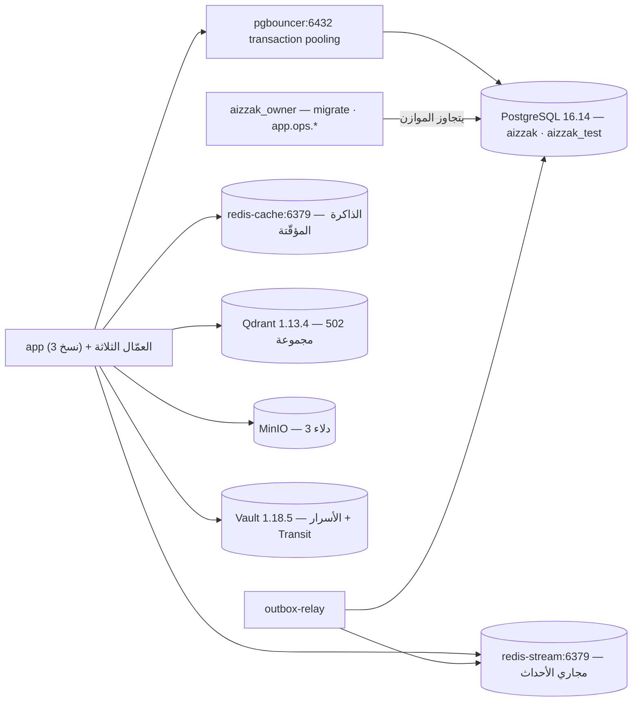

<div dir="rtl">

# ملفّ قواعد البيانات — AIZZAK

> **تقرؤها أوّلاً** كلُّ مهارةٍ وكلُّ وكيلٍ في `data-engineer`. **لا تحوي سرّاً واحداً.**
>
> **آخر تحقّق: 2026‑10‑05** · **مُتحقَّقٌ منه من:** WSL2 / ‏Ubuntu‑24.04 / ‏bash (‏`eng-anas`) · **مسار المشروع:** `/home/AIZZAK`
>
> المرجعُ **المُلزِم** فوق هذه الوثيقة هو [`CLAUDE.md`](../../CLAUDE.md) و[`docs/stack-commands.md`](../stack-commands.md) و[`docs/design/08-local-runbook.md`](../design/08-local-runbook.md). عند أيّ تعارضٍ فهي الصحيحة، والقسم **٨** أدناه ينقل قيودَها حرفيّاً.

---

## 1 · الطوبولوجيا

الجلسةُ تعمل **داخل WSL2 مباشرةً** من `/home/AIZZAK`، لا من Git‑Bash على ويندوز (قناةُ Git‑Bash لا تنفّذ ثنائيّات ELF ⇒ `Exec format error`). كلُّ المخازن حاوياتٌ في **مكدّس Docker Compose واحدٍ على هذا المضيف**، والمنافذ **مُزاحةٌ على المضيف وحده** — داخل الشبكة يحتفظ كلُّ شيءٍ باسمه ومنفذه القانونيّ.



⚠️ **المهاجِرُ لا يعبر الموازن.** ‏`aizzak_owner` يتّصل **مباشرةً** بـ`postgres:5432` لأنّ الـDDL تحت تجميع المعاملات (transaction pooling) خطرٌ بلا داعٍ؛ و`app_rw` يتّصل عبر `pgbouncer:6432` **ولا يتّصل بـ5432 أبداً**.

---

## 2 · المخازن

| المخزن | المحرّك والإصدار | الوظيفة | مُعرَّفٌ في | يُوصَل عبر | يستعمله |
|---|---|---|---|---|---|
| PostgreSQL | **16.14** (‏`postgres:16`) | ‏OLTP، ‏13 مخطّطاً، ‏RLS لكلّ مستأجر | `docker-compose.yml:442` | المضيف `127.0.0.1:15432` ← الحاوية `5432` | ‏`app` · العمّال · `outbox-relay` · `app.ops.*` |
| PgBouncer | **1.23.1‑p2** (‏`edoburu/pgbouncer`) | موازن اتّصالات، **transaction pooling** | `docker-compose.yml:756` | المضيف `127.0.0.1:16432` ← الحاوية `6432` | ‏`app_rw` وحده |
| Redis (مجاري) | **7.4.9** (‏`redis:7`) | ‏Redis Streams + مجموعات المستهلكين + DLQ | `docker-compose.yml:973` | المضيف `127.0.0.1:16379` ← الحاوية `6379` | العمّال الثلاثة · `outbox-relay` |
| Redis (مؤقّت) | **7.4.9** (‏`redis:7`) | ذاكرةٌ مؤقّتة (‏`allkeys-lru`، بلا AOF) | `docker-compose.yml:1029` | المضيف `127.0.0.1:16380` ← الحاوية `6379` | ‏`app` (المبدئيّات · الحصص · التضمينات) |
| Qdrant | **1.13.4** | مخزن المتّجهات، **مجموعةٌ لكلّ مساحة عمل** (‏`ق‑3`) | `docker-compose.yml:1104` | المضيف `127.0.0.1:16333` ← الحاوية `6333` (و`6334` gRPC) | ‏`knowledge` · `worker-knowledge` |
| MinIO | `RELEASE.2025-04-22` | تخزين الكائنات: `workspace-files` · `aizzak-backups` · `aizzak-test` | `docker-compose.yml:1077` | المضيف `127.0.0.1:19000` (وحدة التحكّم `19001`) | ‏`files` · `media` · `app.ops.backup` |
| Vault | **1.18.5** (‏`hashicorp/vault:1.18`) | أسرار التطبيق + **Transit** لتشفير بيانات المستأجر | `docker-compose.yml:1412` | المضيف `127.0.0.1:18200` ← الحاوية `8200` | ‏`credentials` · `integrations` · `app.ops.rotate_transit` |
| Prometheus / Loki | `v3.13.2` / `3.5.7` | قياسات وسجلّات (‏TSDB احتفاظُه 15 يوماً) | `docker-compose.yml:2504` / `:2841` | داخليٌّ فقط | ‏Grafana `127.0.0.1:13000` |

**المحرّكات المثبَّتة في `pyproject.toml`:** ‏`asyncpg` (‏SQLAlchemy async) · `redis` · `qdrant-client` · `minio` · `hvac`.

---

## 3 · البيئات

| البيئة | الصنف | المخزن / القاعدة | الدليل | ملاحظات |
|---|---|---|---|---|
| المكدّس الحيّ — القاعدة | **`shared-dev`** | `aizzak` (‏**2794 م.ب**، مالكها `postgres`) | ‏`CLAUDE.md`: «المكدّس الحيّ على هذا المضيف **قيد الاستعمال**»؛ الموجة 8 (بوّابة النشر) **مؤجّلة** ولا يُعرَض للإنترنت؛ بياناتها من `app.ops.load_seed` الصناعيّة | **المالك يقرؤها.** ‏202+ مساحة عمل، ‏502 مجموعة Qdrant |
| المكدّس الحيّ — قاعدة الاختبار | **`test`** | `aizzak_test` (‏**13 م.ب**، مالكها `aizzak_owner`) | ‏`deploy/postgres/testdb/20-test-database.sh`؛ ‏`tests/integration/conftest.py` يثبّت الاسم | ⚠️ **على العنقود نفسه الذي يحمل `aizzak`** — انظر التحذير أسفل الجدول |
| المكدّس الحيّ — بقيّة المخازن | **`shared-dev`** | ‏redis‑stream · redis‑cache · Qdrant · MinIO · Vault | ‏`.env.test.example` يوجّه `TEST_REDIS_URL` و`TEST_QDRANT_URL` و`TEST_VAULT_ADDR` إلى **المنافذ الحيّة نفسها** | ⚠️ **لا نسخةَ اختبارٍ منفصلةً لها**؛ وبعضُ اختبارات التكامل **يُفرِغها** |
| حزمة CI المعزولة | **`test`** | عنقودٌ جديدٌ في وظيفة `integration` | ‏`.github/workflows/ci.yml:93` — `COMPOSE_FILE=docker-compose.yml:docker-compose.test.yml`، ‏`REQUIRE_LIVE=1`، وتهدمه بـ`down -v` | **البيئةُ الوحيدة القابلةُ للرمي فعلاً** |
| RunPod | **لا يوجد هدفٌ قائم** | — | ‏`deploy/runpod/` صورةٌ شاملةٌ موجودة؛ ‏`CLAUDE.md`: «‏**لا يوجد هدف staging**» | لم تُنشَر؛ ولا تحوي بيانات |

**التصنيفات ثبّتها المالك في 2026‑10‑05.** المجهولُ = `production`. قواعدُ كلّ صنفٍ في `references/safety.md` §2 من إضافة `data-engineer`، ويشدّدها القسم **٨** أدناه.

### ⚠️ ح‑أ · قاعدةُ الاختبار تشارك العنقودَ الحيّ

`aizzak` و`aizzak_test` **في عنقود PostgreSQL واحدٍ** (مقيسٌ: `pg_database` يعرضهما معاً على `15432`). ونتيجته مُلزِمة:

- **كلُّ ما هو على مستوى العنقود يمسّ الحيَّ أيضاً** مهما بدا أنّه «على الاختبار»: الأدوار · `ALTER SYSTEM` والإعدادات · الامتدادات · `max_connections` · القرص · ‏WAL · ‏`pg_stat_statements_reset()` (تصفيرُه **عنقوديّ** — ولهذا `20-test-database.sh` يمنع منحه في `aizzak_test` عمداً).
- ولذلك: أيُّ أمرٍ عنقوديٍّ يُصنَّف **`shared-dev` لا `test`**، فيحتاج موافقتك ولا يُشغَّل تلقائيّاً.
- ‏`MAX_DB_CONNECTIONS` في PgBouncer **لكلّ قاعدةٍ لا مجموعاً** (مقيسٌ، `docker-compose.yml:840`)؛ وما يخفّف الأثرَ أنّ **لا شيءَ في المستودع يصل إلى `aizzak_test` عبر الموازن** — كلّ وصفات الاختبار تنادي 15432 مباشرةً.

### ⚠️ ح‑ب · ‏Redis وQdrant وVault وMinIO بلا نسخةٍ اختباريّة

اختباراتُ `tests/integration/` تصل إلى **المخازن الحيّة نفسها**، وبعضُها يُفرِغ. ولهذا `CLAUDE.md` يفرض: **بلا موافقةٍ بشريّةٍ شغّل `pytest tests/unit tests/architecture tests/eval` فقط.** الحلُّ المعزولُ الوحيد هو وظيفة CI ‏`integration` أو [`docs/quickstart.md`](../quickstart.md).

---

## 4 · وصفات الاتّصال

‏**الـSQL يدخل على `stdin`** دائماً: `<الوصفة> < ملف.sql` أو `<الوصفة> <<'SQL' … SQL`. هكذا لا يُقتبَس عبر ثلاث قذائف، ويستطيع حارسُ الإضافة قراءةَ ملفّات `.sql`.

> **لا كلمةَ سرٍّ في أيّ وصفةٍ هنا.** كلُّها تنفّذ العميلَ **داخل حاوية المخزن**، فيتوسّع `"$POSTGRES_USER"` بالداخل ولا يخرج سرٌّ من الحاوية أصلاً.

### `pg-ro:shared-dev/aizzak` — قراءةٌ محضة

```bash
docker compose exec -T \
  -e PGOPTIONS='-c default_transaction_read_only=on -c statement_timeout=30s -c lock_timeout=1s -c idle_in_transaction_session_timeout=60s' \
  postgres sh -c 'exec psql -X -q -v ON_ERROR_STOP=1 -P pager=off -U "$POSTGRES_USER" -d aizzak'
```

- **الهويّة:** `postgres` — **مستخدمٌ خارق (‏`rolsuper = t`) و`rolbypassrls = t`.**
- ⚠️ **فهو يتجاوز RLS تماماً.** لبيانات المستأجرين استعمل سياقَ المستأجر صراحةً داخل معاملةِ قراءة:

  ```sql
  BEGIN READ ONLY;
    SET LOCAL ROLE app_rw;
    SELECT set_config('app.workspace_id', '<workspace-uuid>', true);
    -- استعلامُك هنا
  ROLLBACK;
  ```

  وهذا لا يحمي البيانات وحده، بل **يعطيك الخطّةَ التي يراها التطبيقُ فعلاً**.
- **مُتحقَّقٌ منه 2026‑10‑05:** `default_transaction_read_only = on` · `PostgreSQL 16.14 (Debian 16.14-1.pgdg13+1)` · القواعد: `aizzak` 2794 م.ب، `aizzak_test` 13 م.ب، `postgres` 7519 ك.ب.

### `pg-ro:test/aizzak_test` — قراءةٌ محضة

الوصفةُ نفسُها مع `-d aizzak_test`. **مُتحقَّقٌ منه 2026‑10‑05:** قُرئت المخطّطاتُ الثلاثةَ عشرَ ومراجعةُ `public.alembic_version`.

### `pg-rw:test/aizzak_test` — قراءةٌ وكتابة، **على قاعدة الاختبار وحدها**

```bash
docker compose exec -T \
  -e PGOPTIONS='-c statement_timeout=30s -c lock_timeout=5s -c idle_in_transaction_session_timeout=60s' \
  postgres sh -c 'exec psql -X -q -v ON_ERROR_STOP=1 -P pager=off -U "$POSTGRES_USER" -d aizzak_test'
```

- **مُتحقَّقٌ منه 2026‑10‑05:** `default_transaction_read_only = off`، و`BEGIN; CREATE TEMP TABLE …; ROLLBACK;` نجحت.
- ⚠️ **لا توجد `pg-rw` للقاعدة الحيّة `aizzak`، ولن تُكتَب.** ‏`CLAUDE.md`: «تشغيلُ الهجرات أو أيّ SQL مُدمِّرٍ على أيّ قاعدةٍ غير `aizzak_test`» يحتاج موافقةً بشريّة.
- ⚠️ وتذكّر **ح‑أ**: أيُّ عبارةٍ عنقوديّةٍ من هذه الجلسة تمسّ `aizzak` أيضاً.

### عبر الموازن — خطّةُ التطبيق الحقيقيّة

```bash
docker compose exec -T pgbouncer psql -X -q -h 127.0.0.1 -p 6432 -U app_rw -d aizzak   # يطلب كلمة سرّ
```

⚠️ **مُفضَّلٌ تركُها.** ‏`AUTH_TYPE=scram-sha-256` ⇒ تحتاج سرَّ `app_rw`، وهو ما ترفضه §4 من قواعد السلامة. استعمل بدلاً منها `SET LOCAL ROLE app_rw` في الوصفة الأولى، أو **أداةَ المشروع نفسِه** `python -m app.ops.explain_hot_paths` (تشرح مسارَ الطلب تحت سياق مستأجرٍ حقيقيّ).

### `redis-ro:redis-stream` · `redis-ro:redis-cache`

```bash
docker compose exec -T redis-stream redis-cli <أمر قراءة>
docker compose exec -T redis-cache  redis-cli <أمر قراءة>
```

- المسموح: `PING` · `INFO` · `XINFO` · `XLEN` · `XPENDING` · `XRANGE … COUNT n` · `TYPE` · `TTL` · `MEMORY USAGE` · `SCAN … COUNT` · `SLOWLOG GET` · `LATENCY` · `CONFIG GET`.
- ❌ **لا `KEYS *` ولا `MONITOR`** — يحجبان خادماً مشتركاً. ❌ ولا `FLUSH*` إطلاقاً على `shared-dev`.
- **مُتحقَّقٌ منه 2026‑10‑05:** الاثنان `7.4.9` وأجابا `PONG`. ‏`redis-stream`: ‏`db0` فيه **35 مفتاحاً**، ‏`maxmemory-policy = noeviction`، ‏`appendonly = yes` (ديمومةٌ مُفعَّلة — صحيحٌ لمجرىً لا يُقبل فقدُه). ‏`redis-cache`: ‏**keyspace فارغ**، ‏`allkeys-lru`، ‏`appendonly = no` (صحيحٌ لذاكرةٍ مؤقّتة).

### `qdrant-ro:shared-dev`

منفذُ Qdrant منشورٌ على `127.0.0.1:16333`، لكنّ `curl` من المضيف **حُجب في هذه الجلسة**، فالوصفةُ المُتحقَّق منها تمرّ من داخل الشبكة:

```bash
docker compose exec -T app python -c "import urllib.request;print(urllib.request.urlopen('http://qdrant:6333/collections').read().decode())"
```

- ‏`GET` فقط: `/` · `/collections` · `/collections/<name>` · `/collections/<name>/snapshots`.
- **مُتحقَّقٌ منه 2026‑10‑05:** `qdrant 1.13.4` · **502 مجموعة**، كلُّها بسابقة `kn-<workspace-uuid>` — أي **مجموعةٌ لكلّ مساحة عمل**، وهو `ق‑3` قائماً.

### `minio-ro:shared-dev`

```bash
docker compose exec -T minio sh -c 'mc alias set loc http://localhost:9000 "$MINIO_ROOT_USER" "$MINIO_ROOT_PASSWORD" >/dev/null 2>&1 && mc ls loc'
```

**مُتحقَّقٌ منه 2026‑10‑05:** ثلاثةُ دلاء — `workspace-files` · `aizzak-backups` · `aizzak-test`.

### `vault-ro:shared-dev`

```bash
docker compose exec -T app python -c "import urllib.request;print(urllib.request.urlopen('http://vault:8200/v1/sys/health').read().decode())"
```

**مُتحقَّقٌ منه 2026‑10‑05:** `1.18.5` · `initialized: true` · `sealed: false`. ❌ **لا تُقرأ `/vault/init/init.json`** ولا أيُّ مسار أسرار — القسم ٨.

---

## 5 · المخطّط والهجرات

- **الأداة:** ‏Alembic (‏`alembic.ini`، ‏`migrations/env.py`). **اثنتا عشرة سلسلةً مستقلّة**، لكلٍّ `version_table_schema` خاصٌّ بها (‏`DAT‑03`): ‏`access` · `conversations` · `credentials` · `files` · `integrations` · `knowledge` · `media` · `memory` · `spaces` · `usage` · `workspace`، وسلسلةُ `platform` الأساسُ التي **لا تُمرَّر `-x vts=`** فتهبط `alembic_version` في `public`.
- **التخطيط:** `migrations/versions/<module>/NNNN_<slug>.py`، و`version_locations` سطرٌ لكلّ وحدةٍ في `alembic.ini`.
- **الأعراف المقروءةُ من الهجرات القائمة:**
  - كلُّ جلسةِ هجرةٍ تحمل `lock_timeout` قصيراً — `migrations/env.py:91` و`:110`، والقيمةُ `MIGRATION_LOCK_TIMEOUT_MS=3000`، **ويجب أن تبقى تحت `DB_STATEMENT_TIMEOUT_MS`**.
  - قفلٌ استشاريٌّ حول `app.ops.provision` كلِّها (‏`pg_advisory_lock`، ‏`PROVISION_LOCK_WAIT_MS=900000`) فلا تتسابق ثلاثُ نسخٍ في نشرٍ متدرّج.
  - ‏**expand/contract** عبر `python -m app.ops.online_ddl` — `CREATE INDEX CONCURRENTLY`، و`NOT VALID` ثمّ `VALIDATE`.
  - ‏`FORCE ROW LEVEL SECURITY` على كلّ جدولِ مستأجرٍ (‏**25 من 43** مقيسةً حيّاً) — فالمالكُ نفسُه محكومٌ بالسياسة.
  - ❌ **لا مفاتيحَ أجنبيّةً عابرةً بين المخطّطات** (‏`stack-commands.md` #32).
  - ‏**مُعرِّفُ المراجعة ≤ 32 حرفاً** — `alembic_version.version_num` هو `VARCHAR(32)`، والأطولُ **يطبّق الـDDL ثمّ يفشل في تسجيل نفسه** فتتوقّف السلسلةُ كلُّها.
- **اختباراتُ الحارس:** `tests/unit/test_zero_downtime_migrations.py` · `test_migration_revision_ids.py` · `test_conversations_schema_parity.py` · `test_ops_provision.py` · `test_ledger_autovacuum.py` · `test_role_provisioning_wiring.py`؛ ونصفُها الحيُّ `tests/integration/test_zero_downtime_migrations_live.py`. تُشغَّل بـ`.venv/bin/pytest -rs`.

| الإجراء | الأمر (حرفيّاً من المشروع) | من يشغّله |
|---|---|---|
| توليد مراجعةٍ جديدة | `alembic revision -m "..."` | ‏data‑engineer |
| إخراج SQL بلا اتّصال | `alembic upgrade <rev> --sql` (لمراجعةِ النصّ فقط) | ‏data‑engineer |
| فحص الـDDL المتدرّج | `python -m app.ops.online_ddl` | ‏data‑engineer |
| التطبيق على `aizzak_test` | `docker compose -f docker-compose.yml -f docker-compose.test.yml up -d` ثمّ `docker compose … exec -T postgres sh /opt/aizzak/testdb/20-test-database.sh` ثمّ `python -m app.ops.provision` على DSN الاختبار | ‏data‑engineer |
| التطبيق على `shared-dev` أو أيّ هدفٍ آخر | `docker compose up migrate` (أي `python -m app.ops.provision`) | **بشريٌّ فقط** |
| ❌ **ممنوع** | `alembic upgrade head` — ‏`head` **غامضٌ** مع اثنتي عشرة سلسلةً، وAlembic يرفضه بـ«Multiple head revisions are present». التسلسلُ الحقيقيُّ مُرمَّزٌ في `app/ops/provision.py` **وحده** | — |

**المراجعةُ الحاليّةُ لكلّ بيئة (قُرئت 2026‑10‑05):**

| السلسلة | `aizzak` (‏shared‑dev) | `aizzak_test` |
|---|---|---|
| `platform` (في `public`) | `0005_ledger_autovacuum` | `0005_ledger_autovacuum` |
| `access` | `0003_access_admin_write` | مطابقة |
| `conversations` | `0006_space_count_covering` | مطابقة |
| `credentials` | `0003_platform_keys` | مطابقة |
| `files` | `0004_space_quota_covering` | مطابقة |
| `integrations` | `0002_rotator_integrations` | مطابقة |
| `knowledge` | `0009_hot_path_indexes` | مطابقة |
| `media` | `0001_media` | مطابقة |
| `memory` | `0001_memory` | مطابقة |
| `spaces` | `0001_spaces` | مطابقة |
| `usage` | `0004_usage_autovacuum` | مطابقة |
| `workspace` | `0009_workspace_purge` | مطابقة |

**المخطّطاتُ الثلاثةَ عشرَ وتغطيةُ RLS (‏`aizzak`، مقيسةً 2026‑10‑05):**

| المخطّط | الجداول | عليها RLS | ‏FORCE RLS |
|---|---|---|---|
| `access` | 2 | 1 | 1 |
| `conversations` | 4 | 3 | 3 |
| `credentials` | 2 | 1 | 1 |
| `files` | 2 | 1 | 1 |
| `integrations` | 3 | 2 | 2 |
| `knowledge` | 8 | 7 | 7 |
| `media` | 2 | 1 | 1 |
| `memory` | 2 | 1 | 1 |
| `platform` | 5 | 1 | 1 |
| `public` | 2 | 0 | 0 |
| `spaces` | 2 | 1 | 1 |
| `usage` | 5 | 4 | 4 |
| `workspace` | 4 | 2 | 2 |
| **المجموع** | **43** | **25** | **25** |

‏**47 سياسةَ RLS.** الجداولُ بلا RLS هي دفاترُ المنصّة غيرُ المستأجَرة (`platform.outbox` · `processed_events`) و`public` (‏`alembic_version` · عرضُ `pg_stat_statements`) — **ليست فجوةً**. **الامتدادات:** `plpgsql 1.0` · `pg_stat_statements 1.10`.

---

## 6 · نموذج الوصول

### الأدوار (أسماءٌ فقط — لا كلمةَ سرٍّ هنا)

تُنشأ مرّةً واحدةً عند تهيئة أوّل حجمٍ في `deploy/postgres/initdb/10-roles.sh` (‏`CREATE ROLE` صلاحيّةُ عنقودٍ لا يملكها `aizzak_owner` عمداً)، والمنحُ في `python -m app.ops.provision` بعد Alembic. **مقيسةٌ حيّاً 2026‑10‑05:**

| الدور | خارق | ‏BYPASSRLS | ‏REPLICATION | ‏INHERIT | منحُ الجداول | الوظيفة |
|---|---|---|---|---|---|---|
| `postgres` | ✅ | ✅ | ✅ | ✅ | — | المستخدمُ الخارق. **وصفةُ القراءة أعلاه تستعمله ⇒ تتجاوز RLS** |
| `aizzak_owner` | ❌ | ❌ | ❌ | ✅ | مالكُ كلّ جدول | المهاجِر. يشغّل Alembic و`provision`. **لا يخدم طلباً أبداً.** يتّصل مباشرةً بـ5432. ويحمل `pg_read_all_stats` و`EXECUTE` على `pg_stat_statements_reset` |
| `app_rw` | ❌ | ❌ | ❌ | **❌ NOINHERIT** | ‏`SELECT,INSERT,UPDATE,DELETE` على **29 جدولاً** | ما يتّصل به الـAPI والعمّال. **ليس مالكاً ولا يتجاوز RLS ⇒ السياسةُ تحصره في مساحةِ عملٍ واحدة.** عبر PgBouncer فقط |
| `outbox_relay` | ❌ | ❌ | ❌ | ❌ | ‏`SELECT,UPDATE` على **جدولين** | ‏`platform.outbox` و`SELECT` على `processed_events`. **صورةٌ معاكسةٌ لمنح `app_rw` هناك (‏INSERT فقط)**: مُنتِجٌ يستطيع `UPDATE published_at` يستطيع إخفاءَ حدثٍ بلا نشر (‏`D‑18`) |
| `retention_sweeper` | ❌ | ❌ | ❌ | ❌ | ‏`SELECT,DELETE` على **4 جداول** | مكنسةُ الاحتفاظ. **يدويٌّ لا خدمةٌ دائمة** |
| `metrics_reader` | ❌ | ❌ | ❌ | ❌ | ‏`SELECT` على **جدولٍ واحد** | قراءةُ `/metrics` من `platform.outbox` — **مستهلكٌ دائم** |
| `transit_rotator` | ❌ | ❌ | ❌ | ❌ | ‏`SELECT` على **3 جداول** (و`UPDATE` **مقصورٌ على عمود الشِّفرة**، فلا يظهر في منح الجداول) | تدويرُ مفتاح Transit. **يدويّ** |
| `workspace_purger` | ❌ | ❌ | ❌ | ❌ | ‏`SELECT,INSERT,DELETE` على **24 جدولاً** | كنسُ محتوى مساحةِ عملٍ محذوفة. **يدويّ** |
| `backup_operator` | ❌ | **✅** | **✅** | **✅** | — (يأخذها من `pg_read_all_data`) | **الدورُ الوحيدُ الذي يقرأ صفوفَ كلّ المستأجرين.** والثلاثةُ ضرورة: REPLICATION لـ`pg_basebackup`؛ ‏BYPASSRLS لأنّ `FORCE RLS` يُخضع المالكَ نفسَه (**مقيسٌ:** `pg_dump` كـ`aizzak_owner` كتب 202 مساحةَ عملٍ و**صفرَ مستخدم**)؛ و`pg_read_all_data` ليغطّي جداولَ لم تُكتَب هجرتُها بعد |

⚠️ **كلُّها `NOINHERIT` إلّا `backup_operator`**، وذلك مقصود: ‏`pg_read_all_data` **عضويّةٌ** فتبقى خامدةً تحت NOINHERIT حتّى `SET ROLE`. وعلى PG16 خيارُ الوراثة يُسجَّل **لكلّ عضويّةٍ** (`pg_auth_members.inherit_option`) ⇒ `GRANT … WITH INHERIT TRUE` حمّالٌ ولا يُصلحه `ALTER ROLE` لاحقاً.

### تعدّد المستأجرين

- **عمودُ المستأجر:** `workspace_id` على كلّ جدولٍ مستأجَر.
- **الإعدادُ الذي تقرؤه السياسات:** **`app.workspace_id`** — ويضعه `SET LOCAL app.workspace_id` كأوّلِ عبارةٍ في كلّ معاملة. الموضع: `src/app/infrastructure/persistence/rls.py:61` (`_GUC`)، والعقد في `src/app/framework/ports/unit_of_work.py` و`framework/repository.py` (‏`DD‑04`): **جلسةٌ واحدةٌ ⇒ `SET LOCAL` واحدٌ ⇒ ‏COMMIT/ROLLBACK واحد**.
- **`SET LOCAL` لا يقبل مُعاملاً** (لا يمكن تمريرُه parameterized) — فالتحقّقُ من قيمة الـUUID قبل حشرها جزءٌ من العقد.
- **مسارُ قراءة مديرِ المنصّة** لا يضع `app.workspace_id` بل سنتينل `app.platform_read` (‏`framework/di/composition_root.py:1575`).
- **`FORCE ROW LEVEL SECURITY`:** ✅ على 25 جدولاً — المالكُ محكومٌ بالسياسة أيضاً.
- **أدوارٌ مذكورةٌ في السياسات نفسِها:** `public` · `retention_sweeper` · `transit_rotator` · `workspace_purger` — أي أنّ المكانسَ العابرةَ للمستأجرين لها سياساتُها الخاصّة، لا استثناءٌ من RLS.
- **حارسُ الدور:** `src/app/ops/role_guard.py` — كلُّ مكنسةٍ عابرةٍ **ترفض العملَ بأيّ دورٍ غير دورها**، بعد عطلٍ مقيسٍ في 2026‑09‑30 على المكدّس الحيّ.
- **Qdrant:** **مجموعةٌ لكلّ مساحةِ عمل** (`kn-<workspace-uuid>`، ‏`ق‑3`) — العزلُ بالمجموعة لا بالمُرشِّح.

### التجميع (pooling)

- **الوضع:** `transaction` (‏`D‑21`). ‏`MAX_CLIENT_CONN=2000` · `DEFAULT_POOL_SIZE=100` · `RESERVE_POOL_SIZE=10` · `MAX_DB_CONNECTIONS=297` · `QUERY_WAIT_TIMEOUT=20` · `CLIENT_IDLE_TIMEOUT=1800` · `IDLE_TRANSACTION_TIMEOUT=120`.
- **ما يمنعه:** حالةَ الجلسة والعباراتِ المحضَّرةَ المسمّاة. ولذلك `asyncpg` يعمل بـ`statement_cache_size=0` في **كلّ** محرّكٍ (‏`OPS‑02`)، و`MAX_PREPARED_STATEMENTS=0` في الموازن. ⇒ **لا `PREPARE` ولا `SET` (غير `SET LOCAL`) ولا جداولَ مؤقّتةً عابرةً للمعاملات** على هذا المسار.
- ‏`max_connections = 300` و`superuser_reserved_connections = 3` على الخادم (منهما جاء الرقم 297).

### ⚠️ ح‑ج · لا دورَ قراءةٍ محضةٍ للتشخيص

الوصفةُ الوحيدةُ المتاحةُ بلا سرٍّ تتّصل كـ**`postgres` الخارق**، فتتجاوز RLS. والسلامةُ تُفضّل **أقلَّ هويّةٍ امتيازاً**.

**التوصية (قرارُك، وإنشاءُ الأدوار بشريٌّ):** دورٌ عاشرٌ للتشخيص —

```sql
CREATE ROLE aizzak_reader LOGIN NOINHERIT;
GRANT pg_read_all_data, pg_monitor TO aizzak_reader WITH INHERIT TRUE;  -- INHERIT TRUE حمّالٌ على PG16
GRANT CONNECT ON DATABASE aizzak TO aizzak_reader;
GRANT CONNECT ON DATABASE aizzak_test TO aizzak_reader;
```

لا يتجاوز RLS (‏`pg_read_all_data` **لا** يمنح BYPASSRLS)، ويُضاف اسمُ كلمةِ سرِّه إلى `.env.example` وقيمتُها إلى Vault كما يفرض القسم ٨. **وإلى أن يوجد، يبقى `SET LOCAL ROLE app_rw` داخل الوصفة الأولى هو الطريقُ لكلّ قراءةٍ لبيانات مستأجر.**

---

## 7 · أدوات المشروع للبيانات

**القاعدةُ المُلزِمة:** أدواتُ المشروع **تُقدَّم على الـSQL الخام** كلّما غطّت الحاجة — فهي تُرمِّز ما لا يُرى من المخطّط: الأقفالَ الاستشاريّة، ودوراً لكلّ أداة، والمنحَ بعد الهجرات، وسياقَ RLS.

| الأمر | ماذا يفعل | قراءةٌ محضة؟ | التأكيد | الدور / متغيّر DSN | الوثيقة |
|---|---|---|---|---|---|
| `python -m app.ops.provision` | الهجراتُ الاثنتا عشرةَ بترتيبها الحقيقيّ والمنحُ معها، تحت قفلٍ استشاريّ | ❌ كتابة | — | `aizzak_owner` | `stack-commands.md` #3 |
| `python -m app.ops.slow_queries top` | أغلى الاستعلامات من `pg_stat_statements` | ✅ | — | `aizzak_owner` | `stack-commands.md` #34‑ج |
| `… slow_queries reset --yes` | تصفيرُ العدّادات | ❌ | `--yes` | `aizzak_owner` | ⚠️ **التصفيرُ عنقوديٌّ ⇒ يمحو قياسَ المالك الجاري** |
| `python -m app.ops.table_growth status` | هل يلحق autovacuum بالدفاتر الكثيفةِ الكتابة | ✅ | — | `aizzak_owner` | خطّة السعة `2.8` |
| `python -m app.ops.explain_hot_paths` | `EXPLAIN (ANALYZE, BUFFERS)` لمسار الطلب **تحت سياق RLS لمستأجر** | ✅ (‏SELECT) | — | `app_rw` | خطّة السعة `2.4` |
| `python -m app.ops.online_ddl` | آليّتا expand/contract التي لا يعطيها Alembic | ❌ | — | `aizzak_owner` | خطّة السعة `2.9` |
| `python -m app.ops.retention` | مكنسةُ الاحتفاظ للدفاتر الثلاثةِ بلا حدّ | ❌ حذف | `--dry-run` / `--yes` | **`retention_sweeper` وحده** (‏`role_guard`) | `stack-commands.md` #33 |
| `python -m app.ops.purge` | كنسُ محتوى مساحةِ عملٍ محذوفة | ❌ حذف | `--dry-run` / `--yes` | **`workspace_purger` وحده** | `BE‑ADM‑014` |
| `python -m app.ops.rotate_transit` | إعادةُ لفّ كلّ شِفرةٍ تحت النسخة الحاليّة لمفتاح Transit | ❌ تحديث | — | **`transit_rotator` وحده** | `stack-commands.md` #34 |
| `python -m app.ops.backup` | ‏`pg_basebackup` وWAL ولقطاتُ Redis/Qdrant/MinIO | يقرأ القاعدةَ ✅ ويكتب للمخزن ❌ | — | **`backup_operator`** · `BACKUP_DATABASE_URL` | خطّة السعة `2.5` |
| `python -m app.ops.dlq peek` | فحصُ صفّ الرسائل الميّتة | ✅ | — | ‏Redis | ‏`P1‑4` |
| `python -m app.ops.dlq requeue` / `purge` | إعادةُ الإدخال أو الحذف | ❌ | `--yes` | ‏Redis | ‏`P1‑4` |
| `python -m app.ops.stream_trim status` | ما يحمله كلُّ مجرىً ومن يحدّ تقليمَه | ✅ | — | ‏Redis | خطّة السعة `5.5` |
| `python -m app.ops.replay plan` | ‏«جفافٌ»: ماذا سيُعاد نشرُه من `outbox` | ✅ | — | `outbox_relay` | خطّة السعة `5.6` |
| `python -m app.ops.notify_groups list` | مجموعاتُ `cg.notify` كلُّها بـLIVE/ORPHAN وسببِه | ✅ | `sweep --yes` للكنس | ‏Redis | `stack-commands.md` #34‑ب |
| `python -m app.ops.qdrant_capacity` | ماذا يكلّف 200 مستأجرٍ في Qdrant | ✅ | — | ‏Qdrant | خطّة السعة `4.4` |
| `python -m app.ops.payload_indexes` | ردمُ فهارس الحِمل لمجموعاتٍ تسبق الفهارس | ❌ | — | ‏Qdrant | `spaces-backend-plan.md` §5‑ب |
| `python -m app.ops.embedding_migration` | تغييرُ نموذج التضمين بلا انقطاع | ❌ | — | ‏Qdrant و PG | خطّة السعة `4.5` |
| `python -m app.ops.load_seed plan` · `run` · `status` · `purge --yes` | بذرةُ الحمل الواقعيّة **عبر RLS**: مليونُ رسالةٍ و100 ألف ملفٍّ ومليونُ متّجهٍ على 200 مساحةِ عمل | `plan`/`status` ✅ · `run`/`purge` ❌ | `--yes` | `app_rw` | `stack-commands.md` #34‑د |
| `python -m app.ops.revoke` | كاتبُ قائمةِ منع الجلسات `auth:revoked:<sub>` | ❌ | — | ‏Redis | §3.79 |
| `python -m app.ops.scheduler status` / `run` | المُشغّلُ الليليُّ للأدوات العشر ودفترُها | `status` ✅ | — | متعدّد | خطّة السعة `5.7` |
| `python -m app.ops.mint_load_tokens verify` | فحصُ توكنات الحمل | ✅ | — | — | `stack-commands.md` |

**نقطةُ تشغيلٍ مهمّة:** هذه الأدواتُ تعمل من **داخل حاوية**، مثل `docker compose exec ops-scheduler python -m app.ops.<tool>`. ولإلقاءِ نظرةٍ على بياناتٍ حيّةٍ قبل إعادةِ بناء الصورة، الطريقُ هو DSN المالك على 15432 و`redis` على 16379 — **لكن ليس** لـ`retention` ولا `purge` ولا `rotate_transit`: تلك ترفض أيَّ دورٍ غير دورها بحكم `role_guard`.

---

## 8 · قواعدُ المشروع المُلزِمة

منقولةٌ بمصادرها. **تشدّد افتراضاتِ الإضافة ولا تُرخيها.**

- «‏**المكدّس الحيّ على هذا المضيف قيد الاستعمال.** اختباراتُ التكامل تصل إلى Redis وQdrant وVault نفسِها، وبعضُها يُفرِغ. **بلا موافقةٍ بشريّة، شغّل فقط `pytest tests/unit tests/architecture tests/eval`**» — `CLAUDE.md` (بوّاباتُ الجودة)
- «‏**الهجرات تُطبَّق فقط عبر `python -m app.ops.provision`** (خدمةُ `migrate`). **وتشغيلُ `alembic upgrade head` مباشرةً ممنوع**» — `CLAUDE.md` (قواعدُ المعمارية) · `docs/stack-commands.md` #3
- «**تشغيلُ الهجرات أو SQL مُدمِّرٍ على أيّ قاعدةٍ غير `aizzak_test`**» يحتاج موافقةً بشريّة — `CLAUDE.md` (‏Do‑not‑touch)
- «‏**نشرُ الإنتاج، وأيُّ إعادةِ إنشاءٍ أو إعادةِ تشغيلٍ للمكدّس العامل، بشريٌّ فقط**» — `CLAUDE.md` (‏Staging & deploy)
- «**كلُّ مستودعٍ جديدٍ يحصل على اختبار RLS**» (`tests/integration/test_*_repository_rls.py`) — `CLAUDE.md` (تعدّدُ المستأجرين)
- «‏**لا تضف `ignore_imports` أبداً** بلا موافقةٍ بشريّة» — `CLAUDE.md` (طبقاتُ `.importlinter`)
- «**لا تقرأ ولا تطبع ولا تنسخ**: `.env` · `.env.bak.*` · `.env.test` · `deploy/load/accounts.json` · `deploy/load/tokens.json` · `deploy/load/include-workspaces.txt` · `deploy/nginx/certs/*` · حجمَ `vault-init` (`/vault/init/init.json`)» — `CLAUDE.md` (‏Secrets)
- «**سرٌّ جديدٌ يعمل هكذا:** أضف **اسمَ** المتغيّر إلى `.env.example` (وإلى `.env.test.example` إن احتاجته الاختبارات) وخزّن **القيمة** في Vault (`deploy/vault/`، خدمةُ `vault-bootstrap`). **وبشريٌّ يضع القيمةَ الحقيقيّة**» — `CLAUDE.md`
- «‏`deploy/` · `docker-compose*.yml` · `Dockerfile` · `.github/workflows/` · `.claude/settings*.json` · `.importlinter`» و«**أدوارُ قاعدةِ البيانات ومنحُها**» و«`src/app/framework/auth/` · `src/app/modules/access/` · `src/app/modules/credentials/`» — كلُّها **do‑not‑touch** بلا موافقة — `CLAUDE.md`
- «‏خطّافُ `.claude/settings.json` يحجب أوامرَ التنظيف الجَرفيّ لأحجام Docker، وهدمَ المكدّس بأحجامه» — الأوامرُ الثلاثةُ مذكورةٌ بالاسم في `CLAUDE.md` ولا تُعاد كتابتُها هنا، لأنّ حارسَ `ت‑4` يعترض على مجرّدِ ورودها في أيّ أمر (**اعترض فعلاً أثناء كتابة هذه الوثيقة**). والحذفُ المسموحُ هو بالاسم صراحةً، وتنظيفُ ذاكرةِ البناء وحدَه لا يمسّ الأحجام
- «‏**الموجةُ 8، بوّابةُ الإنتاج، مؤجّلةٌ بقرار المالك. ولا تعرض المكدّسَ للإنترنت**» — `docs/capacity-status.md`
- «الوثائقُ بالعربيّة؛ والكودُ والتعليقاتُ ورسائلُ الالتزام بالإنجليزيّة» · «المعرّفاتُ بشُرطةٍ غيرِ فاصلة (U+2011)» — `CLAUDE.md` (أعرافُ الوثائق)
- «‏**لا تلتزم إلّا إذا كانت البوّاباتُ الخمسُ كلُّها خضراء**» — `CLAUDE.md`
- «‏لا قاعدةَ اختبارٍ في عنقودِ إنتاج، وكلُّ تزويدٍ اختباريٍّ يدخل عبر ملفِّ تجاوزٍ صريحٍ أو علمٍ مُعطَّلٍ افتراضاً» — `deploy/postgres/testdb/20-test-database.sh` (قاعدةُ 🔒 الثابتة)

---

## 9 · البيانات الحسّاسة

مُستنبَطةٌ من أسماء الأعمدة وأنواعِها ومن `docs/design/01-data-model.md`، و**مُعلَّمةٌ كاستنباطٍ حيث هي كذلك**.

| الجدول | الأعمدة | النوع | المصدر |
|---|---|---|---|
| `workspace.users` | `email` · `display_name` | **شخصيّ** | الاسمُ والنوع |
| `workspace.workspaces` | `name` | شخصيٌّ محتمل (قد يكون اسمَ فردٍ أو شركة) | استنباط |
| `spaces.spaces` | `name` | نصٌّ كتبه مستخدم | استنباط |
| `conversations.messages` | **`content`** | **نصٌّ حرٌّ كتبه مستخدم — أكبرُ سطحٍ شخصيٍّ في النظام** | الاسمُ والنوع |
| `conversations.conversations` | `title` | نصٌّ كتبه مستخدمٌ أو لخّصه نموذج | استنباط |
| `memory.memory_items` | `content` | نصٌّ حرٌّ عن المستخدم | الاسمُ والنوع |
| `knowledge.chunks` · `parent_chunks` · `summaries` | **`text`** | محتوى مستنداتِ المستأجر | الاسمُ والنوع |
| `knowledge.documents` | `text_chunks` · `content_hash` | مشتقٌّ من محتوى المستأجر | استنباط |
| `files.files` | `name` · `name_key` · `storage_key` | أسماءُ ملفّاتٍ كتبها مستخدم | استنباط |
| `media.media_jobs` | `prompt` | نصٌّ حرٌّ كتبه مستخدم | الاسمُ والنوع |
| **`credentials.credentials`** | **`ciphertext_ref`** · `key_id` | **شِفرةُ Transit — اعتمادُ مستأجر** | `rotate_transit.py` |
| **`integrations.connections`** | **`token_ref`** · `key_id` | **مرجعُ توكن OAuth — شِفرةُ Transit** | `rotate_transit.py` |
| **`integrations.mcp_servers`** | عمودُ الشِّفرة · `key_id` | **شِفرةُ Transit** | `rotate_transit.py` |
| `platform.idempotency_keys` | `response_body` · `request_hash` | قد يحوي **جسمَ ردٍّ كاملاً** لطلبِ مستخدم | استنباط |
| `platform.outbox` | `payload` | حِملُ الحدث — قد يحوي حقولَ مستأجر | استنباط |
| `public.pg_stat_statements` | `query` | **نصُّ استعلامٍ قد يحوي قيماً حرفيّة** | `safety.md` §5 |

**القاعدة:** التجميعاتُ أوّلاً · **لا `SELECT *` على بيانات مستخدم** · `LIMIT` دائماً (افتراضاً 20، وبحدٍّ أقصى 100) · **ولا تُنتقى أعمدةُ الشِّفرة أو الاعتمادات إطلاقاً** (`ciphertext_ref` · `token_ref` · `key_id`). والقِناعُ قبل أيّ ظهورٍ في محادثةٍ أو وثيقة: `a***@example.com` · `+9665******12` · والأسماءُ إلى أحرفٍ أولى. ولا تُقتبَس إعداداتٌ قد تحوي أسراراً (`archive_command` · `primary_conninfo` · سلاسلُ الاتّصال).

**ولا تُنسَ المخازنُ الأخرى:** مجموعاتُ Qdrant الـ502 تحمل نصَّ المستأجر في حِملها (payload)؛ ودلو MinIO ‏`workspace-files` يحمل ملفّاتَه كما هي؛ وVault Transit يحمل المفتاحَ الذي يفكّ كلَّ شِفرةٍ في الجدول أعلاه.

---

## 10 · الافتراضاتُ والأسئلةُ المفتوحة

- **A‑1** — بياناتُ `aizzak` الحاليّة مفترَضٌ أنّها **صناعيّةٌ بالكامل** من `app.ops.load_seed` (‏202 مساحةَ عملٍ، ‏502 مجموعةَ Qdrant). لم يُعايَن صفٌّ واحدٌ للتأكّد، وتصنيفُ `shared-dev` لا يتغيّر بالإجابة — لكن **إن وُجد مستخدمٌ حقيقيٌّ واحدٌ فيها، يصير الصنفُ `production`**. صحّح هذا السطرَ إن كان الافتراضُ خاطئاً.
- **A‑2** — ‏`curl` من المضيف إلى `127.0.0.1:16333` و`:19000` و`:18200` **حُجب في هذه الجلسة** بمُصنِّف الصلاحيّات، لا بإعدادٍ في المكدّس. فوصفاتُ Qdrant وVault المُتحقَّق منها أعلاه تمرّ من **داخل** الشبكة. والمنافذُ منشورةٌ فعلاً (مقيسةٌ في `docker compose ps`)، فالنسخةُ المضيفيّةُ من الوصفة يُتوقَّع أن تعمل في جلسةٍ لا تحجب `curl`.
- **A‑3** — ‏`aizzak_test` قُرئت على مراجعة `platform` ‏`0005_ledger_autovacuum` نفسِها، ومخطّطاتُها الثلاثةَ عشرَ بأعدادِ جداولٍ مطابقة. ولم تُقرأ المراجعاتُ الإحدى عشرةَ الباقيةُ فيها واحدةً واحدةً؛ فكلمةُ «مطابقة» في جدول القسم ٥ **استنباطٌ** من تطابقِ عددِ الجداول.
- **Q‑1** — هل تريد **`aizzak_reader`** (‏ح‑ج)؟ هو ما يُزيل حاجةَ كلّ قراءةٍ تشخيصيّةٍ إلى هويّةٍ خارقةٍ تتجاوز RLS. إنشاءُ الأدوار بشريٌّ، والقرارُ لك.
- **Q‑2** — ‏`CLAUDE.md` يحمل بندَ **`TODO(human)`: «لا يوجد هدف staging»**. فأيُّ عملٍ على البيانات يفترض وجودَ بيئةِ عرضٍ يحتاج هذا البندَ مُغلَقاً أوّلاً.
- **Q‑3** — النسخُ الاحتياطيّ والاستعادة خارجَ نطاق هذه الوثيقة. ‏`python -m app.ops.backup` موجود وخدمتا `backup` و`wal-shipper` **تعملان الآن** — لكن **هل جُرِّبت استعادةٌ فعليّةٌ قطّ؟** ذلك سؤالُ مهارة `/data-engineer:backup-restore`.

---

## سجلّ التغييرات

| التاريخ | التغيير |
|---|---|
| 2026‑10‑05 | إنشاءُ الملفّ. ثمانيةُ مخازنَ وخمسُ بيئاتٍ أُحصيَت؛ وتصنيفاتُها ثبّتها المالك؛ وتُحقِّق من تسعِ وصفاتٍ حيّاً (‏PostgreSQL ×3 · ‏Redis ×2 · ‏Qdrant · MinIO · Vault)؛ و‏**ح‑أ** (قاعدةُ الاختبار تشارك العنقودَ الحيّ) · **ح‑ب** (مخازنُ بلا نسخةٍ اختباريّة) · **ح‑ج** (لا دورَ قراءةٍ محضة) مفتوحة |

</div>
