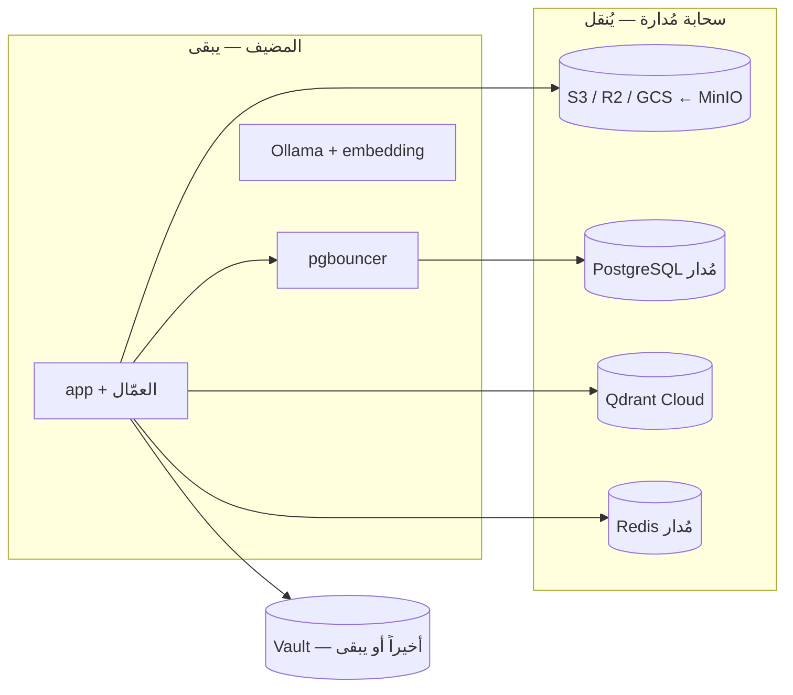

# نقلُ خدمات البيانات إلى خدماتٍ سحابيّةٍ مُدارة — دليل

> **التاريخ:** 2026‑10‑05 · **النوع:** دليلٌ للفهم والقرار، **لا خطّةُ تنفيذ** · **البيئة المقيسة:** المكدّس الحيّ (‏`shared-dev`)
>
> اقرأ قبله: [`db-profile.md`](../db-profile.md) (المخازن والأدوار) و[`capacity-plan.md`](../../capacity-plan.md) (الاختناقات `ح‑n` والقرارات `ق‑n`).

---

## الجواب المختصر

1. **انقل أوّلاً:** تخزين الملفّات (MinIO) وقاعدة البيانات (PostgreSQL). الأوّل أسهلُ نقلة، والثاني أكبرُ خطرٍ اليوم.
2. **بعدهما:** ‏Qdrant، وهو أكبرُ مستهلكٍ للذاكرة الآن.
3. **‏Redis:** نقلُه سهل، ومكسبُه صغير.
4. **‏Vault:** أخيراً أو يبقى، وهو الوحيدُ الذي نقلُه صعبٌ فعلاً.
5. **التوفير:** ≈ **15.5 vCPU و35 GB** من حدود المكدّس، أي قرابةَ نصفِ ميزانيّة المعالج و70% من الذاكرة. والأهمّ: عملُ النسخ الاحتياطيّ والتحديثات والتوفّر العالي ينتقل إلى المزوّد.

---

## 1) كلُّ خدمة: هل تُنقل؟ وهل النقلُ سهل؟

| الخدمة | انقلها؟ | السهولة | السبب (من المشروع) |
|---|---|---|---|
| **MinIO** ← S3 / R2 / GCS | ✅ **أوّلاً** | **سهلٌ جدّاً** | الكود يستعمل مكتبة `minio` وهي تتكلّم S3 أصلاً (`src/app/infrastructure/storage/minio_storage.py:67`). يكفي تغييرُ `MINIO_ENDPOINT` والمفاتيح ثمّ نسخُ الدلاء. والملفّاتُ أسرعُ ما يكبر مع آلاف المستخدمين |
| **PostgreSQL** ← RDS / Cloud SQL / Azure | ✅ **أوّلاً** | **متوسّط** | كودُ التطبيق لا يتغيّر: ‏RLS و`SET LOCAL app.workspace_id` و`pg_stat_statements` مدعومةٌ كلُّها. والقاعدةُ 2.8 GB، فنقلُها بـ`pg_dump` دقائق |
| **Qdrant** ← Qdrant Cloud | ✅ ثانياً | **متوسّط** | الاتّصالُ اليوم بلا `api_key` (`src/app/infrastructure/vector/qdrant_store.py:248-258`) والسحابةُ تشترطه ⇒ تعديلٌ صغيرٌ في الكود وسرٌّ في Vault. و502 مجموعة تُنقل بلقطاتٍ أو بإعادة فهرسة |
| **redis-cache** | ✅ متى شئت | **سهل** | ذاكرةٌ مؤقّتة؛ فقدُها لا يضرّ |
| **redis-stream** | ⚠️ بحذر | **متوسّط** | يحتاج `noeviction` وديمومةً على القرص، وليس كلُّ مزوّدٍ يعطي AOF. يخفّف الخطرَ أنّ `platform.outbox` في Postgres يُعيد نشرَ الأحداث (`python -m app.ops.replay`) |
| **Vault** | ⏸️ أخيراً أو يبقى | **صعب** | مفتاحُ Transit ‏`tenant-secrets` **غيرُ قابلٍ للتصدير** (`deploy/vault/app-policy.hcl:64`) ⇒ لا يُنقل المفتاح، ويلزم أداةٌ جديدةٌ تفكّ كلَّ شِفرةٍ وتعيد تشفيرَها في الجديد. ‏`rotate_transit` تعيد اللفَّ داخل Vault نفسِه فقط |

### ما يتغيّر عند نقل PostgreSQL

1. **الأدوار:** `deploy/postgres/initdb/10-roles.sh` يعمل اليوم كمستخدمٍ خارق عند تهيئة القاعدة. في السحابة لا مستخدمَ خارق ⇒ يُشغَّل مرّةً واحدةً يدويّاً بحساب المدير.
2. **دورُ النسخ الاحتياطيّ:** `backup_operator` يحمل `REPLICATION` و`BYPASSRLS` (`10-roles.sh:158`) لأجل `pg_basebackup` وخدمة `wal-shipper`. الخدماتُ المُدارة لا تسمح عادةً بـ`pg_basebackup`، وتعطي بدلَه نسخاً تلقائيّةً مع استعادةٍ لأيّ لحظة (PITR) ⇒ جزءُ Postgres في `app.ops.backup` يصير غيرَ لازم.
3. **‏PgBouncer:** الأبسطُ أن يبقى حاويةً بجوار التطبيق. نمطُ transaction pooling مضبوطٌ أصلاً (`statement_cache_size=0`، ‏`db-profile.md` §6).
4. **الإعدادات:** ما في `deploy/postgres/postgresql.conf` ينتقل إلى لوحة إعدادات المزوّد.

---

## 2) الموارد التي تتوفّر

**حدودُ المكدّس** (`docker-compose.yml`، قُرئت 2026‑10‑05):

| الخدمة | vCPU | ذاكرة |
|---|---|---|
| postgres | 6 | 18 GB |
| qdrant | 3 | 8 GB |
| redis-stream + redis-cache | 2 | 5 GB |
| minio | 1 | 2 GB |
| vault | 1 | 0.5 GB |
| backup + wal-shipper | 1.5 | 1.25 GB |
| pgbouncer (إن نُقل) | 1 | 0.25 GB |
| **المجموع** | **≈15.5** | **≈35 GB** |

الميزانيّةُ الكاملةُ للمكدّس **31.5 vCPU و50.5 GB** ([`capacity-plan.md`](../../capacity-plan.md) §6).

**على هذا المضيف** (`docker stats` و`free`، 2026‑10‑05، والمكدّسُ شبهُ خامل):

- المضيف: **10 أنوية · 12 GB ذاكرة**، والـswap مشغولٌ 3 من 4 GB.
- **‏Qdrant وحده 4.3 GB** — أكثرُ من ثلث الذاكرة.
- ولهذا السقفُ المقيسُ للبحث: **≈30 سؤال RAG/ث**، لأنّ Qdrant يعمل من الـswap (قياسُ 2026‑10‑04).

**وما هو أثمنُ من الأنوية — العملُ التشغيليّ الذي ينتقل للمزوّد:**

- النسخُ الاحتياطيّ والاستعادةُ لأيّ لحظة — ‏**ح‑13**، ولم تُجرَّب استعادةٌ فعليّةٌ قطّ ([`README.md`](../README.md)).
- التوفّرُ العالي لـPostgres — قرارُ **ق‑5** يصير خياراً في لوحة المزوّد بدل مشروعٍ كامل.
- تحديثاتُ الأمان للمحرّكات.
- مفتاحُ فكّ ختم Vault المحفوظُ نصّاً صريحاً — ‏**ح‑14**، إن نُقل Vault.

---

## 3) انتبه

1. **الموارد تتحوّل إلى فاتورةٍ شهريّة.** لم تُحسَب الأسعارُ هنا؛ تختلف بالمزوّد والمنطقة.
2. **أكبرُ مستهلكٍ عند التوسّع ليس قواعدَ البيانات** بل النموذجُ المحلّيّ وخدمةُ التضمين (**ح‑1** و**ح‑5**). السحابةُ المُدارة للبيانات لا تحلّهما.
3. **‏Qdrant السحابيّ لا يحلّ «مجموعةً لكلّ مساحة عمل».** إقلاعُ 202 مجموعة = 58.4 ث (**ح‑11**). مع آلاف المستأجرين يُعاد فتحُ **ق‑3**.
4. **خصوصيّةُ المستأجرين:** المحادثاتُ والملفّاتُ ستُخزَّن عند طرفٍ خارجيّ. والمعماريّةُ تَعِد بأنّ بعضَ المحادثات تبقى محلّيّةً ولا تُرسَل إلى سحابة ([`architecture.md`](../../architecture.md)، حولَ السطر 723). الوعدُ يخصّ النموذجَ اللغويّ (**استنتاج**)، فيُقرّر المالكُ هل يشمل التخزين، ويختار منطقةَ البيانات (region).
5. **التنفيذُ بشريٌّ كلُّه:** `deploy/` و`docker-compose*.yml` والأدوارُ والأسرارُ **do‑not‑touch** في [`CLAUDE.md`](../../../CLAUDE.md)، والموجةُ 8 مؤجّلةٌ بقرار المالك.

---

## 4) ترتيبُ الانتقال المقترح

| # | الخطوة | ملاحظة |
|---|---|---|
| 1 | سجّلِ القرارَ أوّلاً (ADR) | هو **ق‑2** نفسُه: فصلُ مستوى البيانات عن الحساب |
| 2 | ‏MinIO ← S3 | أسهلُها؛ ويشمل دلوَ `aizzak-backups` |
| 3 | ‏PostgreSQL ← مُدار | **جرّبِ الاستعادةَ قبل التحويل** |
| 4 | ‏Qdrant ← Qdrant Cloud | بعد إضافة `api_key` عبر Vault |
| 5 | ‏redis-cache ثمّ redis-stream | تحقّقْ من ديمومة المجاري عند المزوّد |
| 6 | ‏Vault أخيراً، أو يبقى | مع إصلاح **ح‑14** إن بقي |

---

## ما تحقّقنا منه وما استنتجناه

- **مُتحقَّقٌ منه** (ملفّاتٌ أو قياسٌ حيّ): حدودُ الموارد، استهلاكُ الحاويات، حجمُ القاعدة، غيابُ `api_key` لـQdrant، عدمُ قابليّة مفتاح Transit للتصدير، صفاتُ `backup_operator`.
- **استنتاجٌ يحتاج تأكيداً:** هل يسمح كلُّ مزوّدٍ بـ`BYPASSRLS`؟ وهل يعطي ديمومةً بمستوى AOF لـredis-stream؟ وهل وعدُ «المحلّيّ» في المعماريّة يشمل التخزين؟

## اقرأ بعده

- [`capacity-plan.md`](../../capacity-plan.md) — ‏§2 الاختناقات · §4 القرارات `ق‑2`/`ق‑3`/`ق‑5` · §6 ميزانيّةُ الموارد
- [`db-profile.md`](../db-profile.md) — الأدوارُ وتعدّدُ المستأجرين والبياناتُ الحسّاسة
- [`health/2026-10-05-shared-dev.md`](../health/2026-10-05-shared-dev.md) — حالةُ المخازن اليوم

