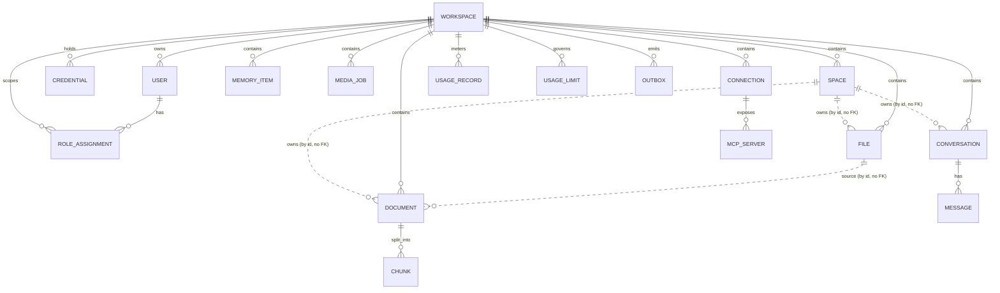

# نموذج البيانات ومخطط قاعدة البيانات

> PostgreSQL · **Schema لكل وحدة** (`DD‑01`) · **UUIDv7** (`DD‑02`) · أعمدة قياسية (`DD‑03`) · **RLS + ترشيح تطبيقي** (`DD‑04`).
> لا FK عابر بين schemas الوحدات؛ المرجعية بالـ`id` فقط. FK مسموح داخل schema الوحدة.

## 0) الاصطلاحات

**Schemas (إحدى عشرة وحدة v1):** `spaces · workspace · access · credentials · conversations · memory · files · knowledge · media · integrations · usage` + `platform` (بنية الأحداث).
> `spaces` أحدثها (‏§2.11، [`spaces-backend-plan.md`](../spaces-backend-plan.md))، وتُذكر **أوّلاً** كما في `_MODULE_SCHEMAS` و`MIGRATION_CHAINS` في [`ops/provision.py`](../../src/app/ops/provision.py): ثلاث سلاسل تملأ `space_id` بالرجوع إلى صفوف هذا الجدول، فوجودُه يسبقها بالضرورة (‏§6).
> **محجوزة لا مُنشأة في v1** (`FR‑110`, DAT‑01): `scheduling · sandbox · runs` — تُضاف بهجرة مستقلّة عند اعتمادها.

**قالب الأعمدة القياسية** (يُطبَّق حسب `DD‑03`):
```sql
id           uuid        PRIMARY KEY,                 -- UUIDv7 من التطبيق
workspace_id uuid        NOT NULL,                    -- على كل جدول مستأجَر
created_at   timestamptz NOT NULL DEFAULT now(),
updated_at   timestamptz NOT NULL DEFAULT now(),      -- + trigger touch
deleted_at   timestamptz NULL,                        -- محتوى المستخدم فقط
version      integer     NOT NULL DEFAULT 1            -- aggregates قابلة للتعديل
-- created_by uuid NULL                               -- (DAT‑05) حيث يُفيد تتبّع المُنشئ (اختياري لكل جدول)
```

**دالة touch (تحديث `updated_at`):**
```sql
CREATE OR REPLACE FUNCTION platform.touch_updated_at() RETURNS trigger AS $$
BEGIN NEW.updated_at = now(); RETURN NEW; END $$ LANGUAGE plpgsql;
-- CREATE TRIGGER trg_touch BEFORE UPDATE ON <t> FOR EACH ROW EXECUTE FUNCTION platform.touch_updated_at();
```

---

## 1) ERD — نظرة كلية


> `FILE ..o{ DOCUMENT` منقّطة: علاقة **منطقية عبر الوحدات** (بالـ`id`)، بلا FK فيزيائي (`DD‑01`).
> **`SPACE` ليست مستأجرًا ثانيًا** بل **محور ملكيّة داخل المستأجر**: الأسهم الثلاثة الخارجة منها منقّطة للسبب نفسه (‏`space_id` مرجعٌ منطقيّ عبر المخطّطات)، والمستأجر يبقى `WORKSPACE` وحده — RLS على `workspace_id` وحده، والترشيح بالوحدة تطبيقيّ في `WHERE` (‏§3).
> `CONNECTION`/`MCP_SERVER` في schema `integrations`؛ `USAGE_RECORD`/`USAGE_LIMIT` في schema `usage`. لا FK بينها وبين بقية الوحدات — المرجعية بالـ`id` فقط (`DAT‑02`).

---

## 2) DDL لكل وحدة

### 2.1 `workspace`
```sql
CREATE SCHEMA workspace;

CREATE TABLE workspace.workspaces (
  id            uuid PRIMARY KEY,
  owner_user_id uuid NOT NULL,
  name          text NOT NULL CHECK (char_length(name) BETWEEN 1 AND 80),
  status        text NOT NULL DEFAULT 'active' CHECK (status IN ('active','suspended','archived')),
  created_at    timestamptz NOT NULL DEFAULT now(),
  updated_at    timestamptz NOT NULL DEFAULT now(),
  version       integer NOT NULL DEFAULT 1,
  purged_at     timestamptz,                     -- BE-ADM-014: set only by `python -m app.ops.purge`
  CONSTRAINT workspaces_purged_at_check CHECK (purged_at IS NULL OR status = 'archived')
);
-- ملاحظة: workspaces جدول جذر المستأجر ⇒ لا RLS بعمود workspace_id (هو المستأجر نفسه)؛
-- يُقيَّد بالوصول عبر id + AuthZ.
-- BE-ADM-014: `purged_at` غير NULL يعني أنّ محتوى مساحة العمل (كلّ الجداول المستأجَرة عبر
-- عشر وحدات، زائدًا Qdrant/MinIO) قد مُحي نهائيًا بعد نافذة احتفاظٍ (30 يومًا افتراضيًا) تلت
-- تدمير آخر مستخدمٍ فيها (`workspace.users.status='deleted'`)؛ الصفّ نفسه يبقى (لا حذف)
-- لأنّ `platform.admin_audit_log` يشير إليه.

CREATE TABLE workspace.users (
  id           uuid PRIMARY KEY,                 -- مشتق من firebase_uid عبر جدول ربط
  workspace_id uuid NOT NULL,
  firebase_uid text NOT NULL UNIQUE,
  email        text NOT NULL,
  display_name text,
  status       text NOT NULL DEFAULT 'active' CHECK (status IN ('active','disabled','deleted')),
  created_at   timestamptz NOT NULL DEFAULT now(),
  updated_at   timestamptz NOT NULL DEFAULT now(),      -- + trigger touch (قابل للتعديل عبر status)
  deleted_at   timestamptz,                             -- BE-ADM-006
  version      integer NOT NULL DEFAULT 1,
  CONSTRAINT fk_user_ws FOREIGN KEY (workspace_id) REFERENCES workspace.workspaces(id),
  CONSTRAINT users_deleted_at_check CHECK ((status = 'deleted') = (deleted_at IS NOT NULL))
);
-- ملاحظة: `deleted` حالةٌ طرفيّة لا رجعة منها، والصفّ **شاهدُ قبرٍ** لا حساب: تُمحى
-- `email` و`display_name` في المعاملة نفسها وتُسحب كل إسناداته في `access.role_assignments`.
-- الصفّ يبقى لأن `platform.admin_audit_log` يشير إليه بمفتاحٍ أجنبيّ NOT NULL بلا ON DELETE،
-- فحذفُه يأخذ معه سجلَّ الحذف ذاته. و`firebase_uid` يبقى عمداً: بدونه يعود صاحبُ الهُويّة
-- نفسها فيُزوَّد بمساحة عملٍ جديدة، فيصير «الحذف» إعادةَ ضبط.
CREATE UNIQUE INDEX uq_users_owner ON workspace.users(workspace_id) WHERE status='active';
-- BE-ADM-014: `app.ops.purge.find_candidates` يمسح هذا العمود بحثًا عن أحدث شاهد قبرٍ
-- لكلّ مساحة عمل؛ فهرسٌ جزئيّ (الأغلبيّة الساحقة من الصفوف لم تُحذف قط، فلا داعي لفهرستها).
CREATE INDEX ix_users_deleted_at ON workspace.users(deleted_at) WHERE deleted_at IS NOT NULL;
```

### 2.2 `access`
```sql
CREATE SCHEMA access;

CREATE TABLE access.role_assignments (
  id           uuid PRIMARY KEY,
  workspace_id uuid NOT NULL,
  user_id      uuid NOT NULL,                    -- مرجع منطقي لـ workspace.users.id
  role         text NOT NULL CHECK (role IN ('owner','admin','member','viewer','platform_admin')),
  granted_by   uuid,
  created_at   timestamptz NOT NULL DEFAULT now(),
  CONSTRAINT uq_assignment UNIQUE (workspace_id, user_id, role)
);
CREATE INDEX ix_ra_ws_user ON access.role_assignments(workspace_id, user_id);
-- Permission كتالوج ثابت بالكود (لا جدول) — انظر 05-rbac-config-secrets.md
```

### 2.3 `credentials`
```sql
CREATE SCHEMA credentials;

CREATE TABLE credentials.credentials (
  id             uuid PRIMARY KEY,
  workspace_id   uuid NULL,                       -- NULL ⇔ scope=platform
  provider       text NOT NULL,
  scope          text NOT NULL CHECK (scope IN ('platform','user')),
  label          text,
  ciphertext_ref text NOT NULL,                   -- ناتج Vault Transit (لا سرّ خام)
  key_id         text NOT NULL,                   -- معرّف مفتاح التشفير في Vault
  status         text NOT NULL DEFAULT 'active' CHECK (status IN ('active','revoked')),
  created_by     uuid,
  created_at     timestamptz NOT NULL DEFAULT now(),
  updated_at     timestamptz NOT NULL DEFAULT now(),
  version        integer NOT NULL DEFAULT 1,
  CONSTRAINT ck_scope_ws CHECK ((scope='user' AND workspace_id IS NOT NULL)
                             OR (scope='platform' AND workspace_id IS NULL))
);
CREATE INDEX ix_cred_ws_provider ON credentials.credentials(workspace_id, provider) WHERE status='active';
```

### 2.4 `conversations`
```sql
CREATE SCHEMA conversations;

CREATE TABLE conversations.conversations (
  id           uuid PRIMARY KEY,
  workspace_id uuid NOT NULL,
  space_id     uuid NULL,                        -- §2.11 · مرجع منطقي لـ spaces.spaces.id (⇐ NOT NULL في الصفّ ٨‑ب)
  agent_key    text NOT NULL,                     -- slug الوكيل أو workflow_key
  kind         text NOT NULL DEFAULT 'agent' CHECK (kind IN ('agent','workflow')),
  title        text,
  model_route  text NULL,                        -- مفتاح توجيه من جدول D‑16 (لا اسم موديل خام)؛ NULL ⇒ يُحلّ بمفتاح الوكيل
  created_by   uuid,
  created_at   timestamptz NOT NULL DEFAULT now(),
  updated_at   timestamptz NOT NULL DEFAULT now(),
  deleted_at   timestamptz NULL,
  version      integer NOT NULL DEFAULT 1
);
CREATE INDEX ix_conv_ws_agent ON conversations.conversations(workspace_id, agent_key)
  WHERE deleted_at IS NULL;
CREATE INDEX ix_conv_space ON conversations.conversations(space_id) WHERE deleted_at IS NULL;

CREATE TABLE conversations.messages (
  id              uuid PRIMARY KEY,
  conversation_id uuid NOT NULL,
  workspace_id    uuid NOT NULL,
  role            text NOT NULL CHECK (role IN ('user','assistant','system','tool')),
  content         jsonb NOT NULL,                 -- نص + مرفقات (file_id بالإشارة)
  token_count     integer,
  seq             integer NOT NULL,
  created_at      timestamptz NOT NULL DEFAULT now(),
  deleted_at      timestamptz NULL,                 -- حذف ناعم على مستوى الرسالة (FR‑81)
  CONSTRAINT fk_msg_conv FOREIGN KEY (conversation_id) REFERENCES conversations.conversations(id),
  CONSTRAINT uq_msg_seq UNIQUE (conversation_id, seq)
);

-- نطاق استرجاع الخيط: أي مستندات مساحة العمل يُجيب منها هذا الخيط (BE‑RAG‑005).
-- الصفّ **مرجع** لا امتلاك: الملف يبقى على مستوى مساحة العمل ويُفهرَس مرّة واحدة في
-- مجموعة Qdrant الواحدة لكل مساحة عمل، و`knowledge.documents` لا يعرف المحادثات (§2.7).
-- مجموعةٌ فارغة ⇒ النطاق الشامل، وهو سلوك كلّ خيطٍ سبق هذا الجدول (لا backfill).
CREATE TABLE conversations.conversation_files (
  conversation_id uuid NOT NULL,
  file_id         uuid NOT NULL,                     -- مرجع منطقي لـ files.files.id
  workspace_id    uuid NOT NULL,
  created_at      timestamptz NOT NULL DEFAULT now(),
  PRIMARY KEY (conversation_id, file_id),
  CONSTRAINT fk_convfile_conv FOREIGN KEY (conversation_id) REFERENCES conversations.conversations(id)
);
```

### 2.5 `memory`
```sql
CREATE SCHEMA memory;

CREATE TABLE memory.memory_items (
  id           uuid PRIMARY KEY,
  workspace_id uuid NOT NULL,
  agent_key    text NOT NULL,
  kind         text NOT NULL CHECK (kind IN ('semantic','episodic')),
  content      text NOT NULL,
  collection   text,                              -- Qdrant collection
  point_id     uuid,                              -- Qdrant point (NULL ريثما يُفهرَس)
  salience     real NOT NULL DEFAULT 0,
  created_at   timestamptz NOT NULL DEFAULT now(),
  deleted_at   timestamptz NULL
);
CREATE INDEX ix_mem_ws_agent ON memory.memory_items(workspace_id, agent_key) WHERE deleted_at IS NULL;
```

### 2.6 `files`
```sql
CREATE SCHEMA files;

CREATE TABLE files.files (
  id           uuid PRIMARY KEY,
  workspace_id uuid NOT NULL,
  space_id     uuid NULL,                        -- §2.11 · مرجع منطقي لـ spaces.spaces.id (⇐ NOT NULL في الصفّ ٨‑ب)
  name         text NOT NULL CHECK (char_length(name) BETWEEN 1 AND 255),
  content_type text NOT NULL,
  size_bytes   bigint NOT NULL CHECK (size_bytes >= 0),
  storage_key  text NOT NULL UNIQUE,              -- workspace_id/uuid
  checksum     text,                              -- sha256 hex
  status       text NOT NULL DEFAULT 'uploaded'
                 CHECK (status IN ('uploaded','scanning','ready','quarantined')),
  uploaded_by  uuid,
  created_at   timestamptz NOT NULL DEFAULT now(),
  updated_at   timestamptz NOT NULL DEFAULT now(),
  deleted_at   timestamptz NULL,
  version      integer NOT NULL DEFAULT 1
);
CREATE INDEX ix_files_ws ON files.files(workspace_id) WHERE deleted_at IS NULL;
CREATE INDEX ix_files_space ON files.files(space_id) WHERE deleted_at IS NULL;
```
> **`ix_files_space` هو فهرس الحصّة قبل أن يكون فهرس السرد:** مجموع `size_bytes` لوحدةٍ واحدة يُقرأ تحت قفلٍ في مسار **تسجيل كلّ رفع** (‏§2.11 والحدّ في [`07 §4`](07-nfr-slo.md#4-الحدود-الرقمية-limits))، فمسحٌ تتابعيّ هنا يقع على أسخن كتابةٍ في الوحدة لا على قراءةٍ عابرة.

### 2.7 `knowledge`
```sql
CREATE SCHEMA knowledge;

CREATE TABLE knowledge.documents (
  id           uuid PRIMARY KEY,
  workspace_id uuid NOT NULL,
  space_id     uuid NULL,                         -- §2.11 · يُورَث من وحدة الملفّ عبر الحدث، لا من طلب (⇐ NOT NULL في ٨‑ب)
  file_id      uuid NOT NULL,                     -- مرجع منطقي لـ files.files.id
  status       text NOT NULL DEFAULT 'pending'
                 CHECK (status IN ('pending','indexing','indexed','failed')),
  chunk_count  integer NOT NULL DEFAULT 0,
  error        text,
  created_at   timestamptz NOT NULL DEFAULT now(),
  updated_at   timestamptz NOT NULL DEFAULT now(),
  version      integer NOT NULL DEFAULT 1
);
CREATE INDEX ix_doc_ws_status ON knowledge.documents(workspace_id, status);
-- ⚠️ `ix_kndoc_space` **كامل لا جزئيّ**، وحده من فهارس الوحدة الثلاثة: هذا الجدول
-- لا يحمل `deleted_at` أصلاً (المستند يُتلَف صلبًا، INV‑K4)، فشرط `WHERE deleted_at IS NULL`
-- لا يُصرَّف هنا. والاختبار الحيّ يوكّد **غياب** العمود بجانب الفهرس كي لا «يُصلِح»
-- قارئٌ لاحقٌ التفاوتَ إلى خطأ صياغة.
CREATE INDEX ix_kndoc_space ON knowledge.documents(space_id);

CREATE TABLE knowledge.chunks (
  id           uuid PRIMARY KEY,
  document_id  uuid NOT NULL,
  workspace_id uuid NOT NULL,
  seq          integer NOT NULL,
  text         text NOT NULL,
  token_count  integer,
  collection   text,
  point_id     uuid,                              -- Qdrant
  created_at   timestamptz NOT NULL DEFAULT now(),
  CONSTRAINT fk_chunk_doc FOREIGN KEY (document_id) REFERENCES knowledge.documents(id),
  CONSTRAINT uq_chunk_seq UNIQUE (document_id, seq)   -- Idempotency للاستيعاب
);

-- BE-RAG-007/008: مهمّة إعادة الفهرسة. الصفّ لا يحمل تقدّماً ولا حالةً —
-- هُويّةً و`cancelled_at` فقط، والباقي يُشتقّ من حالات المستندات التي أنشأتها
-- (عدّادٌ مخزَّن يحتاج كاتباً في العامل ويهجر الحقيقة عند أوّل انهيار).
CREATE TABLE knowledge.reindex_jobs (
  id           uuid PRIMARY KEY,
  workspace_id uuid NOT NULL,
  cancelled_at timestamptz,
  created_at   timestamptz NOT NULL DEFAULT now(),
  updated_at   timestamptz NOT NULL DEFAULT now(),
  version      integer NOT NULL DEFAULT 1
);
CREATE INDEX ix_reindex_jobs_ws ON knowledge.reindex_jobs(workspace_id, id DESC);

CREATE TABLE knowledge.reindex_job_items (
  job_id             uuid NOT NULL,
  document_id        uuid NOT NULL,               -- المستند الجديد (INV-K3)
  workspace_id       uuid NOT NULL,
  file_id            uuid NOT NULL,               -- مرجع منطقي لـ files.files.id
  -- المستند المُتلَف الذي حلّ الجديدُ محلّه: سجلٌّ تاريخيّ بلا صفٍّ خلفه، فلا
  -- مفتاح أجنبيّ له — الـ FK كان سيمنع الإتلاف الذي هو غايةُ العملية نفسها.
  source_document_id uuid NOT NULL,
  created_at         timestamptz NOT NULL DEFAULT now(),
  PRIMARY KEY (job_id, document_id),
  CONSTRAINT fk_reindex_item_job FOREIGN KEY (job_id) REFERENCES knowledge.reindex_jobs(id),
  CONSTRAINT fk_reindex_item_doc FOREIGN KEY (document_id) REFERENCES knowledge.documents(id)
);

-- BE-RAG-009/010/011: الملخّص ومهمّةُ بنائه.
-- الملخّص معلّقٌ بالمستند لا بالملف: هو دعوى عن **نصّ**، والنصّ الذي كُتب منه
-- يخصّ مستنداً واحداً. إعادةُ الفهرسة تُتلف المستند (INV-K4) لأنّ بايتات الملف
-- قد تُحلَّل الآن تحليلاً آخر، وملخّصٌ مفتاحُه الملف كان سيبقى بعد ذلك الإتلاف
-- ويستمرّ في وصف مجموعةٍ لم تعد موجودة، بلا قيدٍ واحدٍ يستطيع ملاحظة ذلك.
CREATE TABLE knowledge.summaries (
  id            uuid PRIMARY KEY,
  workspace_id  uuid NOT NULL,
  document_id   uuid NOT NULL,
  kind          text NOT NULL CHECK (kind IN ('overview','full')),
  lang          text NOT NULL CHECK (lang IN ('auto','ar','en')),
  text          text NOT NULL,
  model         text NOT NULL,                    -- مَن كتبه (سابقةُ `host` في BE-ADM-007)
  source_chunks integer NOT NULL,                 -- كم مقطعاً قُرئ فعلاً
  truncated     boolean NOT NULL DEFAULT false,   -- هل تجاوز المستندُ سقف الخريطة
  built_at      timestamptz NOT NULL,
  created_at    timestamptz NOT NULL DEFAULT now(),
  updated_at    timestamptz NOT NULL DEFAULT now(),
  version       integer NOT NULL DEFAULT 1,
  -- بلا `ON DELETE`، عمداً — سابقةُ `fk_chunk_doc`: `purge` يحذف الملخّصات ثمّ
  -- المقاطع ثمّ الصفّ، وغيابُ الشلّال هو ما يجعل ذلك الترتيب واجباً لا ذوقاً.
  CONSTRAINT fk_summary_doc FOREIGN KEY (document_id) REFERENCES knowledge.documents(id),
  CONSTRAINT uq_summary_key UNIQUE (document_id, kind, lang)
);
CREATE INDEX ix_summaries_ws ON knowledge.summaries(workspace_id, document_id);

-- **هذا الجدول يخزّن حالته وتقدّمه، وهي مخالفةٌ موثّقة لـINV-K5 لا سهو.**
-- مهمّةُ إعادة الفهرسة تشتقّ كلّ رقمٍ لأنّ المتن يسجّله أصلاً: بنودُها تشير إلى
-- مستنداتٍ تحمل حالاتها بنفسها. أمّا مهمّةُ التلخيص فلا شاهد ثانٍ لها — قبل أن
-- تنتهي لا وجود لصفّ ملخّصٍ إطلاقاً، و«الخطوة 7 من 42» حقيقةٌ لا يعرفها إلا
-- العاملُ الذي ينفّذ الخطوة 7. فلا شيء يُشتقّ منه، فيُكتَب؛ والثمن مُعلَن حيث
-- يعيش العدّاد: عاملٌ يموت بين خطوتين يترك `done_chunks` قديماً حتى تُعيد
-- الرسالةُ تسليمَه، والرقم في تلك النافذة آخرُ ما كان صادقاً لا ما هو صادق.
CREATE TABLE knowledge.summary_jobs (
  id            uuid PRIMARY KEY,
  workspace_id  uuid NOT NULL,
  -- بلا مفتاح أجنبيّ، سابقةُ `source_document_id`: المهمّة سجلُّ عمليةٍ وقعت،
  -- وإعادةُ الفهرسة قد تُتلف المستند تحت بناءٍ جارٍ — والـFK كان سيمنع الإتلاف
  -- نفسه. البناءُ الذي يحاول عندئذٍ تخزينَ نتيجته يوقفه `fk_summary_doc`، وهو
  -- الموضع الذي فيه الخطأُ فعلاً، ويحوّله العاملُ إلى مهمّةٍ فاشلةٍ بسبب.
  document_id   uuid NOT NULL,
  kind          text NOT NULL CHECK (kind IN ('overview','full')),
  lang          text NOT NULL CHECK (lang IN ('auto','ar','en')),
  status        text NOT NULL DEFAULT 'queued'
                  CHECK (status IN ('queued','running','succeeded','failed','cancelled')),
  total_chunks  integer NOT NULL DEFAULT 0,
  done_chunks   integer NOT NULL DEFAULT 0,
  error         text,
  cancelled_at  timestamptz,
  finished_at   timestamptz,
  created_at    timestamptz NOT NULL DEFAULT now(),
  updated_at    timestamptz NOT NULL DEFAULT now(),
  version       integer NOT NULL DEFAULT 1
);
-- درسُ `uq_cred_active_platform` مُطبَّقاً هنا: بلا فهرسٍ فريدٍ جزئيّ على
-- الحالات غير الطرفيّة، يصطفّ طلبان متزامنان لنفس المفتاح، **يدفعان كلاهما**
-- ثمن المستند كاملاً، ثمّ يتسابقان إلى صفّ `uq_summary_key` واحد — فيدفع
-- أحدهما بالكامل ثمّ يفشل عند آخر جملة. الفهرس يحوّل ذلك إلى 409 قبل أوّل رمز.
CREATE UNIQUE INDEX uq_summary_job_active
  ON knowledge.summary_jobs(document_id, kind, lang)
  WHERE status IN ('queued','running');
CREATE INDEX ix_summary_jobs_ws ON knowledge.summary_jobs(workspace_id, id DESC);
```

**إتلافُ المستند القديم جزءٌ من العقد لا أثرٌ جانبيّ.** معرّف نقطة Qdrant مُشتقٌّ من
معرّف المستند (`chunk_point_id(document_id, seq)`), فمستندٌ ثانٍ على الملف نفسه يعني
نسختين من كل مقطعٍ في المجموعة **إلى الأبد**. لذلك تحذف إعادةُ الفهرسة نقاطَ المستند
القديم ثمّ صفوف `chunks` ثمّ صفّه، قبل تسجيل الجديد. والترتيب مقصود: فشلُ حذف النقاط
يترك كل شيءٍ كما كان، بينما العكس كان سيترك نقاطاً يتيمةً لمستندٍ لا وجود له.

### 2.8 `media`
```sql
CREATE SCHEMA media;

CREATE TABLE media.media_jobs (
  id             uuid PRIMARY KEY,
  workspace_id   uuid NOT NULL,
  agent_key      text NOT NULL,
  kind           text NOT NULL CHECK (kind IN ('image','video')),
  prompt         text NOT NULL,
  params         jsonb NOT NULL DEFAULT '{}',
  status         text NOT NULL DEFAULT 'queued'
                   CHECK (status IN ('queued','running','succeeded','failed')),
  result_file_id uuid,                            -- مرجع منطقي لـ files.files.id
  error          text,
  created_by     uuid,
  created_at     timestamptz NOT NULL DEFAULT now(),
  updated_at     timestamptz NOT NULL DEFAULT now(),
  version        integer NOT NULL DEFAULT 1
);
CREATE INDEX ix_media_ws_status ON media.media_jobs(workspace_id, status);
```

### 2.9 `integrations` (وحدة v1 — `FR‑120…124`)
موصّلات OAuth بطرف ثالث وخوادم MCP **بعيدة (HTTP/SSE) حصراً**، لكل Workspace. الأسرار (رموز/مفاتيح) **مُعمّاة عبر Vault Transit** (`SEC‑07`) — لا نصّ صريح.
```sql
CREATE SCHEMA integrations;

CREATE TABLE integrations.connections (
  id             uuid PRIMARY KEY,
  workspace_id   uuid NOT NULL,
  connector_key  text NOT NULL,                    -- مُعرّف الموصّل في الكتالوج (مثل 'github','slack')
  display_name   text,
  status         text NOT NULL DEFAULT 'pending'
                   CHECK (status IN ('pending','connected','revoked','error')),
  scopes         text[] NOT NULL DEFAULT '{}',
  token_ref      text,                             -- ناتج Vault Transit (access/refresh) — لا سرّ خام
  key_id         text,                             -- معرّف مفتاح Transit المستخدَم للتعمية
  expires_at     timestamptz,                      -- انتهاء access token (لفحص التجديد الكسول — FR‑124)
  last_error     text,
  created_by     uuid,
  created_at     timestamptz NOT NULL DEFAULT now(),
  updated_at     timestamptz NOT NULL DEFAULT now(),
  version        integer NOT NULL DEFAULT 1,
  CONSTRAINT uq_conn_ws_connector UNIQUE (workspace_id, connector_key)
);
CREATE INDEX ix_conn_ws ON integrations.connections(workspace_id) WHERE status = 'connected';

CREATE TABLE integrations.mcp_servers (
  id             uuid PRIMARY KEY,
  workspace_id   uuid NOT NULL,
  name           text NOT NULL,
  endpoint_url   text NOT NULL,                    -- بعيد فقط (https/sse) — لا stdio (v1)
  transport      text NOT NULL DEFAULT 'http'
                   CHECK (transport IN ('http','sse')),   -- نقل بعيد حصراً (خارج v1: stdio → sandbox)
  auth_ref       text,                             -- سرّ مصادقة MCP مُعمّى عبر Transit (اختياري)
  key_id         text,
  status         text NOT NULL DEFAULT 'active' CHECK (status IN ('active','disabled','error')),
  created_by     uuid,
  created_at     timestamptz NOT NULL DEFAULT now(),
  updated_at     timestamptz NOT NULL DEFAULT now(),
  version        integer NOT NULL DEFAULT 1,
  CONSTRAINT uq_mcp_ws_name UNIQUE (workspace_id, name)
);
CREATE INDEX ix_mcp_ws ON integrations.mcp_servers(workspace_id) WHERE status = 'active';
```
> اكتشاف أدوات MCP يتمّ **وقت التشغيل** عبر `MCPClient` (لا تُخزَّن قوائم الأدوات إلزامياً)؛ التخزين هنا للاتصال/الاعتماد فقط. **يُمنع** تشغيل خوادم MCP كعمليات فرعية داخل حاويات التطبيق/العمّال (§6.13 من المتطلبات).

### 2.10 `usage` (وحدة v1 — `FR‑130…134`)
قياس + حصص + ميزانيات + حدود. **خارج الناقل**: الالتقاط عبر منفذ وارد متزامن يُلحِق في **سجلّ append‑only** (لا Redis Streams). الفوترة المالية خارج v1.
```sql
CREATE SCHEMA usage;

-- سجلّ استهلاك append‑only (بلا deleted_at/version — DAT‑07)
CREATE TABLE usage.usage_records (
  id            uuid PRIMARY KEY,
  workspace_id  uuid NOT NULL,
  agent_key     text NOT NULL,
  provider      text NOT NULL,
  tokens        bigint NOT NULL DEFAULT 0 CHECK (tokens >= 0),
  cost_micros   bigint NOT NULL DEFAULT 0 CHECK (cost_micros >= 0),  -- تكلفة بوحدات صغرى (تفادي العائم)
  operation_id  uuid NOT NULL,                    -- مفتاح إدمبوتنسي طبيعي (FR‑134)
  created_at    timestamptz NOT NULL DEFAULT now(),
  CONSTRAINT uq_usage_op UNIQUE (workspace_id, operation_id)   -- إعادة الالتقاط بنفس المفتاح ⇒ تُتجاهَل بهدوء
);
CREATE INDEX ix_usage_ws_agent_prov ON usage.usage_records(workspace_id, agent_key, provider, created_at);

-- تجميع/تدوير داخلي للفرض السريع (rollup — شأن داخلي للوحدة)
CREATE TABLE usage.usage_rollups (
  workspace_id  uuid NOT NULL,
  agent_key     text NOT NULL DEFAULT '*',        -- '*' = كل الوكلاء
  provider      text NOT NULL DEFAULT '*',
  period        text NOT NULL CHECK (period IN ('day','month')),
  period_start  date NOT NULL,
  tokens_sum    bigint NOT NULL DEFAULT 0,
  cost_micros_sum bigint NOT NULL DEFAULT 0,
  updated_at    timestamptz NOT NULL DEFAULT now(),
  PRIMARY KEY (workspace_id, agent_key, provider, period, period_start)
);

-- حصص/ميزانيات/حدود قابلة للإعداد (متوائمة مع SLO — FR‑133)
CREATE TABLE usage.limits (
  id            uuid PRIMARY KEY,
  workspace_id  uuid NOT NULL,
  scope         text NOT NULL CHECK (scope IN ('workspace','agent','provider')),
  scope_key     text NOT NULL DEFAULT '*',        -- agent_key أو provider عند تخصيص النطاق
  metric        text NOT NULL CHECK (metric IN ('tokens','cost_micros')),
  period        text NOT NULL CHECK (period IN ('day','month')),
  limit_value   bigint NOT NULL CHECK (limit_value >= 0),
  created_at    timestamptz NOT NULL DEFAULT now(),
  updated_at    timestamptz NOT NULL DEFAULT now(),
  version       integer NOT NULL DEFAULT 1,
  CONSTRAINT uq_limit UNIQUE (workspace_id, scope, scope_key, metric, period)
);
CREATE INDEX ix_limits_ws ON usage.limits(workspace_id);
```
> **الفرض** (قبل العملية) يقرأ `usage_rollups` مقابل `limits` ويعيد **كائن قرار**؛ عقد المنفذ قابل للتطوّر إلى **reserve/commit** بإضافة عمود `reservation_id`/جدول حجوزات لاحقاً بلا كسر (`FR‑132` — نقطة توسعة). كلا المنفذين يُستدعى من **المُنسِّق** (طبقة الوكلاء) حصراً.
>
> **BE-ADM-014**: الجداول الثلاثة هنا تُمحى مع مساحة العمل التي تخصّها عند التطهير (`python -m
> app.ops.purge`) — قراءةُ عدّادٍ لكلّ مستأجرٍ لا التزامًا ماليًا (الفوترة خارج v1)، فلا تُجمَّع في
> سجلٍّ عابرٍ للمساحات قبل الحذف؛ REVIEW POINT في نصّ الوحدة نفسها إن ظهر التزام احتفاظٍ فوترةً/ضرائب.

### 2.11 `spaces` (وحدة v1 — [`spaces-backend-plan.md`](../spaces-backend-plan.md))

**الوحدة (space) محور ملكيّة داخل المستأجر، لا مستأجر ثانٍ.** مساحة العمل تبقى الحدّ الأمنيّ الوحيد؛ الوحدة تقسّم محتواها إلى أقسامٍ يملك كلٌّ منها ملفّاته ومحادثاته ومستنداته. **الرقم يأتي أخيرًا في هذا الترقيم وحده** — تسلسل §2 تاريخيّ، والإشارات إليه (‏`01 §2.7`…) مبثوثةٌ في بقيّة الوثائق فلا تُعاد ترقيمها — أمّا ترتيب الإنشاء الحقيقيّ فهو §6: مباشرةً بعد سلسلة الأساس.

```sql
CREATE SCHEMA spaces;

CREATE TABLE spaces.spaces (
  id           uuid PRIMARY KEY,
  workspace_id uuid NOT NULL,
  name         text NOT NULL CHECK (char_length(name) BETWEEN 1 AND 120),
  created_by   uuid,
  created_at   timestamptz NOT NULL DEFAULT now(),
  updated_at   timestamptz NOT NULL DEFAULT now(),
  deleted_at   timestamptz NULL,
  version      integer NOT NULL DEFAULT 1
);
-- تفرّدٌ **غير حسّاس لحالة الأحرف** وعلى **الحيّ وحده**: «Research» و«research» اسمٌ
-- واحدٌ لقارئ، ووحدةٌ محذوفةٌ ناعمًا يجب ألّا تحتجز اسمها إلى الأبد. وهذا الفهرس هو
-- **كامل دفاع الوحدة عن التفرّد**: التطبيق لا يقرأ قبل الكتابة عمدًا (زوج «اقرأ ثمّ أدرج»
-- خاطئٌ بالضبط حين يتسابق طلبان)، فـ`23505` الصادر من هنا هو ما يصير `spaces.duplicate_name`.
CREATE UNIQUE INDEX ux_spaces_ws_name
  ON spaces.spaces(workspace_id, lower(name)) WHERE deleted_at IS NULL;

CREATE TRIGGER trg_touch BEFORE UPDATE ON spaces.spaces
  FOR EACH ROW EXECUTE FUNCTION platform.touch_updated_at();

ALTER TABLE spaces.spaces ENABLE ROW LEVEL SECURITY;
ALTER TABLE spaces.spaces FORCE  ROW LEVEL SECURITY;
CREATE POLICY tenant_isolation ON spaces.spaces
  USING      (workspace_id = NULLIF(current_setting('app.workspace_id', true), '')::uuid)
  WITH CHECK (workspace_id = NULLIF(current_setting('app.workspace_id', true), '')::uuid);
```

**المخطّط `spaces` نفسه لا تُنشئه هذه السلسلة** بل مراجعةُ منصّةٍ سابقة ([`platform/0004_spaces_schema.py`](../../migrations/versions/platform/0004_spaces_schema.py))، والسبب بنيويّ: Alembic يُنشئ `spaces.alembic_version` **قبل** تنفيذ أوّل `upgrade()`، فلا تستطيع السلسلة أن تُنشئ المخطّط الذي يسكنه جدولُ دفاترها.

**الأعمدة الثلاثة المضافة على الوحدات الأخرى** (‏§2.4 · §2.6 · §2.7) `space_id uuid NULL` اليوم، ونمطُ ترحيلها ADD ⇒ backfill ⇒ فهرس. والتشديد إلى `NOT NULL` **مؤجَّلٌ بقصد** إلى صفٍّ لاحق في الخطّة: عمودٌ إلزاميٌّ قبل أن يصير له كُتّاب كان يردّ `23502` على كلّ إدراجٍ في ثلاثة جداول. آخرُ ما يمنع التشديد اليوم كاتبٌ واحد — **الوسائط المولَّدة**، ووظيفتها لا تحمل خيطًا ولا وحدة.

**لا مفاتيح خارجيّة عبر المخطّطات** (`DD‑01`): `space_id` مرجعٌ منطقيّ، على سابقة `conversation_files.file_id`. ⇒ **إثبات وجود الوحدة قبل الكتابة مسؤوليّة التطبيق** (منفذٌ لكلّ مستهلك، [`02 §2`](02-port-contracts.md))، ولا شيء في القاعدة يمنع صفًّا يشير إلى وحدةٍ غير موجودة. والقراءة **لا تُثبت**: سردٌ بمعرّفٍ لا يسمّي وحدةً يعيد صفحةً فارغة لا `404`، وإلّا صار السرد عرّافَ وجودٍ لمعرّفاتٍ لم يُعطها أحد.

**الحذف حذفٌ متسلسل** يعبر خمس وحدات + Qdrant + MinIO؛ يعيش في **خدمة تنسيق** عند جذر التركيب لا في وحدة (سابقة [`app/ops/purge.py`](../../src/app/ops/purge.py))، بلا وحدة عملٍ جامعة: كلّ خطوةٍ معاملتُها وكلٌّ منها عديمةُ الأثر عند التكرار، فسلسلةٌ انقطعت يُصلحها إعادةُ التشغيل. والوسمُ (‏`deleted_at` على صفّ الوحدة) **أوّلًا** كي لا يرى المستخدم وحدةً نصف-محذوفة.

---

## 3) عزل المستأجر — RLS (تنفيذ `DD‑04`, D‑23)

على **كل جدول مستأجَر** (يحمل `workspace_id`):
```sql
ALTER TABLE files.files ENABLE ROW LEVEL SECURITY;
ALTER TABLE files.files FORCE ROW LEVEL SECURITY;   -- يشمل مالك الجدول

CREATE POLICY tenant_isolation ON files.files
  USING      (workspace_id = NULLIF(current_setting('app.workspace_id', true), '')::uuid)
  WITH CHECK (workspace_id = NULLIF(current_setting('app.workspace_id', true), '')::uuid);
```
- ضبط السياق لكل معاملة (من `ExecutionContext` عبر `infrastructure/persistence/rls.py`):
```sql
SET LOCAL app.workspace_id = '018f...';   -- بداية كل معاملة تطبيق/عامل
```
- **دور التطبيق** `app_rw`: `NOINHERIT`, **بلا** `BYPASSRLS`, وليس مالك الجداول ⇒ خاضع للسياسة.
- **الترشيح التطبيقي** (دفاع ثانٍ): كل Repository يضيف `WHERE workspace_id = :ws` صراحةً.
- تنطبق نفس السياسة على **كل** الجداول المستأجَرة الجديدة: `spaces.spaces`, `integrations.connections`, `integrations.mcp_servers`, `usage.usage_records`, `usage.usage_rollups`, `usage.limits`.
- **و`space_id` ليست في أيّ سياسة — قرارٌ مقصود، لا سهو.** مساحة العمل تُشتقّ من **هويّة** المستخدم بعد المصادقة؛ الوحدة يختارها **الطلب**. ووضعُ قيمةٍ يختارها الطلب في متغيّرٍ أمنيّ لا يضيف أمنًا — التطبيق هو من يضبطها أصلًا — ويحوّل خطأ ترشيحٍ عاديًّا إلى ثغرةٍ صامتة. الترشيح بالوحدة مكانه `WHERE` المستودع، وهو **دفاعٌ أوّل** لا ثانٍ: لا سياسةَ خلفه تُمسك ما يسقط منه.
- الجداول غير المستأجَرة (`workspace.workspaces`, كتالوجات المنصّة) تُحمى بالـAuthZ لا بالـRLS.
- `current_setting(..., true)` يعيد `NULL` عند غياب السياق ⇒ **صفر صفوف** (فشل آمن، لا تسريب).
- **تصليب `NULLIF` إلزامي (مُثبَت تجريبياً على PG16، 2026‑07‑14):** على الاتصالات المجمّعة، أوّل `SET LOCAL` على الـbackend يجعل قيمة إعادة الضبط للـGUC **سلسلة فارغة `''`** لا «غير مضبوط»؛ فمعاملة لاحقة تنسى `SET LOCAL` تحصل على `''`، و`''::uuid` **يرمي خطأ** (22P02 ⇒ 500) بدل صفر صفوف. صيغة `NULLIF(...,'')::uuid` تُرجِع الفشل الآمن (`''`→`NULL`→صفر صفوف). خلف PgBouncer (D‑21) هذا مسار ساخن لا حالة حدّية.

### 3.1 حالة خاصّة — قراءة مفاتيح المنصّة (`credentials` بـ`workspace_id IS NULL`)

صفوف `credentials.credentials` على مستوى المنصّة (`scope='platform'`, `workspace_id IS NULL`) لا تطابق سياسة `tenant_isolation` (المطابقة على `workspace_id = app.workspace_id`)، والدور `app_rw` **بلا** `BYPASSRLS`؛ فتبقى غير مقروءة عبر السياسة القياسية. يحلّ `ProviderResolver` هذا عبر **سياسة RLS إضافية (permissive) للقراءة فقط** تسمح بصفوف المنصّة المشتركة — سياسات RLS تُدمَج بمنطق **OR**، فتوسّع القراءة لصفوف المنصّة دون كسر عزل صفوف المستأجرين الآخرين (تبقى مقيَّدة بـ`workspace_id IS NULL`):
```sql
-- قراءة فقط لمفاتيح المنصّة المشتركة، فوق سياسة العزل المستأجري
CREATE POLICY platform_credentials_read ON credentials.credentials
  FOR SELECT
  USING (workspace_id IS NULL AND scope = 'platform');
```
- النطاق **SELECT فقط** ⇒ لا كتابة/تعديل على مفاتيح المنصّة عبر مسار المستأجر (إدارتها بمسار PlatformAdmin منفصل عبر AuthZ).
- القيد `workspace_id IS NULL` يمنع تسريب مفاتيح مستأجرين آخرين؛ الرؤية تقتصر على المنصّة المشتركة + مفاتيح المستأجر الحالي (عبر `tenant_isolation`).
- يتّسق مع قاعدة الاختيار في `06-domain-models.md` (§3): تفضيل مفتاح المستخدم، وإلا مفتاح المنصّة، بلا Fallback بين المزوّدين (D‑16).

---

## 4) بنية الأحداث — `platform` (تنفيذ D‑18, D‑19)

### 4.1 Transactional Outbox
```sql
CREATE SCHEMA platform;

CREATE TABLE platform.outbox (
  id             uuid PRIMARY KEY,                -- = event_id (UUIDv7)
  workspace_id   uuid,                            -- للتتبّع (قد يكون NULL لأحداث منصّة)
  aggregate_type text NOT NULL,
  aggregate_id   uuid NOT NULL,
  event_type     text NOT NULL,                  -- <module>.<aggregate>.<event>.vN
  stream         text NOT NULL,                  -- اسم مجرى الوحدة الهدف
  payload        jsonb NOT NULL,                 -- مظروف CloudEvents كامل
  correlation_id uuid,
  causation_id   uuid,
  created_at     timestamptz NOT NULL DEFAULT now(),
  published_at   timestamptz NULL,               -- يملؤه المُرحّل بعد النشر
  attempts       integer NOT NULL DEFAULT 0
);
CREATE INDEX ix_outbox_unpublished ON platform.outbox(created_at)
  WHERE published_at IS NULL;
```
- الأثر النطاقي + صف الـOutbox يُكتبان في **نفس المعاملة** ⇒ لا فقد ولا نشر أشباح.
- `outbox_relay` (نسخة واحدة، D‑26): يسحب غير المنشور بترتيب `created_at`، ينشر إلى `XADD` للمجرى، ثم يضبط `published_at`. `at‑least‑once`.

### 4.2 Idempotency (تنفيذ D‑19, `DD‑09`)
```sql
CREATE TABLE platform.processed_events (
  consumer_group text NOT NULL,
  event_id       uuid NOT NULL,
  processed_at   timestamptz NOT NULL DEFAULT now(),
  PRIMARY KEY (consumer_group, event_id)
);
```
- المستهلك يُدرج `(group, event_id)` **داخل معاملة الأثر الجانبي**؛ تعارض المفتاح ⇒ سبق المعالجة ⇒ `ACK` بلا تكرار.

### 4.2‑ب مثاليّة الطلبات — `Idempotency-Key` (‏3.79، `03 §0`)
```sql
CREATE TABLE platform.idempotency_keys (
  workspace_id    uuid NOT NULL,
  endpoint        text NOT NULL,
  idempotency_key text NOT NULL,
  request_hash    text NOT NULL,                  -- بصمة sha256، لا الجسد
  response_body   jsonb,                          -- NULL ⇒ مُطالَبٌ به وقيد التنفيذ
  created_at      timestamptz NOT NULL DEFAULT now(),
  completed_at    timestamptz,
  PRIMARY KEY (workspace_id, endpoint, idempotency_key)
);
CREATE INDEX ix_idempotency_keys_created ON platform.idempotency_keys(created_at);
```
- نظير §4.2 عند حدّ الـAPI لا حدّ المستهلك: عمليّةٌ قد تُسلَّم مرّتين يجب أن تُنفَّذ مرّة. الإدراج **أوّلاً** (وتعارض المفتاح الأساسيّ هو ما يجعل «واحدٌ فقط ينفّذ» صحيحاً تحت التزامن)، ثمّ يُملأ `response_body` بعد اكتمال العمليّة، وتُحذف المطالبة إن **رمَت** كي لا يتعطّل المفتاح للأبد.
- **الجدول الوحيد في `platform` بسياسة RLS**: جسد الردّ المخزَّن بيانات مستأجر، خلافاً لـ`outbox`/`processed_events` اللذين لا يحملان عمود مستأجر أصلاً. السياسة بصيغة `NULLIF` المُصلَّبة (‏§3).
- **الصلاحيات:** الجدول الوحيد في `platform` الذي يأخذ `SELECT, INSERT, UPDATE, DELETE` لـ`app_rw` — لأنّ غايته أن يُقرأ ويُحدَّث ويُحرَّر؛ ما يحصره هو RLS لا المنحة.
- **الاحتفاظ:** كـ§4.2، لا سياسة احتفاظٍ في v1؛ `created_at` مفهرسٌ لأنّ كنسةً تشغيليّةً ستعمل عليه.

### 4.3 مواضع المجاري (اختياري للمراقبة)
```sql
CREATE TABLE platform.stream_offsets (
  stream         text NOT NULL,
  consumer_group text NOT NULL,
  last_id        text NOT NULL,                   -- Redis stream entry id
  updated_at     timestamptz NOT NULL DEFAULT now(),
  PRIMARY KEY (stream, consumer_group)
);
```
> نقطة توسعة Observability: `correlation_id`/`causation_id` محمولة في Outbox والمظروف ⇒ تتبّع لاحق بلا إعادة هيكلة.

---

## 5) الفهارس والأداء
- كل مفاتيح البحث الشائعة مفهرسة بـ`(workspace_id, …)` لتوافق مسح RLS.
- الفهارس الجزئية `WHERE deleted_at IS NULL` تُبقي المسح على الحيّ فقط.
- **فهارس الوحدة الثلاثة** — `ix_files_space` · `ix_conv_space` (جزئيّان) · `ix_kndoc_space` (كامل، §2.7) — تخدم ثلاث قراءاتٍ لا واحدة: السرودَ الثلاثة (‏`?space_id=` إلزاميّ)، ومجموعَ الحصّة على مسار كلّ رفع، والحذفَ المتسلسل. وفهرسٌ رابع خارج PostgreSQL: بطاقة `space` في Qdrant بـ`is_tenant=True` — إعادةُ ترتيبٍ فيزيائيّ للنقاط، لا تسريعُ مطابقة (‏[`07 §5`](07-nfr-slo.md#5-الأداء-والصيانة-بنيوياً)).
- `platform.outbox` فهرس جزئي على غير المنشور ⇒ سحب المُرحّل O(الطابور).
- UUIDv7 يقلّل تضخّم صفحات B‑Tree مقارنةً بـv4 تحت الإدراج.

## 6) استراتيجية الهجرات (Alembic)
- **سلسلة هجرات لكل وحدة** (‏**إحدى عشرة سلسلة** v1 + سلسلة الأساس = 12 مدخلة في `MIGRATION_CHAINS`) ضمن `version_table_schema` منفصل لكل وحدة (`DAT‑03`)، تُدار مركزياً بأمر واحد؛ سلسلة تمهيدية تُنشئ الـschemas والامتدادات وجداول `platform`.
- **`spaces` تلي الأساس مباشرةً وقبل كلّ سلسلةٍ كسبت `space_id`** (‏§2.11): ترحيلات تلك الأعمدة الثلاثة تملأ نفسها بالرجوع إلى صفوف `spaces.spaces`، فالجدول يجب أن يكون موجودًا. **ولا FK يفرض هذا الترتيب** (المرجعيّة منطقيّة، `DD‑01`) — ولهذا بالذات يُكتب الترتيب في `MIGRATION_CHAINS` بدل تركه لـAlembic ليكتشفه. و`workspace` تسبق الثلاثة كذلك، ولسببٍ أحدّ: `workspace.workspaces` بلا RLS (جدولُ جذر المستأجر، §2.1)، فهي الجدول الوحيد الذي يستطيع مُرحِّلٌ ليس superuser ولا `BYPASSRLS` أن يعدّده **قبل** أن يعرف أيّ مساحةٍ يضبط `app.workspace_id` عليها — وفراغُها هناك يعني أنّ كلّ backfill يمرّ ناجحًا وهو لا يفعل شيئًا.
- `alembic.ini` يوجّه `version_table_schema` لكل وحدة بمعزل ⇒ إضافة وحدة جديدة = **سلسلة هجرات مستقلّة** بلا مساس بالقائم (`FR‑111`).
- ترتيب البذر: schemas → جداول المنصّة → جداول الوحدات → سياسات RLS → الأدوار/الصلاحيات (`app_rw`).
- **schemas المحجوزة** (`scheduling · sandbox · runs`) **لا تُنشأ في v1**؛ تُضاف بسلسلة هجرات خاصّة عند اعتمادها.
- لا هجرة تُنشئ FK عابراً بين schemas الوحدات (يُفحص في مراجعة الهجرات).
