<div dir="rtl">

# الدليل العربي الشامل لبنية مشروع AIZZAK

> هذا الملف يشرح **كيف رُكِّب المشروع وكيف تتواصل أجزاؤه** اعتمادًا على الشيفرة الحالية وملفات التصميم، لا على وصف نظري منفصل عنها.
>
> آخر مراجعة للشيفرة لهذا الدليل: **19 أغسطس 2026**.

## 1. ما المشروع باختصار؟

**AIZZAK** هو الجزء الخلفي لمنصّة ذكاء اصطناعي متعددة الوكلاء. يستطيع المستخدم إنشاء مساحة عمل، رفع ملفات، فهرستها، البحث داخلها، محادثة وكلاء متخصصين، طلب إنشاء صور أو فيديو، وربط خدمات خارجية. كما يستطيع مسؤول المنصّة إدارة المستخدمين والمزوّدين ومراقبة حالة النظام.

يمكن تخيّل المشروع كمبنى كبير:

- **البوابة الأمامية** هي Nginx وواجهة API.
- **موظف الاستقبال** يتحقق من هوية المستخدم وصلاحياته.
- **الأقسام الداخلية** هي وحدات الأعمال، مثل الملفات والمحادثات والمعرفة.
- **المنسّق** يختار الوكيل ومزوّد الذكاء المناسب ويجمع ما يحتاجه الطلب.
- **المخازن** هي PostgreSQL وMinIO وQdrant وRedis وVault.
- **فريق العمل الخلفي** هو العمّال الذين ينفذون المهام الطويلة خارج طلب المستخدم.

المشروع ليس مجموعة خدمات صغيرة منفصلة لكل ميزة. أغلب منطق الأعمال موجود في **تطبيق واحد منظم إلى وحدات مستقلة**، بينما توجد عمليات منفصلة للمهام الخلفية وخدمة تضمين مستقلة. هذا الأسلوب يسمى في الوثائق **Modular Monolith**، ويمكن تبسيطه إلى: **تطبيق واحد، لكن داخله أقسام ذات حدود واضحة**.

## 2. الصورة العامة في رسم واحد

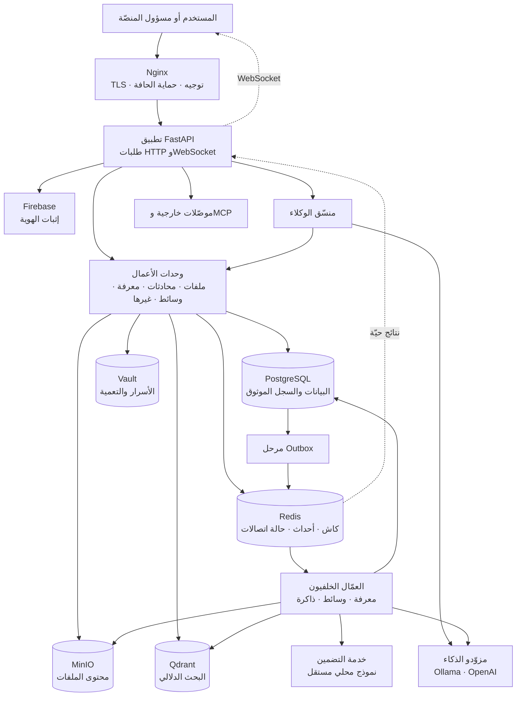

الفكرة الأهم في الرسم: الطلب السريع يبقى داخل تطبيق API، أما العمل الطويل فيتحول إلى **مهمة مسجلة بأمان** ثم ينفذها عامل خلفي.

## 3. أين توجد أجزاء المشروع؟

```text
AIZZAK/
├── src/app/
│   ├── api/             واجهة HTTP وWebSocket والتحقق من الطلبات
│   ├── agents/          الوكلاء الخمسة والمنسّق
│   ├── modules/         وحدات الأعمال المستقلة
│   ├── framework/       القواعد المشتركة والعقود والتسجيل والربط
│   ├── infrastructure/  الاتصال بالتقنيات الفعلية
│   ├── workers/         نقاط تشغيل العمّال والـOutbox Relay
│   └── ops/             أدوات التشغيل والصيانة
├── services/embedding/  خدمة التضمين المستقلة
├── migrations/          تغييرات قاعدة البيانات
├── deploy/              إعداد Nginx وVault وPostgreSQL وأدوات الفحص
├── docs/design/         وثائق التصميم التفصيلية
├── tests/               اختبارات الوحدة والتكامل والبنية
├── docker-compose.yml   طوبولوجيا التشغيل المحلية/الخادمية
├── Dockerfile           صورة التطبيق والعمّال المشتركة
└── .importlinter        قواعد تمنع كسر حدود الطبقات والوحدات
```

يوجد تطبيق Python رئيسي في `src/app`، لكن خدمة التضمين في `services/embedding` مستقلة عمدًا، لأن مكتبات النموذج مثل Torch ثقيلة ولا يجب تحميلها في كل عملية API أو عامل.

## 4. النمط المعماري بلغة بسيطة

يعتمد المشروع أربعة أفكار متكاملة:

1. **تطبيق واحد مقسّم إلى وحدات:** كل مجال أعمال له مجلد وقواعد وبيانات خاصة به.
2. **القلب لا يعرف الأدوات الخارجية:** منطق الأعمال لا يعرف Redis أو FastAPI أو MinIO مباشرة.
3. **الوكلاء إضافات قابلة للاكتشاف:** إضافة مجلد وكيل صحيح تكفي ليكتشفه النظام عند الإقلاع.
4. **المهام الطويلة تعمل بالأحداث:** الطلب يسجل المهمة ويرجع سريعًا، والعامل يكملها لاحقًا.

### 4.1 اتجاه الاعتماد بين الطبقات

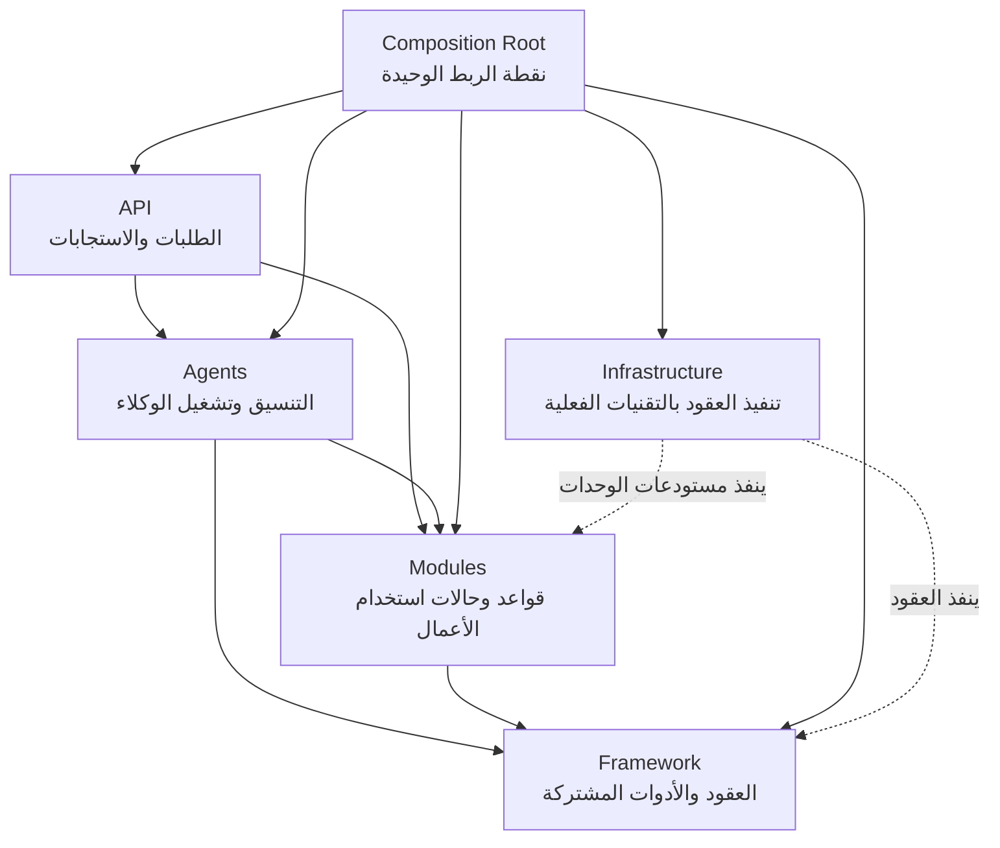

الأسهم العادية تعني أن الطبقة الأعلى تستطيع استخدام ما تحتها. أما البنية التحتية فليست قلب النظام؛ هي مجموعة قطع تنفيذية يربطها `CompositionRoot` بالعقود المطلوبة.

قواعد الاستيراد ليست نصائح فقط. ملف `.importlinter` واختبار `tests/architecture/test_import_contracts.py` يفرضانها آليًا، ومنها:

- نطاق الوحدة `domain` لا يستورد FastAPI أو SQLAlchemy أو Redis أو البنية التحتية.
- وحدات المستأجر الإحدى عشرة لا تستورد بعضها مباشرة.
- إضافات الوكلاء لا تستورد بعضها ولا تستورد API أو البنية التحتية.
- لا يستورد أحد `infrastructure` إلا نقاط الربط المسموح بها.
- `CompositionRoot` هو الاستثناء المقصود لأنه المكان الذي يعرف القطع الفعلية كلها ويربطها.

## 5. شرح الطبقات

### 5.1 طبقة الواجهة `api`

هذه هي البوابة البرمجية للنظام. ملف `src/app/api/main.py` يبني تطبيق FastAPI ويربط الموجّهات التالية:

- الوكلاء والنماذج وسير العمل.
- المحادثات والملفات والمساحات والمعرفة والوسائط.
- مساحة العمل والاستخدام ومفاتيح المزوّدين والتكاملات.
- إدارة المنصّة.
- WebSocket للبث الحي.
- `/health` و`/health/ready` و`/metrics` للتشغيل والمراقبة.

وظيفة API هي فهم الطلب، التحقق منه، استدعاء حالة الاستخدام المناسبة، ثم تحويل النتيجة إلى استجابة. لا يفترض أن يحتوي الموجّه على قواعد أعمال معقدة.

يضيف التطبيق أيضًا:

- رقم تتبع `X-Correlation-Id` لكل طلب.
- أخطاء موحدة بصيغة RFC 9457.
- دورة إقلاع وإغلاق تربط MinIO، تبدأ جسر الإشعارات، وتغلق الاتصالات بأمان.
- حالة جاهزية تمنع موازن الحمل من إرسال طلبات إلى عملية لم يكتمل ربطها.

### 5.2 طبقة الوكلاء `agents`

تحتوي إضافات الوكلاء الفعلية، إضافة إلى `orchestrator.py`. المنسّق ليس وكيلاً سادسًا؛ هو مدير التشغيل الذي:

- يتحقق من صلاحيات الوكيل.
- يقرأ إعداد النموذج المثبت على المحادثة عند وجوده.
- يختار المزوّد والنموذج ومفتاح الوصول الخاص بمساحة العمل.
- يتحقق من الحصة قبل التشغيل.
- يبني حزمة احتياجات خاصة بهذا الطلب.
- يشغّل الوكيل ويدير بث الأحداث.
- يفتح المحادثة ويحفظ رسالة المستخدم ورد الوكيل.
- يسجل استهلاك الرموز والتكلفة بعد التشغيل.

المنسّق عديم الحالة الدائمة: يحتفظ فقط بالخدمات المشتركة، أما بيانات كل طلب فتبقى محلية لذلك الطلب.

### 5.3 طبقة الوحدات `modules`

هذه هي قلب الأعمال. توجد **11 وحدة مستأجر أساسية**، إضافة إلى حزمة `admin` خاصة بإدارة المنصّة، أي 12 مجلدًا وظيفيًا تحت `src/app/modules`.

الوحدة النموذجية مقسمة هكذا:

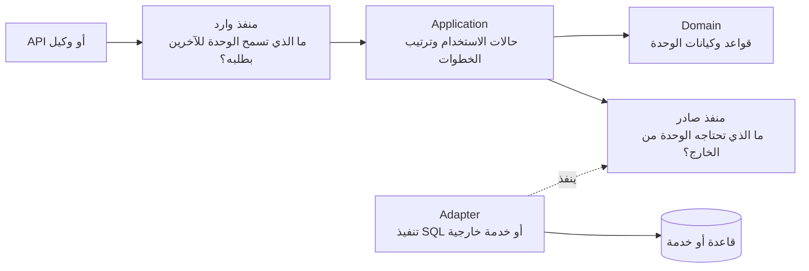

ومجلداتها المعتادة هي:

- `domain/`: معنى الأشياء وقواعدها وحالاتها، بلا اتصال خارجي.
- `application/`: حالات الاستخدام التي ترتب الخطوات.
- `ports/`: عقود صغيرة توضح ما يدخل الوحدة وما تحتاجه من الخارج.
- `adapters/`: تنفيذ العقود، وغالبًا مستودع SQL.

### 5.4 طبقة الإطار `framework`

هي صندوق الأدوات المشترك، وليست وحدة أعمال. أهم أجزائها:

| الجزء | وظيفته المبسطة |
|---|---|
| `ports/` | عقود مزوّدي اللغة والتضمين والصور والفيديو والتخزين والكاش والأحداث والأسرار وغيرها |
| `agent_runtime/` | عقد الوكيل، بياناته، اكتشاف الإضافات، السجل، ودورة التشغيل |
| `providers/` | اختيار المزوّد والنموذج حسب نوع القدرة أو الوكيل |
| `tools/` | تسجيل الأدوات واستدعاؤها بالاسم دون ربط الوكيل بتنفيذها |
| `workflows/` | تعريف وتشغيل سلسلة خطية من الوكلاء |
| `events/` | شكل الحدث ومظروفه وجدول مجاري Redis |
| `streaming/` | سجل اتصالات WebSocket وتوزيع الإشعارات |
| `context/` | هوية الطلب ومساحة العمل والأدوار ورقم التتبع |
| `di/` | نقطة تركيب النظام وربط العقود بالتنفيذات |
| `settings/` | الإعدادات والحدود القادمة من البيئة |
| `observability/` | السجلات والنبض وإخفاء البيانات الحساسة |

### 5.5 طبقة البنية التحتية `infrastructure`

هذه الطبقة تعرف أسماء التقنيات وكيفية الاتصال بها. مثلًا، قلب النظام يعرف عقدًا اسمه `StorageProvider`، بينما `MinioStorage` هو التنفيذ الفعلي لهذا العقد.

هذا الفصل يسمح بتبديل التقنية أو اختبار الوحدة بتنفيذ مزيف دون تغيير قواعد الأعمال.

## 6. وحدات المشروع بالتفصيل

### 6.1 `workspace` — المستأجر والمستخدم

تمثل مساحة العمل الرئيسية وحساب المستخدم داخل المنصّة. عند أول تسجيل دخول موثوق، تنشئ أو تربط المستخدم بمساحة عمل وتعيد سياقه. تدير قراءة اسم مساحة العمل وتغييره، الأرشفة، وتسجيل حضور المستخدم الذي يراه مسؤول المنصّة.

بياناتها الأساسية: `Workspace` و`User` و`user_presence`.

### 6.2 `access` — الأدوار والصلاحيات

تقرر ما إذا كان الدور يسمح بعملية معينة. تخزن تعيين الأدوار، وتوفر حالات استخدام للإسناد والإلغاء، وخدمة `Authorization` التي تستخدمها حواجز API والمنسّق.

يوجد نوعان مهمان من الصلاحيات:

- صلاحيات داخل مساحة العمل، مثل قراءة الملفات أو تشغيل الوكلاء.
- صلاحية إدارة المنصّة التي تعبر مساحات العمل من خلال مسار إداري منفصل.

### 6.3 `credentials` — مفاتيح مزوّدي الذكاء

تدير مفاتيح API التي يضيفها المستخدم لمزوّد مثل OpenAI. لا تخزن المفتاح كنص واضح في PostgreSQL؛ ترسله إلى Vault Transit للتعمية ثم تخزن النص المعمّى فقط.

لها وجهان منفصلان:

- وجه للمستخدم: إضافة المفتاح وعرض بياناته العامة وإلغاؤه.
- وجه داخلي: فك تعمية المفتاح عند اختيار مزوّد لطلب حقيقي.

### 6.4 `spaces` — تقسيم مساحة العمل

تضيف تقسيمًا داخل مساحة العمل الرئيسية، مثل مساحة مشروع أو فريق. يمكن إنشاء مساحة وتسميتها وإعادة تسميتها وحذفها. ترتبط الملفات والمحادثات والمعرفة بـ`space_id`.

الحذف ليس حذف صف واحد فقط. `CompositionRoot` يبني خدمة تنسيق تمسح ملفات المساحة ومحتوى MinIO ومعرفة Qdrant والمحادثات المرتبطة بها ثم تنهي الحذف وفق ترتيب آمن.

### 6.5 `conversations` — المحادثات والرسائل

تدير المحادثات ورسائلها وعلاقتها بالوكيل أو بسير العمل، وتشمل:

- بدء محادثة وإضافة رسالة.
- عرض المحادثات والرسائل وإعادة التسمية والحذف المنطقي.
- تثبيت نموذج محدد للمحادثة.
- تثبيت ملفات على المحادثة لتضييق نطاق بحث وكيل المعرفة.
- التأكد من أن الملف المثبت ينتمي إلى المساحة نفسها.

المنسّق يستخدم واجهة ضيقة من هذه الوحدة لفتح المحادثة وحفظ دورة المستخدم والوكيل، بدل أن يكتب إلى قاعدة البيانات مباشرة.

### 6.6 `files` — سجل الملفات ونقلها

تفصل الوحدة بين **معلومات الملف** و**محتواه**:

- PostgreSQL يحتفظ بالاسم والحجم والنوع والحالة ومفتاح التخزين والمساحة.
- MinIO يحتفظ بالبايتات الفعلية.

مسار الرفع مبني على روابط موقعة:

1. يسجل العميل ملفًا جديدًا في API.
2. النظام يتحقق من المساحة والحصة ويعيد رابط رفع مؤقت إلى MinIO.
3. يرفع العميل البايتات مباشرة إلى MinIO.
4. يخبر API أن الرفع اكتمل.
5. تتحول حالة الملف إلى جاهز ويسجل حدث `files.file.uploaded.v1`.

منذ الانتقال إلى الفهرسة اليدوية، اكتمال الرفع **لا يعني تلقائيًا** فهرسة الملف في المعرفة؛ يطلب المستخدم ذلك من واجهة المعرفة.

### 6.7 `knowledge` — المعرفة والفهرسة والبحث والتلخيص

هذه الوحدة تحول الملفات إلى معرفة قابلة للبحث. تدير:

- تسجيل مستند من ملف جاهز.
- مهام الفهرسة وإعادة الفهرسة وحالاتها.
- قراءة أنواع متعددة من الملفات عبر محولات التحليل.
- حفظ سجل المستندات والمقاطع في PostgreSQL.
- حفظ تمثيل البحث في Qdrant.
- البحث داخل مساحة العمل أو ضمن ملفات محددة ومساحة داخلية محددة.
- طلب ملخصات وبنائها وتصديرها.

تستخدم مجموعة Qdrant هجينة لكل مساحة عمل باسم قريب من `kn-<workspace_id>`. تحتوي على تمثيل دلالي وتمثيل نصي مساعد، مع ترشيح صريح بـ`workspace_id` و`space` و`document_id` عند الحاجة.

لا ينفذ API الفهرسة الثقيلة بنفسه. يسجل مستندًا وحادثة، ثم يلتقطها `worker-knowledge`.

### 6.8 `memory` — ذاكرة الوكيل

تحفظ معلومات طويلة العمر تخص تفاعل وكيل داخل مساحة عمل. العزل فيها على مستويين:

- مساحة العمل.
- مفتاح الوكيل `agent_key`.

يسجل الحفظ أولًا في PostgreSQL، ثم يفهرس `worker-memory` المحتوى في Qdrant داخل مجموعة `mem-<workspace_id>`. البحث يضيف مرشح الوكيل حتى لا تختلط ذاكرة وكيل بآخر.

### 6.9 `media` — طلبات الصور والفيديو

تدير سجل مهمة الوسائط وحالاتها: مطلوبة، قيد التنفيذ، ناجحة أو فاشلة. الطلب السريع لا ينتج الصورة داخل API؛ يسجل `MediaJob` وحدثًا في Outbox ثم يرجع رقم المهمة وحالة القبول.

`worker-media` يستهلك الطلب. التنفيذ الفعلي المربوط حاليًا يولد الصور عبر OpenAI Images، ثم يسجل الناتج كملف في MinIO/PostgreSQL ويصدر حدث نجاح أو فشل. يوجد نوع فيديو في العقود والوكيل، لكن `WorkerMediaGenerator` يرفض أي نوع غير الصورة بالخطأ المصنف `media.unsupported_kind`. لذلك يقبل المسار الأولي مهمة الفيديو ويسجلها، ثم تنتهي في العامل كغير مدعومة حاليًا؛ وهذا يوضح الفرق بين **وجود عقد الفيديو ووكيله** و**وجود تنفيذ فيديو مربوط**.

### 6.10 `integrations` — الموصّلات وMCP

تدير اتصالات OAuth وخوادم MCP البعيدة وأدواتها. النقل المسموح به حاليًا هو HTTP/SSE، ولا يشغل النظام خوادم MCP محلية كعمليات فرعية.

تخزن رموز الوصول بصورة معمّاة، وتجدد الرمز عند الحاجة، وتبني كتالوج أدوات خاصًا بكل مساحة عمل. يستطيع نظام الأدوات استدعاء الأداة بالاسم دون أن يعرف الوكيل هل جاءت من موصّل ثابت أم من خادم MCP مكتشف.

### 6.11 `usage` — القياس والحصص

تسجل استهلاك الرموز والتكلفة، وتدير الحدود اليومية أو الشهرية. يتعامل معها المنسّق فقط أثناء تشغيل الوكيل:

1. يفحص الحد قبل التشغيل.
2. يرفض الطلب قبل أي تكلفة إذا تجاوز الحصة.
3. يسجل الاستهلاك بعد التشغيل باستخدام `operation_id` يمنع احتساب العملية مرتين.

هذه عملية سريعة ومتزامنة، لذلك لا تمر عبر Redis Streams.

### 6.12 `admin` — إدارة المنصّة عبر المستأجرين

هذه حزمة إدارية خاصة وليست وحدة مستأجر عادية ذات مخطط بيانات مستقل. تقرأ أو تعدل بيانات موزعة في مخططات `workspace` و`access` و`credentials` و`platform` من خلال أدوار قاعدة بيانات إدارية مخصصة وتكتب سجل تدقيق.

تشمل:

- البحث في مستخدمي المنصّة.
- تفعيل الحساب أو تعطيله وحذفه.
- تعديل دور المستخدم داخل مساحة العمل أو دور مسؤول المنصّة.
- إدارة مفاتيح المزوّدين على مستوى المنصّة وفحصها.
- عرض معلومات النظام.

وجودها خارج عقد استقلال وحدات المستأجر في `.importlinter` مقصود لأنها واجهة إدارية عابرة للحدود، وليست نموذجًا ينبغي للوحدات الأخرى تقليده.

## 7. الوكلاء وكيف يعملون

### 7.1 الوكلاء الموجودون في الشيفرة

| الوكيل | ماذا يفعل؟ | أهم ما يحتاجه |
|---|---|---|
| `rag_agent` | يجيب اعتمادًا على معرفة مساحة العمل ويعيد مراجع للمقاطع | LLM + وحدة المعرفة |
| `data_analysis_agent` | يقرأ ملف بيانات ويجيب عن أسئلة حوله | LLM + الملفات + MinIO |
| `file_editing_agent` | يقرأ ملفًا نصيًا ويولد النسخة المعدلة في نتيجة الطلب | LLM + الملفات + MinIO |
| `image_agent` | يضع مهمة إنشاء صورة في الطابور | وحدة الوسائط |
| `video_agent` | يضع مهمة من نوع فيديو في الطابور | وحدة الوسائط |

وكيلا الصورة والفيديو يرثان سلوكًا مشتركًا في `agents/_shared.py`: يتحققان من `prompt`، يطلبان مهمة من وحدة الوسائط، ثم يعيدان `job_id` فورًا دون انتظار الناتج.

### 7.2 كيف تُكتشف الإضافات؟

كل وكيل مجلد يحوي عادة:

```text
agents/<agent_key>/
├── manifest.py   الاسم والإصدار والقدرات والصلاحيات
├── agent.py      التنفيذ الموروث من BaseAgent
├── tools/        أدوات خاصة عند الحاجة
└── prompts/      قوالب نصوص عند الحاجة
```

عند الإقلاع، يقوم `PluginLoader` بالآتي:

1. يمسح المجلدات داخل `app.agents`.
2. يقرأ `METADATA` من `manifest.py`.
3. يتأكد أن المفتاح مكتوب بصيغة صحيحة ويساوي اسم المجلد.
4. يجد صنف الوكيل الصحيح في `agent.py`.
5. يسجله في `AgentRegistry`.
6. يعزل الإضافة المعطوبة ويسجل سببها بدل إسقاط المنصّة كلها.

إزالة مجلد الوكيل ثم إعادة الإقلاع تزيله من السجل تلقائيًا.

### 7.3 دورة حياة استدعاء وكيل

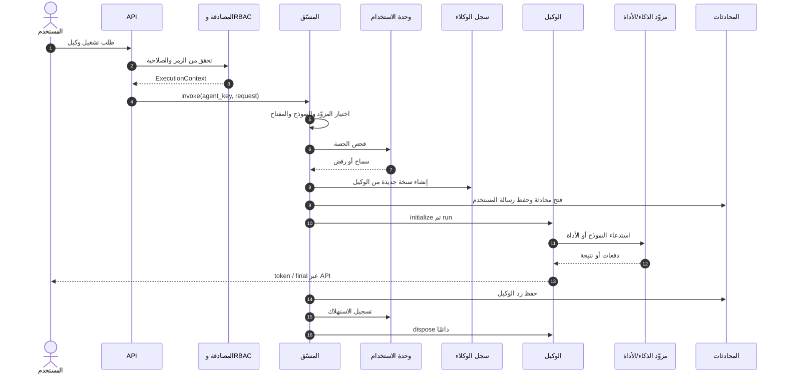

الحالات المفاهيمية التي يفرضها المنفذ هي:

```text
Created → Initialized → Running → Completed → Disposed
                              └→ Failed ─────→ Disposed
```

`dispose` ينفذ سواء نجح الوكيل أم فشل، حتى لا تتسرب الموارد.

### 7.4 سير العمل متعدد الوكلاء

يوجد محرك `SequentialWorkflowEngine` لتشغيل خطوات خطية، بحيث ينتقل ناتج الخطوة إلى سياق الخطوة التالية. الحد الأقصى والتعريفات تضبطها سجلات الإطار، ولا يستورد وكيل وكيلاً آخر مباشرة.

لكن الشيفرة الحالية في `framework/workflows/definitions/content_pipeline.py` لا تسجل تعريفًا فعليًا، و`CompositionRoot` ينشئ `WorkflowRegistry` فارغًا. النتيجة الحالية:

- بنية المحرك وواجهات API موجودة.
- `GET /workflows` يعرض قائمة فارغة.
- تشغيل مفتاح غير مسجل يعيد `workflow.unknown`.

هذا فرق مهم بين **القدرة المعمارية الجاهزة** و**سير عمل فعلي مفعل**.

## 8. المهام الخلفية ونظام الأحداث

### 8.1 لماذا لا تنفذ كل الأعمال داخل طلب API؟

الفهرسة وتوليد الوسائط قد يستغرقان وقتًا طويلًا أو يفشلان مؤقتًا. إبقاء اتصال المستخدم مفتوحًا طوال هذه المدة يستهلك موارد ويجعل إعادة المحاولة صعبة. لذلك يستخدم المشروع نمطًا اسمه **Transactional Outbox**.

تبسيطه: عند تسجيل المهمة، يكتب النظام في المعاملة نفسها:

- التغيير الأساسي، مثل إنشاء مهمة وسائط.
- رسالة تقول إن هذه المهمة يجب تنفيذها.

إذا نجحت المعاملة يُحفظ الاثنان، وإذا فشلت لا يحفظ أي منهما. وهكذا لا توجد مهمة بلا رسالة، ولا رسالة تشير إلى مهمة غير موجودة.

### 8.2 مسار الحدث الموثوق

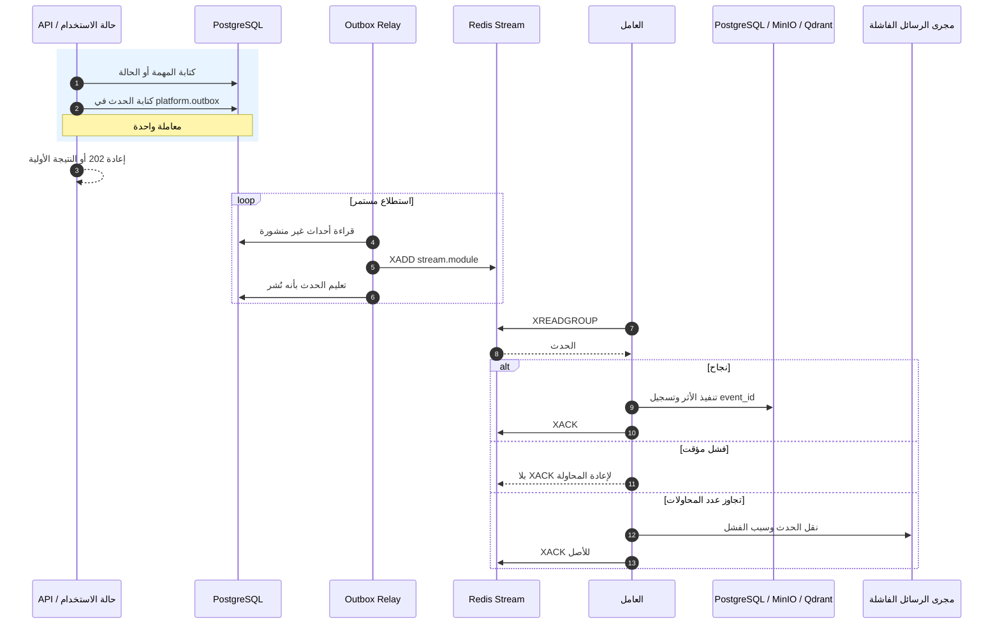

قد يصل الحدث أكثر من مرة، لذلك يسجل العامل `(consumer_group, event_id)` في `platform.processed_events`. إذا تكرر الحدث، يتجاهله بأمان. النتيجة العملية هي تنفيذ الأثر مرة واحدة حتى لو أعاد الناقل التسليم.

### 8.3 مجاري Redis والعمّال

| المجرى | المجموعة | من يقرأه؟ | الغرض |
|---|---|---|---|
| `stream.knowledge` | `cg.knowledge` | `worker-knowledge` | فهرسة المستندات وبناء الملخصات |
| `stream.knowledge` | `cg.notify.<host>.<pid>` | كل عملية API | إرسال نجاح أو فشل فهرسة المستند إلى الاتصالات الحية |
| `stream.media` | `cg.media` | `worker-media` | إنشاء الوسائط |
| `stream.media` | `cg.notify.<host>.<pid>` | كل عملية API | إرسال نتيجة الوسائط الحية |
| `stream.memory` | `cg.memory` | `worker-memory` | بناء تمثيل الذاكرة في Qdrant |
| `stream.files` | لا توجد مجموعة حاليًا | لا أحد | يبقى سجل واقعة رفع الملف، دون فهرسة تلقائية |

كل نوع من العمال له عملية مستقلة حتى لا يؤدي تراكم مهام الوسائط مثلًا إلى تعطيل مهام الذاكرة.

### 8.4 لماذا مجموعة إشعارات لكل عملية API؟

كل عملية Gunicorn تحتفظ باتصالات WebSocket الموجودة داخلها فقط. لو اشتركت عمليات API كلها في مجموعة Redis واحدة، فسيوزع Redis الأحداث بينها، وقد يصل الحدث إلى عملية لا تملك اتصال المستخدم المطلوب.

لذلك تنشئ كل عملية مجموعة باسم `cg.notify.<hostname>.<pid>`، فتقرأ كل عملية نتائج المعرفة والوسائط ثم ترسل فقط للاتصالات الموجودة فيها. تُحذف المجموعة عند الإغلاق النظيف، وتُكنس المجموعات اليتيمة عند الإقلاع التالي.

## 9. البيانات: أين يُحفظ كل شيء؟

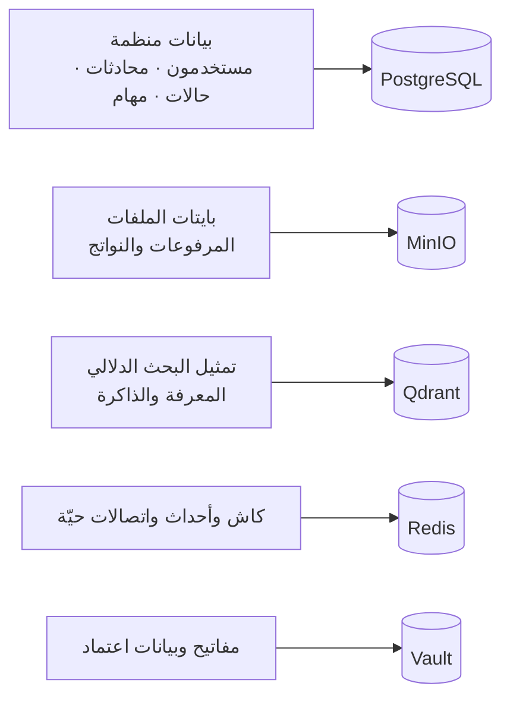

### 9.1 PostgreSQL

ينظم قاعدة البيانات إلى مخططات منفصلة:

`workspace`, `access`, `credentials`, `conversations`, `memory`, `files`, `knowledge`, `media`, `integrations`, `usage`, `spaces`, إضافة إلى `platform` للبنية المشتركة.

لكل وحدة سلسلة Alembic خاصة وجدول إصدار داخل مخططها. أمر `app.ops.provision` هو الذي يرتب تشغيل السلاسل والمنح؛ عملية `migrate` تتصل مباشرة بـPostgreSQL بدور المالك، لا عبر PgBouncer.

لا تستخدم الوحدات مفاتيح أجنبية تعبر المخططات. تحتفظ بمعرف فقط، ثم تتحقق عبر عقد ضيق عند الحاجة. هذا يمنع وحدة من الارتباط داخليًا بجداول وحدة أخرى.

### 9.2 عزل مساحات العمل

عزل البيانات لا يعتمد على شرط في الشيفرة فقط. توجد طبقتان:

1. كل استعلام مستأجر يضيف شرط `workspace_id`.
2. جلسة PostgreSQL تضبط `SET LOCAL app.workspace_id` وتفعل سياسات RLS.

إذا نسي استعلام شرطه، تبقى قاعدة البيانات حاجزًا ثانيًا. عملية التطبيق تستخدم دور `app_rw` بلا ملكية للجداول وبلا تجاوز RLS.

المسارات الإدارية تستخدم مصانع جلسات وأدوارًا منفصلة للقراءة أو الكتابة العابرة للمستأجرين، بدل توسيع صلاحيات دور التطبيق العادي.

### 9.3 MinIO

يوجد bucket رئيسي واحد، ومفتاح كل ملف يبدأ بمساحة العمل، مثل `<workspace_id>/...`. التطبيق يولد روابط رفع وتنزيل مؤقتة، فيتبادل المتصفح البايتات مع MinIO بدل تمرير الملف الكبير عبر FastAPI.

اعتماد MinIO يربط بعد بدء التطبيق لأن بيانات وصوله تُقرأ من Vault بصورة غير متزامنة. يمسك `StorageHandle` مكان التنفيذ إلى أن يكتمل هذا الربط، فتتفعّل كل الخدمات التي تعتمد عليه مرة واحدة.

### 9.4 Qdrant

يحفظ نقاط البحث الدلالي، لا السجل الأساسي. PostgreSQL يبقى المرجع لحالة المستند أو الذاكرة، بينما يحمل Qdrant التمثيل المناسب للبحث.

- المعرفة: مجموعة هجينة `kn-<workspace_id>`.
- الذاكرة: مجموعة `mem-<workspace_id>`.
- توجد مرشحات حمولة للدفاع عن حدود مساحة العمل والمساحة الداخلية والمستند أو الوكيل.

### 9.5 Redis

يقوم بعدة أدوار منفصلة:

- كاش سريع.
- Redis Streams للمهام والأحداث.
- سجل موزع لعدد اتصالات WebSocket لكل مستخدم.
- إبطال جلسة تسجيل الخروج حتى انتهاء الرمز.

يستخدم جسر الإشعارات والعمّال اتصالات Redis ذات مهلة قراءة أطول لأنها تنتظر `XREADGROUP`، بينما يستخدم مسار الطلب اتصالًا سريع الفشل حتى لا يعلق الطلب.

### 9.6 Vault

يؤدي وظيفتين:

- KV لحفظ أسرار تشغيل مثل بيانات MinIO.
- Transit لتعمية مفاتيح المستخدمين والموصّلات دون تسليم مفتاح التعمية للتطبيق.

يدعم التطبيق رمزًا مباشرًا للتطوير، وAppRole للبيئات غير المحلية. يوجد فحص صحة للتأكد من أن العملية ما زالت تستطيع الوصول إلى Vault.

## 10. اختيار مزوّد الذكاء

لا يختار الوكيل صنف OpenAI أو Ollama مباشرة. يطلب قدرة، ويحل `ProviderResolver` المسار من إعداد `PROVIDER_ROUTING` ثم يعيد:

- المزوّد الفعلي.
- اسم النموذج.
- مفتاح الوصول المناسب لمساحة العمل إن كان مطلوبًا.

هذا يسمح بتغيير المسار بالإعدادات بدل تعديل الوكيل.

الربط الحالي في عملية API يشمل:

- LLM: ‏Ollama وOpenAI.
- التضمين: خدمة `embedding-local` الداخلية.
- الصور: OpenAI Images.

توجد ملفات محولات لـClaude وGemini وOpenRouter وفيديو خارجي وبحث Exa، لكن وجود ملف محول لا يعني أنه مربوط في `CompositionRoot`. على سبيل المثال، `web_search` يمرر حاليًا بقيمة `None` إلى المنسّق، وسجل المزوّدين في عملية API لا يضيف Claude أو Gemini أو OpenRouter. هذه أمثلة على الفرق بين **كود قابل للاستخدام مستقبلًا** و**مسار تشغيل فعلي**.

## 11. الأمن من دخول الطلب إلى البيانات

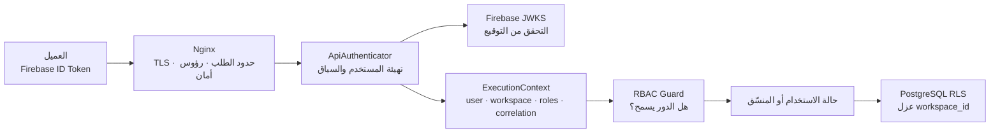

الطبقات الأمنية الأساسية:

1. **Nginx:** ينهي TLS، يضيف رؤوس أمان وCORS، يضع حدًا لحجم الطلب ومعدل الاستدعاء، ويدعم ترقية WebSocket.
2. **Firebase:** يثبت هوية صاحب الرمز؛ لا يقرر صلاحياته داخل المنصّة.
3. **ApiAuthenticator:** يهيئ المستخدم عند أول دخول، يقرأ أدواره، يبني `ExecutionContext`، ويتحقق من إبطال الجلسة.
4. **RBAC:** كل مسار يعلن الصلاحية المطلوبة، وكل manifest وكيل يعلن صلاحياته أيضًا.
5. **RLS:** قاعدة البيانات تعزل مساحة العمل حتى لو حدث خطأ في استعلام التطبيق.
6. **Vault:** يمنع حفظ المفاتيح الحساسة كنص واضح.
7. **أدوار قاعدة منفصلة:** للتطبيق، والـOutbox Relay، والهجرات، والقياسات، والاحتفاظ، وتدوير الأسرار، والتطهير الإداري.

## 12. البنية التحتية والخدمات

| الخدمة أو التقنية | وظيفتها | من يتصل بها؟ |
|---|---|---|
| Nginx | المدخل العام وTLS وWebSocket والحماية | المستخدم ←→ التطبيق |
| FastAPI/Gunicorn/Uvicorn | واجهة النظام والمنسّق وحالات الاستخدام | Nginx |
| PostgreSQL 16 | السجل الأساسي وOutbox والمثالية والتدقيق | التطبيق والعمّال والأدوات |
| PgBouncer | تجميع اتصالات PostgreSQL بنمط transaction | التطبيق والعمّال والمرحل |
| Redis 7 | الكاش والأحداث واتصالات WebSocket والإبطال | التطبيق والعمّال والمرحل |
| MinIO | بايتات الملفات والنواتج | المتصفح والتطبيق والعمّال |
| Qdrant | متجهات المعرفة والذاكرة | التطبيق وعمّالا المعرفة والذاكرة |
| Vault | أسرار التشغيل وتعمية بيانات الاعتماد | التطبيق وعمّال يحتاجون أسرارًا |
| embedding | تحويل النص إلى تمثيل عددي للبحث | التطبيق وعمّالا المعرفة والذاكرة |
| Firebase | التحقق من رموز الهوية | التطبيق عبر HTTP |
| Ollama | نموذج لغة محلي على المضيف | التطبيق وبعض العمّال |
| OpenAI | اللغة والصور حسب التوجيه والمفتاح | التطبيق وعامل الوسائط |
| OAuth/MCP خارجي | أدوات وتكاملات مساحة العمل | وحدة integrations |

### 12.1 العمليات التي تستخدم صورة التطبيق نفسها

الصورة المبنية من `Dockerfile` واحدة، لكن الأمر يحدد دور العملية:

- `app`: خادم API.
- `worker-knowledge`: الفهرسة والملخصات.
- `worker-media`: تنفيذ مهام الوسائط.
- `worker-memory`: فهرسة الذاكرة.
- `outbox-relay`: نقل الأحداث من PostgreSQL إلى Redis.
- `migrate`: تشغيل الهجرات والمنح مرة واحدة.
- أدوات `app.ops.*`: مهام صيانة يدوية أو مجدولة.

هذا يمنع اختلاف نسخة الشيفرة بين API والعامل، مع بقاء كل دور عملية مستقلة يمكن مراقبتها وإعادة تشغيلها.

## 13. الشبكات وطوبولوجيا Docker Compose

لا يعرّف `docker-compose.yml` شبكات مخصصة متعددة؛ لذلك تنضم الخدمات إلى شبكة Compose الافتراضية باسم المشروع، وتتخاطب بأسماء الخدمات مثل `redis:6379` و`pgbouncer:6432` و`minio:9000`.

الاستثناء هو `ollama-bridge` الذي يستخدم `network_mode: host` في بيئة WSL. يستمع على عنوان جسر Docker `172.17.0.1:11435` ويرسل إلى Ollama المحلي على `127.0.0.1:11434`. الغرض أن تصل الحاويات إلى خدمة Ollama الموجودة على المضيف من دون نشرها على الشبكة المحلية كلها.

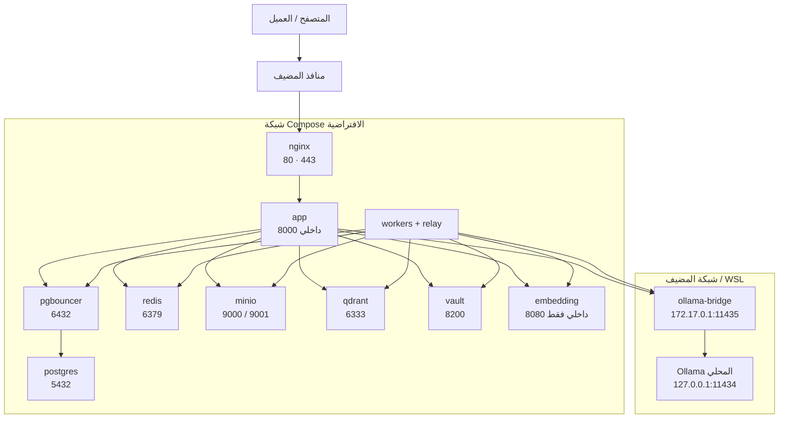

### 13.1 ما هو منشور خارج الحاويات؟

- Nginx ينشر HTTP وHTTPS على جميع واجهات المضيف افتراضيًا.
- PostgreSQL وPgBouncer وRedis وMinIO وQdrant وVault تنشر منافذ صيانة على `127.0.0.1` فقط، فلا تستقبل اتصالًا مباشرًا من الشبكة الخارجية.
- `app:8000` و`embedding:8080` يستخدمان `expose` فقط، أي داخل شبكة Compose.
- Nginx لا يمرر `/metrics` للعامة حسب إعداد الحافة، بينما يبقى داخل التطبيق للمراقب الموثوق.

### 13.2 ترتيب الإقلاع

يعتمد Compose على فحوص صحة حقيقية:

1. يبدأ PostgreSQL وRedis وMinIO وQdrant وVault وخدمة التضمين.
2. ينتظر PgBouncer PostgreSQL ويتحقق باتصال فعلي عبره.
3. ينفذ `vault-bootstrap` و`minio-bootstrap` التهيئة مرة واحدة.
4. ينفذ `migrate` الهجرات والمنح مباشرة على PostgreSQL.
5. يبدأ التطبيق والعمّال بعد نجاح التبعيات.
6. يبدأ Nginx بعد التطبيق والشهادة، ثم يفحص المسار كاملًا عبر الوكيل العكسي.

العمّال والـRelay لا يفتحون منفذ HTTP. بدل ذلك يكتب كل منهم ملف نبض دوري، ويقرأ فحص الصحة عمر هذا الملف. لعامل الوسائط مهلة أطول لأن مهمة صورة واحدة قد تشغل الحلقة عدة دقائق.

## 14. `CompositionRoot`: غرفة توصيل الأسلاك

أهم ملف لفهم كيف تصبح الأجزاء نظامًا عاملًا هو `src/app/framework/di/composition_root.py`.

يبني عند الإقلاع:

- محرك قاعدة البيانات ومصانع الجلسات.
- عميل Redis السريع وعميلًا منفصلًا للقراءة المنتظرة.
- Qdrant وVault وFirebase وعملاء HTTP للمزوّدين.
- مستودع كل وحدة وحالات استخدامها.
- `ProviderResolver` وسجل الوكلاء وتقرير الإضافات.
- المنسّق وسجل سير العمل.
- خدمات الملفات والمعرفة والوسائط والمساحات والحصص والإدارة.
- WebSocket hub وجسر الإشعارات.
- مصادر المقاييس وصحة Vault ومعلومات المضيف.

ثم يربط MinIO في خطوة إقلاع غير متزامنة، لأن بيانات الوصول تأتي من Vault.

وجود مكان واحد لهذه التوصيلات يمنع انتشار إنشاء العملاء والمستودعات في الموجّهات والوكلاء. كما يجعل الاختبار قادرًا على حقن بدائل صغيرة بدل تشغيل البنية كلها.

## 15. مسارات عملية كاملة

### 15.1 محادثة مع `rag_agent`

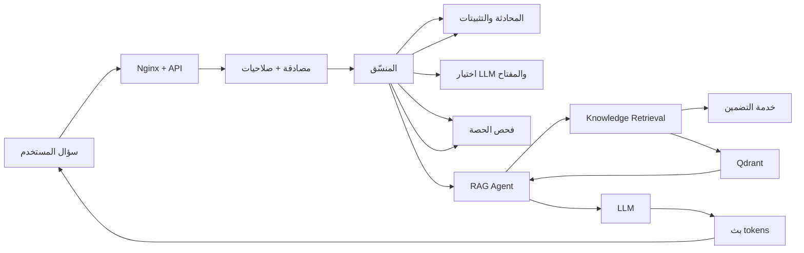

الوكيل لا يفتح Qdrant أو PostgreSQL بنفسه. يستدعي منفذ المعرفة الذي حُقن فيه، ووحدة المعرفة تتولى البحث والتصفية.

### 15.2 رفع ملف ثم فهرسته

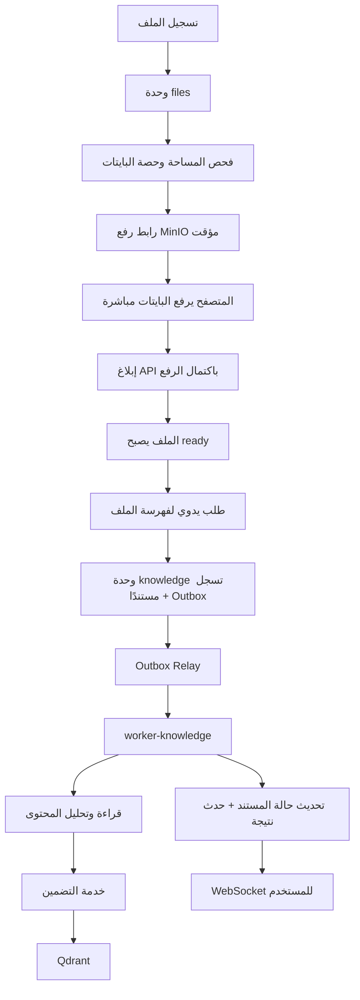

### 15.3 إنشاء صورة

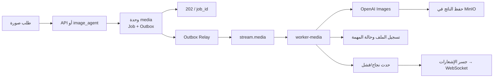

## 16. الاختبارات التي تحمي البنية

ينقسم مجلد `tests` إلى:

- `unit/`: قواعد النطاق وحالات الاستخدام والمنسّق والوكلاء بمزيفات سريعة.
- `integration/`: PostgreSQL وRedis وMinIO وQdrant وVault والمزوّدون عند تفعيل البيئة الحية.
- `architecture/`: منع الاستيرادات التي تكسر اتجاه الطبقات.

بوابات الجودة المعرفة في المشروع تشمل تنسيق Ruff وفحصه، `mypy --strict`، و`lint-imports`، ثم Pytest. المهم معماريًا أن تغييرًا صغيرًا لا يستطيع جعل وحدة تستورد وحدة أخرى أو جعل الوكيل يتصل بالبنية التحتية مباشرة دون أن يفشل الفحص.

## 17. أدوات التشغيل والصيانة

مجلد `src/app/ops` ليس جزءًا من مسار المستخدم اليومي، بل يوفر أدوات للمشغّل، منها:

- `provision`: تشغيل سلاسل الهجرات والمنح.
- `healthcheck`: فحص نبض العمليات التي لا تملك منفذًا.
- `dlq`: فحص الرسائل التي فشلت نهائيًا وإدارتها.
- `retention`: تنظيف السجلات غير المحدودة وفق السياسة.
- `notify_groups`: إدارة مجموعات إشعارات Redis اليتيمة.
- `payload_indexes`: إضافة فهارس حمولة Qdrant للمجموعات القديمة.
- `rotate_transit`: إعادة لف النصوص المعمّاة بعد تدوير مفتاح Vault Transit.
- `purge`: تطهير محتوى مساحة عمل من PostgreSQL وMinIO وQdrant.
- `revoke`: إبطال جلسات.

لكل أداة تحتاج صلاحية واسعة دور PostgreSQL ضيق ومخصص، بدل تشغيلها بدور مالك قاعدة البيانات.

## 18. حقائق الحالة الحالية التي يجب ألا تختلط بالتصميم

عند قراءة الوثائق القديمة قد تظهر معلومات سبقتها الشيفرة الحالية. الحالة التي يثبتها الربط الحالي هي:

- توجد 11 وحدة مستأجر، بعد إضافة `spaces`، وحزمة `admin` خاصة بالمنصّة.
- عمال `knowledge` و`media` و`memory` مربوطون في Compose الافتراضي، ولكل واحد خدمة مستقلة.
- خدمة التضمين مستقلة ومربوطة فعليًا.
- الفهرسة أصبحت طلبًا يدويًا؛ `stream.files` لا يملك مستهلكًا.
- محرك سير العمل موجود لكن سجل التعريفات فارغ.
- بحث Exa ومحولات Claude/Gemini/OpenRouter موجودة ككود، لكنها ليست ضمن ربط `CompositionRoot` الحالي.
- توليد الصورة مربوط فعليًا في عامل الوسائط؛ عقد الفيديو والوكيل موجودان، لكن العامل الحالي لا يربط مزوّد فيديو.
- تعريفات Compose تستخدم شبكة افتراضية واحدة، مع استثناء جسر Ollama على شبكة المضيف.

## 19. كيف تضيف قدرة جديدة دون كسر البنية؟

### وكيل جديد

أضف مجلدًا يحوي manifest وتنفيذ `BaseAgent`. استخدم فقط الاحتياجات المحقونة، ولا تستورد وكيلًا أو بنية تحتية. سيكتشفه `PluginLoader` عند الإقلاع.

### وحدة أعمال جديدة

أنشئ `domain/application/ports/adapters` ومخطط PostgreSQL وسلسلة هجرات خاصة. اربطها في `CompositionRoot` وأضفها إلى عقد استقلال الوحدات. لا تعدّل الوحدات الأخرى كي تستوردها؛ قدم لها منفذًا ضيقًا أو حدثًا عند الحاجة.

### مزوّد تقني جديد

نفّذ عقدًا موجودًا في `framework/ports`، ثم اربط التنفيذ في `CompositionRoot` وأضفه إلى جدول التوجيه. لا تجعل الوكيل يعرف اسم الصنف الجديد.

### مهمة خلفية جديدة

إذا كانت العملية ثقيلة: اكتب الحالة والحدث في Outbox ضمن معاملة واحدة، أضف مجرى/مجموعة ومعالجًا مثاليًا، وحدد سياسة إعادة المحاولة وDLQ، ثم أضف عملية عامل مستقلة إذا كان حملها قد يعطل بقية الأنواع.

## 20. قاموس صغير للمصطلحات الضرورية

| المصطلح | المعنى في هذا المشروع |
|---|---|
| Module | قسم أعمال مستقل له قواعد وبيانات خاصة |
| Domain | القواعد الخالصة التي تحدد معنى البيانات وحالاتها |
| Use Case | عملية مفهومة للمستخدم، مثل بدء محادثة أو تسجيل ملف |
| Port | عقد يصف المطلوب دون تحديد التقنية |
| Adapter | تنفيذ العقد باستخدام SQL أو Redis أو خدمة خارجية |
| Composition Root | المكان الوحيد الذي ينشئ القطع الفعلية ويربطها |
| Agent | إضافة تنسق قدرات للوصول إلى نتيجة ذكية |
| Orchestrator | مدير تشغيل الوكيل واختيار المزوّد والحصة والمحادثة |
| Worker | عملية خلفية تنفذ عملًا طويلًا |
| Outbox | جدول موثوق للرسائل يكتب مع تغيير الأعمال في معاملة واحدة |
| Stream | مجرى أحداث مرتب في Redis |
| Consumer Group | مجموعة قراء تتقاسم العمل داخل المجرى |
| RLS | حاجز داخل PostgreSQL يمنع رؤية بيانات مساحة أخرى |
| Embedding | تحويل النص إلى أرقام تمثل معناه لأغراض البحث |
| WebSocket | اتصال مفتوح لإرسال النتائج الحية من الخادم إلى العميل |

## 21. ملفات مرجعية لمن يريد التعمق

- [`architecture.md`](architecture.md): القرارات المعمارية الأصلية والمخططات العامة.
- [`design/README.md`](design/README.md): فهرس وثائق التصميم التفصيلي.
- [`design/01-data-model.md`](design/01-data-model.md): مخططات PostgreSQL والجداول وRLS.
- [`design/02-port-contracts.md`](design/02-port-contracts.md): عقود المنافذ.
- [`design/04-event-catalog.md`](design/04-event-catalog.md): أنواع الأحداث والمجاري.
- [`design/05-rbac-config-secrets.md`](design/05-rbac-config-secrets.md): الصلاحيات والإعدادات والأسرار.
- [`design/08-local-runbook.md`](design/08-local-runbook.md): التشغيل والفحص والصيانة.
- [`design/11-agent-authoring-guide.md`](design/11-agent-authoring-guide.md): إضافة وكيل.
- [`design/12-module-authoring-guide.md`](design/12-module-authoring-guide.md): إضافة وحدة.
- [`../docker-compose.yml`](../docker-compose.yml): طوبولوجيا الخدمات والشبكة الفعلية.
- [`../src/app/framework/di/composition_root.py`](../src/app/framework/di/composition_root.py): الربط الفعلي لكل الأجزاء.
- [`../.importlinter`](../.importlinter): القواعد الآلية لحدود الطبقات.

## 22. الخلاصة

بنية AIZZAK تقوم على فصل واضح للمسؤوليات:

- API يستقبل ولا يحمل منطق الأعمال الثقيل.
- الوكيل ينسق ولا يعرف التقنيات الفعلية.
- الوحدة تملك قواعد مجالها ولا تستورد الوحدات الأخرى.
- الإطار يعرّف العقود والآليات المشتركة.
- البنية التحتية تنفذ العقود.
- `CompositionRoot` يربط الجميع في مكان واحد.
- PostgreSQL هو سجل الحقيقة، وMinIO للملفات، وQdrant للبحث، وRedis للأحداث والحالة السريعة، وVault للأسرار.
- المهام الثقيلة تخرج إلى عمّال مستقلين عبر Outbox وRedis Streams.
- العزل يطبق في الشيفرة وفي PostgreSQL، والصلاحيات تطبق عند API وعند تشغيل الوكيل.

هذه الحدود هي أهم ما يجعل المشروع قابلًا للتوسع: يمكن إضافة وكيل أو مزوّد أو وحدة جديدة مع إبقاء الأجزاء الحالية مستقرة وقابلة للاختبار.

</div>
